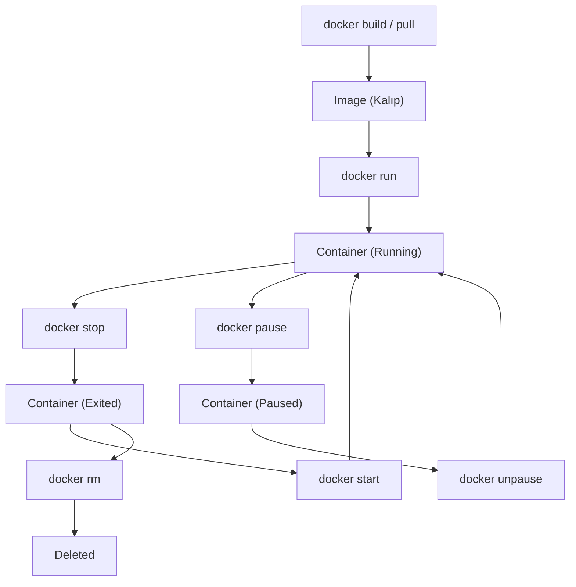

## 📌 Özet

Docker Komut Satırı Arayüzü (CLI), imajların yönetiminden konteynerlerin yaşam döngüsüne kadar tüm Docker operasyonlarının kalbidir. Bu doküman, uygulamaları paketlemek için kullanılan imaj komutlarını, çalışan süreçleri yöneten konteyner komutlarını ve sistem genelinde temizlik yapan bakım komutlarını kapsamlı bir şekilde sunar. Özellikle "docker run", "docker exec" ve "docker logs" gibi temel komutların parametreleri, günlük geliştirme ve sistem yönetimi süreçlerinde verimliliği artıran kritik araçlardır. Bu komutları ustalıkla kullanmak, konteynerize edilmiş uygulamaların hata ayıklama, izleme ve dağıtım aşamalarında geliştiricilere ve sistem yöneticilerine büyük kolaylık sağlar.

---

## 🧠 Detay



### Image Komutları

```bash
# Image listele
docker images
docker image ls

# Image indir
docker pull nginx
docker pull python:3.11-slim
docker pull ubuntu:22.04

# Image sil
docker rmi nginx
docker rmi $(docker images -q)  # Tümünü sil

# Image detay
docker inspect nginx
docker image history nginx       # Katmanları gör

# Image build
docker build -t myapp:1.0 .
docker build -t myapp:latest -f Dockerfile.prod .

# Image tag
docker tag myapp:1.0 myregistry/myapp:1.0

# Image push / pull
docker push myregistry/myapp:1.0
docker pull myregistry/myapp:1.0

# Image ara
docker search nginx
```

### Container Komutları

```bash
# Container çalıştır
docker run nginx                          # Ön planda
docker run -d nginx                       # Arka planda (detach)
docker run -it ubuntu bash                # İnteraktif terminal
docker run --name web nginx               # İsim ver
docker run -p 8080:80 nginx               # Port: host:container
docker run -v /host/path:/container/path  # Volume bağla
docker run -e ENV_VAR=value nginx         # Ortam değişkeni
docker run --rm nginx                     # Bitince sil

# Container listele
docker ps                    # Çalışanlar
docker ps -a                 # Hepsi (durmuşlar dahil)
docker ps -q                 # Sadece ID'ler

# Container durdur / başlat / sil
docker stop <container>
docker start <container>
docker restart <container>
docker rm <container>
docker rm -f <container>     # Zorla sil (çalışıyor olsa da)
docker rm $(docker ps -aq)   # Tümünü sil

# Container içine gir
docker exec -it <container> bash
docker exec -it <container> sh      # bash yoksa
docker exec <container> ls /app     # Tek komut çalıştır

# Logları gör
docker logs <container>
docker logs -f <container>          # Canlı takip (follow)
docker logs --tail 100 <container>  # Son 100 satır
docker logs --since 1h <container>  # Son 1 saat

# Container detay
docker inspect <container>
docker stats <container>            # CPU, RAM kullanım
docker top <container>              # Çalışan süreçler

# Dosya kopyala
docker cp <container>:/app/file.txt ./local/
docker cp ./local/file.txt <container>:/app/
```

### Sistem Komutları

```bash
# Disk kullanımı
docker system df

# Temizlik
docker system prune           # Durmuş container, kullanılmayan image
docker system prune -a        # Tüm kullanılmayanlar
docker container prune        # Sadece durmuş containerlar
docker image prune            # Dangling (etiket yok) imageler
docker volume prune           # Kullanılmayan volumeler
docker network prune          # Kullanılmayan networkler

# Docker bilgisi
docker info
docker version
```

### Kullanışlı Kısayollar

```bash
# Çalışan tüm containerları durdur
docker stop $(docker ps -q)

# ID ile işlem (kısaltılmış ID yeterli)
docker stop abc123  # tam yazmak zorunda değilsin

# Format ile listeleme
docker ps --format "table {{.ID}}\t{{.Names}}\t{{.Status}}\t{{.Ports}}"

# Son oluşturulan container
docker ps -l

# Container IP adresi
docker inspect -f '{{range .NetworkSettings.Networks}}{{.IPAddress}}{{end}}' <container>
```

### Run Parametreleri Özeti

| Parametre | Açıklama | Örnek |
|---|---|---|
| `-d` | Arka planda çalıştır | `docker run -d nginx` |
| `-it` | İnteraktif terminal | `docker run -it ubuntu bash` |
| `-p` | Port yönlendirme | `-p 8080:80` |
| `-v` | Volume bağla | `-v /data:/app/data` |
| `-e` | Ortam değişkeni | `-e DB_HOST=localhost` |
| `--name` | Container adı | `--name myapp` |
| `--rm` | Bitince sil | `docker run --rm alpine echo hi` |
| `--network` | Ağa bağla | `--network mynet` |
| `--restart` | Yeniden başlatma | `--restart always` |
| `-m` | Bellek sınırı | `-m 512m` |
| `--cpus` | CPU sınırı | `--cpus 1.5` |

### Restart Policy

```bash
docker run --restart no nginx          # Varsayılan
docker run --restart always nginx      # Her zaman yeniden başlat
docker run --restart on-failure nginx  # Hata varsa yeniden başlat
docker run --restart unless-stopped nginx  # Manuel durdurana kadar
```

---

## 💡 Bağlantılar
- [[Docker - Giriş ve Temel Kavramlar]]
- [[Docker - Dockerfile Yazımı]]
- [[Docker - Volume ve Veri Yönetimi]]
- [[Docker - Network Yönetimi]]

## ❓ Sorular / Anlamadıklarım

## 🔗 Kaynaklar
- docs.docker.com/engine/reference/commandline/cli/
