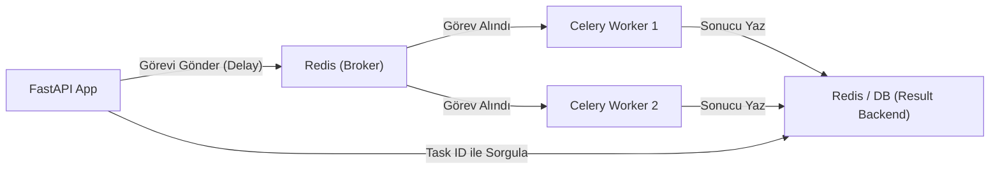

## 📌 Özet
Asenkron Görev Kuyrukları (Celery ve Redis), web uygulamalarında uzun süren işlemlerin (büyük veri işleme, model eğitimi, toplu e-posta gönderimi vb.) ana istek döngüsünü (request cycle) bloke etmeden arka planda yürütülmesini sağlar. FastAPI, yüksek performanslı bir yapı sunsa da, saniyeler veya dakikalar süren makine öğrenmesi tahminleri istemciyi bekletmemelidir. Celery, bu görevleri yöneten güçlü bir işleyici (worker) sistemi sunarken; Redis, mesajların iletildiği hızlı bir aracı (broker) görevi görerek sistemin ölçeklenebilir ve dayanıklı olmasını sağlar.

---

## 🧠 Detay

### 🏗️ Görev Kuyruğu Mimarisi



### 1. Neden Arka Plan Görevleri?
- **Kullanıcı Deneyimi:** Kullanıcı "Dosya yükle" dediğinde işlemin bitmesini beklemez, "İşleminiz başladı" yanıtını hemen alır.
- **Kaynak Yönetimi:** CPU yoğunluklu ML işlemleri web sunucusunu yormaz, ayrı worker makinelerinde çalışır.
- **Hata Toleransı:** Bir görev başarısız olursa otomatik olarak tekrar denenebilir (retry mechanism).

### 2. Temel Bileşenler
- **Producer (Üretici):** Görevi oluşturan FastAPI uygulaması.
- **Broker (Aracı):** Mesajları ileten Redis veya RabbitMQ.
- **Worker (İşçi):** Görevi gerçekte yürüten Python süreci.
- **Result Backend:** Görevin sonucunun saklandığı yer.

### 3. FastAPI ile Entegrasyon
FastAPI'nin kendi `BackgroundTasks` özelliği basit işler için uygundur. Ancak dağıtık sistemler, zamanlanmış görevler (cron jobs) ve karmaşık iş akışları için Celery endüstri standardıdır.

### 🛠️ Kod Örneği: Celery Görevi Tanımlama
```python
# worker.py
from celery import Celery

celery_app = Celery(
    "tasks",
    broker="redis://localhost:6379/0",
    backend="redis://localhost:6379/0"
)

@celery_app.task
def uzun_ml_islemi(data):
    # Model tahmini veya ağır hesaplama burada yapılır
    import time
    time.sleep(10) 
    return {"sonuc": "İşlem tamamlandı", "data_len": len(data)}

# main.py (FastAPI)
@app.post("/tahmin-baslat")
async def start_task(data: list):
    task = uzun_ml_islemi.delay(data)
    return {"task_id": task.id, "durum": "baslatildi"}
```

### 🔍 İzleme ve Yönetim
**Flower**, Celery görevlerini izlemek için kullanılan web tabanlı bir araçtır. Hangi görevlerin başarılı olduğunu, ne kadar sürdüğünü ve worker'ların durumunu anlık olarak görmenizi sağlar.

---

## 💡 Bağlantılar
- [[API - FastAPI Async ve Background Tasks]]
- [[API - ML Modeli Servis Etmek]]
- [[Docker - Docker Compose]]

## ❓ Sorular / Anlamadıklarım
- Redis yerine RabbitMQ kullanmanın avantajları nelerdir?
- Celery worker'ları Docker container'ları içinde nasıl ölçeklendirilir?

## 🔗 Kaynaklar
- Celery Project: https://docs.celeryq.dev/
- FastAPI with Celery Tutorial
