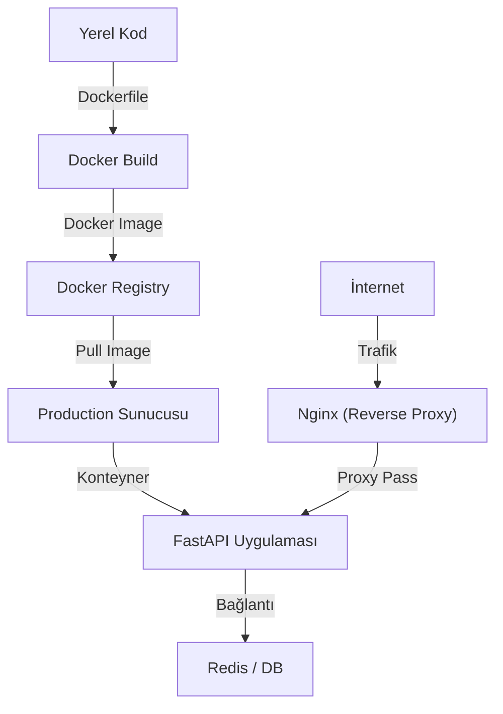

## 📌 Özet
FastAPI uygulamalarını Docker ile paketlemek, uygulamanın farklı ortamlarda (geliştirme, test, üretim) tutarlı bir şekilde çalışmasını sağlar. Bu süreçte, çok aşamalı (multi-stage) build stratejisi kullanılarak hem güvenlik artırılır hem de Docker imaj boyutları optimize edilir. Docker Compose ile FastAPI, veritabanı, Redis ve Nginx gibi yan servisler tek bir yapılandırma altında orkestre edilebilir. Production ortamında sağlık kontrolleri (healthcheck), root olmayan kullanıcı kullanımı ve reverse proxy (Nginx) yapılandırması gibi en iyi uygulamalar hayati önem taşır.

## 🧠 Detay

### Konsept Akışı


### Proje Yapısı
```
ml-api/
├── app/
│   ├── __init__.py
│   ├── main.py
│   ├── model.py
│   └── schemas.py
├── model/
│   ├── rf_model.pkl
│   └── scaler.pkl
├── tests/
│   └── test_main.py
├── Dockerfile
├── docker-compose.yml
├── requirements.txt
└── .env
```

### Dockerfile
```dockerfile
# Çok aşamalı build
FROM python:3.11-slim AS builder

WORKDIR /app
COPY requirements.txt .
RUN pip install --no-cache-dir --user -r requirements.txt

# Production image
FROM python:3.11-slim

WORKDIR /app

# Builder'dan paketleri kopyala
COPY --from=builder /root/.local /root/.local

# Uygulama kodunu kopyala
COPY app/ ./app/
COPY model/ ./model/

# Güvenlik: root olmayan kullanıcı
RUN useradd -m appuser
USER appuser

ENV PATH=/root/.local/bin:$PATH
ENV PYTHONPATH=/app

EXPOSE 8000

HEALTHCHECK --interval=30s --timeout=10s --retries=3 \
    CMD curl -f http://localhost:8000/saglik || exit 1

CMD ["uvicorn", "app.main:app", \
     "--host", "0.0.0.0", \
     "--port", "8000", \
     "--workers", "2"]
```

### requirements.txt
```
fastapi==0.111.0
uvicorn[standard]==0.29.0
pydantic==2.7.0
scikit-learn==1.4.2
numpy==1.26.4
pandas==2.2.2
joblib==1.4.0
python-jose[cryptography]==3.3.0
python-multipart==0.0.9
```

### Docker Compose
```yaml
# docker-compose.yml
version: "3.8"

services:
  ml-api:
    build: .
    ports:
      - "8000:8000"
    environment:
      - API_KEY=${API_KEY}
      - SECRET_KEY=${SECRET_KEY}
      - DEBUG=false
    volumes:
      - ./model:/app/model:ro   # salt okunur
      - ./logs:/app/logs
    restart: unless-stopped
    healthcheck:
      test: ["CMD", "curl", "-f", "http://localhost:8000/saglik"]
      interval: 30s
      timeout: 10s
      retries: 3

  redis:
    image: redis:7-alpine
    ports:
      - "6379:6379"
    restart: unless-stopped

  nginx:
    image: nginx:alpine
    ports:
      - "80:80"
      - "443:443"
    volumes:
      - ./nginx.conf:/etc/nginx/nginx.conf:ro
    depends_on:
      - ml-api
    restart: unless-stopped
```

### Docker Komutları
```bash
# Build
docker build -t ml-api:v1.0 .

# Çalıştır
docker run -d \
  -p 8000:8000 \
  -e API_KEY=gizli-key \
  --name ml-api \
  ml-api:v1.0

# Compose ile
docker-compose up -d
docker-compose logs -f ml-api
docker-compose down

# Konteyner içine gir
docker exec -it ml-api bash

# Log izle
docker logs -f ml-api
```

### .env Dosyası
```bash
API_KEY=production-gizli-anahtar
SECRET_KEY=jwt-gizli-anahtar
DEBUG=false
MODEL_PATH=/app/model/rf_model.pkl
```

### Nginx Reverse Proxy
```nginx
# nginx.conf
upstream ml_api {
    server ml-api:8000;
}

server {
    listen 80;

    location / {
        proxy_pass http://ml_api;
        proxy_set_header Host $host;
        proxy_set_header X-Real-IP $remote_addr;
    }

    location /saglik {
        proxy_pass http://ml_api/saglik;
        access_log off;
    }
}
```

## 💡 Bağlantılar
- [[API - FastAPI Giriş]]
- [[API - ML Modeli Servis Etmek]]
- [[API - FastAPI Loglama ve İzleme]]

## ❓ Sorular / Anlamadıklarım
- Çok büyük model dosyaları Docker image'a mı yoksa volume'a mı konmalı?
- Kubernetes'e geçiş ne zaman gerekli?

## 🔗 Kaynaklar
- https://fastapi.tiangolo.com/deployment/docker/
