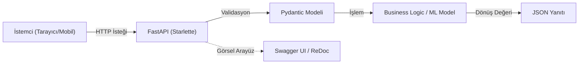

## 📌 Özet
FastAPI, Python tabanlı modern bir web framework'ü olup, özellikle yüksek performanslı ve ölçeklenebilir API'lar geliştirmek için tasarlanmıştır. Starlette ve Pydantic kütüphaneleri üzerine inşa edilen yapısı, veri doğrulama ve serileştirme işlemlerini Python'un standart tip ipuçlarını kullanarak otomatikleştirir. Geliştiricilere Swagger ve ReDoc üzerinden anında interaktif dokümantasyon sunarak test süreçlerini hızlandırır. Modern makine öğrenmesi modellerini hızlıca web servisi haline getirmek için sektör standardı haline gelmiştir.

## 🧠 Detay

### Temel Mimari


### Flask vs FastAPI Karşılaştırması
| Özellik | Flask | FastAPI |
|---------|-------|---------|
| Hız | Orta | Çok hızlı (Starlette) |
| Tip kontrolü | Manuel | Otomatik (Pydantic) |
| Dokümantasyon | Manuel | Otomatik (Swagger) |
| Async desteği | Sınırlı | Native |
| Öğrenme eğrisi | Kolay | Kolay-Orta |

### Kurulum
```bash
pip install fastapi uvicorn[standard]
pip install python-multipart  # dosya yükleme için
```

### İlk API
```python
# main.py
from fastapi import FastAPI

app = FastAPI(
    title="ML Model API",
    description="Makine öğrenmesi modeli servisi",
    version="1.0.0"
)

@app.get("/")
def anasayfa():
    return {"mesaj": "ML API çalışıyor!", "durum": "aktif"}

@app.get("/saglik")
def saglik_kontrol():
    return {"durum": "sağlıklı"}
```

### Çalıştırma
```bash
# Geliştirme (hot reload)
uvicorn main:app --reload

# Production
uvicorn main:app --host 0.0.0.0 --port 8000 --workers 4
```

### Otomatik Dokümantasyon
```
Swagger UI  → http://localhost:8000/docs
ReDoc       → http://localhost:8000/redoc
OpenAPI JSON → http://localhost:8000/openapi.json
```

### Path ve Query Parametreleri
```python
from fastapi import FastAPI
from typing import Optional

app = FastAPI()

# Path parametresi
@app.get("/musteri/{musteri_id}")
def musteri_getir(musteri_id: int):
    return {"id": musteri_id}

# Query parametresi
@app.get("/musteriler")
def musteri_listesi(
    sayfa: int = 1,
    limit: int = 10,
    sehir: Optional[str] = None
):
    return {"sayfa": sayfa, "limit": limit, "sehir": sehir}

# Path + Query birlikte
@app.get("/urunler/{kategori}")
def urun_listesi(kategori: str, sirala: str = "fiyat", artan: bool = True):
    return {"kategori": kategori, "sirala": sirala, "artan": artan}
```

### HTTP Metodları
```python
@app.get("/items/{id}")      # Okuma
@app.post("/items")          # Oluşturma
@app.put("/items/{id}")      # Güncelleme (tümü)
@app.patch("/items/{id}")    # Güncelleme (kısmi)
@app.delete("/items/{id}")   # Silme
```

## 💡 Bağlantılar
- [[API - Pydantic ile Veri Doğrulama]]
- [[API - ML Modeli Servis Etmek]]
- [[API - FastAPI Middleware ve Güvenlik]]

## ❓ Sorular / Anlamadıklarım
- FastAPI neden Flask'tan daha hızlı?
- `async def` ile `def` arasındaki fark ne zaman önemli?

## 🔗 Kaynaklar
- https://fastapi.tiangolo.com/tr/tutorial/
