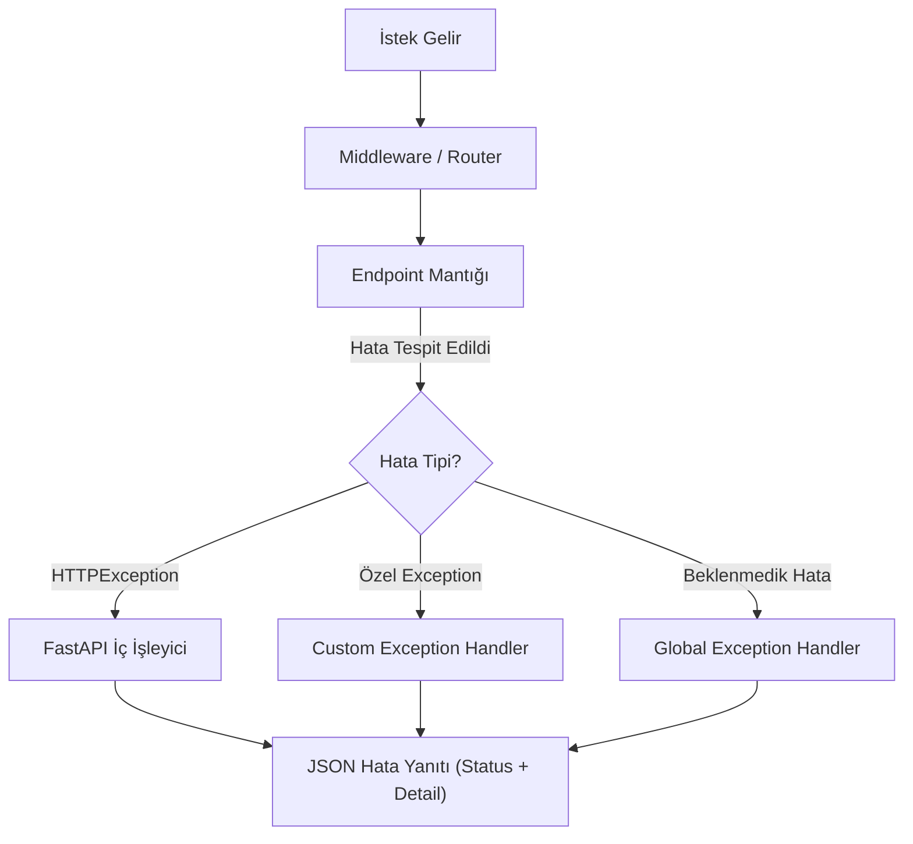

## 📌 Özet
FastAPI'da hata yönetimi, hem istemci tarafındaki hataları (4xx) hem de sunucu tarafındaki beklenmedik durumları (5xx) disiplinli bir şekilde ele almayı sağlar. `HTTPException` sınıfı kullanılarak belirli status kodları ve açıklayıcı mesajlar doğrudan fırlatılabilirken, daha karmaşık senaryolar için özel hata sınıfları (`Exception`) tanımlanabilir. Bu özel hatalar, global `exception_handler` fonksiyonları aracılığıyla yakalanarak tüm uygulama genelinde tutarlı ve standart bir JSON hata şeması sunulmasına olanak tanır. Etkili bir hata yönetimi stratejisi, özellikle ML API'larında model yükleme hataları veya geçersiz veri girişleri gibi kritik durumların kullanıcıya anlamlı bir şekilde raporlanmasını sağlar.

## 🧠 Detay

### Hata Yakalama Akışı


### HTTPException
```python
from fastapi import FastAPI, HTTPException, status

app = FastAPI()

@app.get("/musteri/{id}")
def musteri_getir(id: int):
    musteri = db.get(id)

    if musteri is None:
        raise HTTPException(
            status_code=status.HTTP_404_NOT_FOUND,
            detail=f"Müşteri bulunamadı: ID={id}"
        )

    if not musteri.aktif:
        raise HTTPException(
            status_code=status.HTTP_403_FORBIDDEN,
            detail="Bu müşteri hesabı pasif"
        )

    return musteri
```

### Yaygın HTTP Status Kodları
```python
from fastapi import status

status.HTTP_200_OK            # Başarılı
status.HTTP_201_CREATED       # Oluşturuldu
status.HTTP_400_BAD_REQUEST   # Geçersiz istek
status.HTTP_401_UNAUTHORIZED  # Kimlik doğrulama gerekli
status.HTTP_403_FORBIDDEN     # Erişim yasak
status.HTTP_404_NOT_FOUND     # Bulunamadı
status.HTTP_422_UNPROCESSABLE # Validasyon hatası
status.HTTP_429_TOO_MANY      # Rate limit aşıldı
status.HTTP_500_INTERNAL      # Sunucu hatası
```

### Özel Exception Sınıfı
```python
from fastapi import FastAPI, Request
from fastapi.responses import JSONResponse

class MLModelHatasi(Exception):
    def __init__(self, mesaj: str, kod: int = 500):
        self.mesaj = mesaj
        self.kod = kod

class VeriDogrulamaHatasi(Exception):
    def __init__(self, alan: str, mesaj: str):
        self.alan = alan
        self.mesaj = mesaj

app = FastAPI()

@app.exception_handler(MLModelHatasi)
async def ml_hata_handler(request: Request, exc: MLModelHatasi):
    return JSONResponse(
        status_code=exc.kod,
        content={
            "hata": "Model Hatası",
            "detay": exc.mesaj,
            "yol": str(request.url)
        }
    )

@app.exception_handler(VeriDogrulamaHatasi)
async def validasyon_hata_handler(request: Request, exc: VeriDogrulamaHatasi):
    return JSONResponse(
        status_code=422,
        content={"alan": exc.alan, "mesaj": exc.mesaj}
    )
```

### Genel Hata Handler
```python
from fastapi.exceptions import RequestValidationError
from fastapi.responses import JSONResponse
import traceback

@app.exception_handler(RequestValidationError)
async def validasyon_handler(request: Request, exc: RequestValidationError):
    hatalar = []
    for hata in exc.errors():
        hatalar.append({
            "alan": " → ".join(str(x) for x in hata["loc"]),
            "mesaj": hata["msg"],
            "tip": hata["type"]
        })
    return JSONResponse(status_code=422, content={"hatalar": hatalar})

@app.exception_handler(Exception)
async def genel_hata_handler(request: Request, exc: Exception):
    return JSONResponse(
        status_code=500,
        content={
            "hata": "Sunucu Hatası",
            "detay": str(exc),
            "iz": traceback.format_exc() if DEBUG else "Gizlendi"
        }
    )
```

### ML Endpoint'te Hata Yönetimi
```python
import numpy as np

@app.post("/tahmin")
def tahmin_yap(giris: TahminGiris):
    try:
        veri = np.array([[giris.yas, giris.gelir]])
        veri_scaled = ml_modeller["scaler"].transform(veri)
        tahmin = ml_modeller["model"].predict(veri_scaled)[0]
        return {"tahmin": int(tahmin)}

    except KeyError:
        raise HTTPException(503, "Model henüz yüklenmedi")
    except ValueError as e:
        raise VeriDogrulamaHatasi("giris", str(e))
    except Exception as e:
        raise MLModelHatasi(f"Tahmin hatası: {str(e)}")
```

## 💡 Bağlantılar
- [[API - FastAPI Giriş]]
- [[API - ML Modeli Servis Etmek]]
- [[API - FastAPI Middleware ve Güvenlik]]
- [[API - FastAPI Loglama ve İzleme]]

## ❓ Sorular / Anlamadıklarım
- 422 ve 400 arasındaki fark ne zaman önemli?
- Production'da hata detayları gösterilmeli mi?

## 🔗 Kaynaklar
- https://fastapi.tiangolo.com/tutorial/handling-errors/
