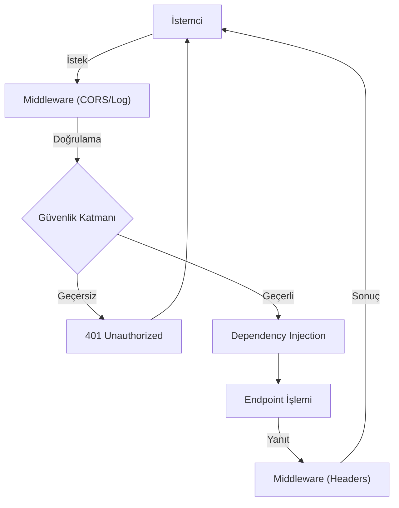

## 📌 Özet
FastAPI uygulamalarında güvenlik ve çapraz kesen ilgiler (cross-cutting concerns), middleware katmanları ve gelişmiş yetkilendirme mekanizmaları ile yönetilir. Middleware, her HTTP isteğinin uç noktaya ulaşmadan önce ve her yanıtın istemciye dönmeden önce geçtiği bir filtre görevi görerek CORS yapılandırması, loglama ve işlem süresi takibi gibi görevleri üstlenir. Güvenlik tarafında ise, basit senaryolar için API Key, daha karmaşık kullanıcı tabanlı erişimler için ise OAuth2 ve JWT (JSON Web Token) standartları kullanılır. Bu katmanlı yapı, hem uygulamanın dış dünyadan gelen kötü niyetli isteklere karşı korunmasını sağlar hem de geliştiricilere yetkilendirme mantığını merkezi bir noktadan yönetme kolaylığı sunar.

## 🧠 Detay

### İstek ve Güvenlik Yaşam Döngüsü


### CORS Middleware
```python
from fastapi import FastAPI
from fastapi.middleware.cors import CORSMiddleware

app = FastAPI()

app.add_middleware(
    CORSMiddleware,
    allow_origins=["http://localhost:3000", "https://myapp.com"],
    allow_credentials=True,
    allow_methods=["GET", "POST", "PUT", "DELETE"],
    allow_headers=["*"],
)

# Geliştirmede tümüne izin ver
# allow_origins=["*"]
```

### Özel Middleware
```python
from fastapi import Request
import time
import uuid

@app.middleware("http")
async def istek_loglama(request: Request, call_next):
    istek_id = str(uuid.uuid4())[:8]
    baslangic = time.time()

    # İstek logla
    print(f"[{istek_id}] → {request.method} {request.url.path}")

    response = await call_next(request)

    sure = round((time.time() - baslangic) * 1000, 2)

    # Yanıt logla
    print(f"[{istek_id}] ← {response.status_code} ({sure}ms)")

    # Header ekle
    response.headers["X-Request-ID"] = istek_id
    response.headers["X-Process-Time"] = str(sure)

    return response
```

### API Key Güvenliği
```python
from fastapi import FastAPI, Security, HTTPException
from fastapi.security.api_key import APIKeyHeader
import os

API_KEY = os.getenv("API_KEY", "gizli-anahtar-123")
api_key_header = APIKeyHeader(name="X-API-Key", auto_error=False)

async def api_key_dogrula(api_key: str = Security(api_key_header)):
    if api_key != API_KEY:
        raise HTTPException(
            status_code=403,
            detail="Geçersiz API anahtarı"
        )
    return api_key

# Sadece bu endpoint'e uygula
@app.post("/tahmin", dependencies=[Security(api_key_dogrula)])
def tahmin_yap(giris: TahminGiris):
    ...

# Tüm app'e uygula
app = FastAPI(dependencies=[Security(api_key_dogrula)])
```

### JWT Token
```python
from fastapi.security import OAuth2PasswordBearer, OAuth2PasswordRequestForm
from jose import JWTError, jwt
from datetime import datetime, timedelta
import os

SECRET_KEY = os.getenv("SECRET_KEY", "cok-gizli-key")
ALGORITHM = "HS256"

oauth2_scheme = OAuth2PasswordBearer(tokenUrl="token")

def token_olustur(data: dict, sure_dk: int = 30):
    to_encode = data.copy()
    bitis = datetime.utcnow() + timedelta(minutes=sure_dk)
    to_encode.update({"exp": bitis})
    return jwt.encode(to_encode, SECRET_KEY, algorithm=ALGORITHM)

async def kullanici_dogrula(token: str = Security(oauth2_scheme)):
    try:
        payload = jwt.decode(token, SECRET_KEY, algorithms=[ALGORITHM])
        kullanici_adi = payload.get("sub")
        if kullanici_adi is None:
            raise HTTPException(401, "Geçersiz token")
        return kullanici_adi
    except JWTError:
        raise HTTPException(401, "Token doğrulanamadı")

@app.post("/token")
async def giris(form: OAuth2PasswordRequestForm = Depends()):
    # Kullanıcı doğrulama
    if form.username != "admin" or form.password != "sifre":
        raise HTTPException(401, "Hatalı kullanıcı/şifre")
    token = token_olustur({"sub": form.username})
    return {"access_token": token, "token_type": "bearer"}

@app.post("/tahmin")
async def korunan_tahmin(
    giris: TahminGiris,
    kullanici: str = Depends(kullanici_dogrula)
):
    return {"kullanici": kullanici, "tahmin": 1}
```

### Rate Limiting
```python
from slowapi import Limiter, _rate_limit_exceeded_handler
from slowapi.util import get_remote_address
from slowapi.errors import RateLimitExceeded

limiter = Limiter(key_func=get_remote_address)
app.state.limiter = limiter
app.add_exception_handler(RateLimitExceeded, _rate_limit_exceeded_handler)

@app.post("/tahmin")
@limiter.limit("10/minute")
async def tahmin_yap(request: Request, giris: TahminGiris):
    return {"tahmin": 1}
```

## 💡 Bağlantılar
- [[API - FastAPI Giriş]]
- [[API - FastAPI Hata Yönetimi]]
- [[API - FastAPI Loglama ve İzleme]]
- [[API - Docker ile Deploy]]

## ❓ Sorular / Anlamadıklarım
- JWT refresh token nasıl uygulanır?
- API Key ve JWT ne zaman hangisi tercih edilir?

## 🔗 Kaynaklar
- https://fastapi.tiangolo.com/tutorial/security/
