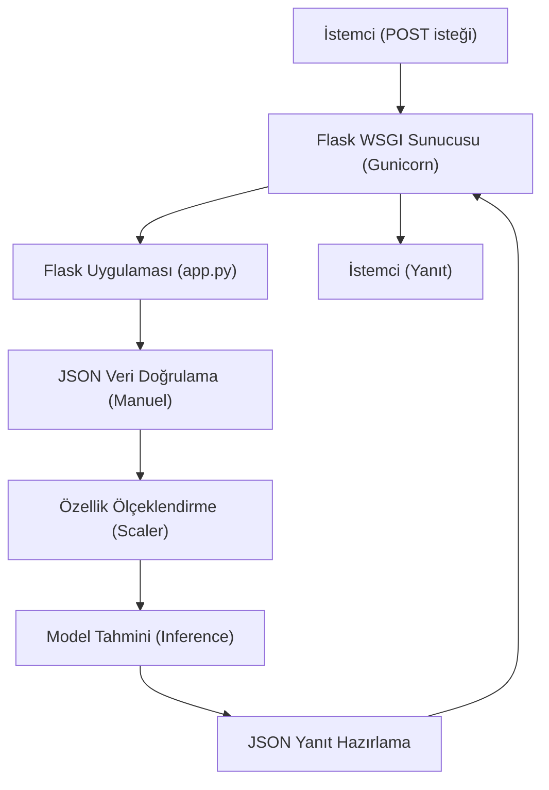

## 📌 Özet
Flask, Python dünyasında uzun yıllardır popülerliğini koruyan, "mikro" yapıda, esnek ve hafif bir web framework'üdür. Özellikle hızlı prototipleme, küçük çaplı makine öğrenmesi servisleri ve basit API geliştirmeleri için ideal bir tercihtir. FastAPI'nin sunduğu otomatik tip doğrulama ve asenkron yapı gibi modern özelliklerden yoksun olsa da, geniş ekosistemi ve öğrenme kolaylığı sayesinde hala birçok projede aktif olarak kullanılmaktadır. Bu dokümanda, eğitilmiş bir ML modelinin Flask üzerinden nasıl servis edileceği, hata yönetimi ve production ortamı için Gunicorn yapılandırması detaylandırılmıştır.

## 🧠 Detay



### Kurulum
```bash
pip install flask flask-restful gunicorn
```

### Temel Flask ML API
```python
# app.py
from flask import Flask, request, jsonify
import joblib
import numpy as np

app = Flask(__name__)

# Model yükle
model = joblib.load("model/rf_model.pkl")
scaler = joblib.load("model/scaler.pkl")

@app.route("/")
def anasayfa():
    return jsonify({"mesaj": "Flask ML API", "durum": "aktif"})

@app.route("/saglik")
def saglik():
    return jsonify({"durum": "sağlıklı"})

@app.route("/tahmin", methods=["POST"])
def tahmin():
    try:
        veri = request.get_json()

        # Validasyon
        gerekli = ["yas", "gelir", "kredi_skoru"]
        for alan in gerekli:
            if alan not in veri:
                return jsonify({"hata": f"{alan} alanı zorunlu"}), 400

        X = np.array([[veri["yas"], veri["gelir"], veri["kredi_skoru"]]])
        X_scaled = scaler.transform(X)

        tahmin = int(model.predict(X_scaled)[0])
        olasilik = float(model.predict_proba(X_scaled)[0].max())

        return jsonify({
            "tahmin": tahmin,
            "karar": "Onaylandı" if tahmin == 1 else "Reddedildi",
            "olasilik": round(olasilik, 4)
        })

    except Exception as e:
        return jsonify({"hata": str(e)}), 500

if __name__ == "__main__":
    app.run(debug=False, host="0.0.0.0", port=5000)
```

### Batch Endpoint
```python
@app.route("/tahmin/batch", methods=["POST"])
def batch_tahmin():
    veri = request.get_json()
    kayitlar = veri.get("kayitlar", [])

    if not kayitlar:
        return jsonify({"hata": "Kayıt listesi boş"}), 400

    X = np.array([[k["yas"], k["gelir"], k["kredi_skoru"]] for k in kayitlar])
    X_scaled = scaler.transform(X)

    tahminler = model.predict(X_scaled).tolist()
    olasiliklar = model.predict_proba(X_scaled).max(axis=1).tolist()

    return jsonify({
        "tahminler": tahminler,
        "olasiliklar": [round(o, 4) for o in olasiliklar],
        "toplam": len(tahminler)
    })
```

### Blueprint ile Organizasyon
```python
# routes/tahmin_routes.py
from flask import Blueprint, request, jsonify

tahmin_bp = Blueprint("tahmin", __name__, url_prefix="/api/v1")

@tahmin_bp.route("/tahmin", methods=["POST"])
def tahmin():
    ...

# app.py
from routes.tahmin_routes import tahmin_bp
app.register_blueprint(tahmin_bp)
```

### Hata Yönetimi
```python
@app.errorhandler(404)
def bulunamadi(e):
    return jsonify({"hata": "Endpoint bulunamadı"}), 404

@app.errorhandler(500)
def sunucu_hatasi(e):
    return jsonify({"hata": "Sunucu hatası"}), 500
```

### Gunicorn ile Production
```bash
gunicorn app:app \
  --workers 4 \
  --bind 0.0.0.0:5000 \
  --timeout 120 \
  --log-level info
```

### Flask vs FastAPI Özet
```
Flask tercih et:
  ✅ Basit servis
  ✅ Mevcut Flask projesi
  ✅ Esnek routing
  ✅ Geniş ekosistem

FastAPI tercih et:
  ✅ Otomatik dokümantasyon gerekli
  ✅ Tip güvenliği önemli
  ✅ Async gerekli
  ✅ Yüksek performans
  ✅ Büyük proje
```

## 💡 Bağlantılar
- [[API - FastAPI Giriş]]
- [[API - ML Modeli Servis Etmek]]
- [[API - Docker ile Deploy]]

## ❓ Sorular / Anlamadıklarım
- Flask-RESTful ve Flask-RESTX farkı nedir?
- Mevcut Flask projesini FastAPI'ya taşımalı mıyım?

## 🔗 Kaynaklar
- https://flask.palletsprojects.com/en/3.0.x/
