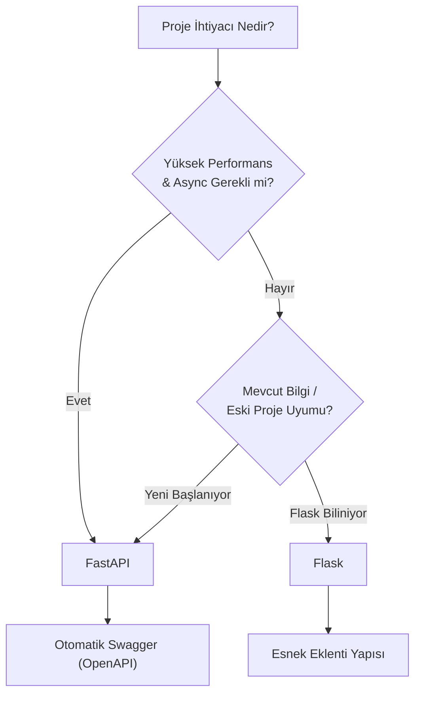

## 📌 Özet
Flask ve FastAPI, Python dünyasının en popüler iki web çerçevesidir (framework). Flask, 2010'dan beri piyasada olan, "micro-framework" felsefesini benimsemiş, esnek ve geniş bir topluluk desteğine sahip klasik bir araçtır. FastAPI ise modern Python özelliklerini (Tip ipuçları, async/await) kullanarak yüksek performans, otomatik dökümantasyon ve veri doğrulama sunan yeni nesil bir çerçevedir. Makine öğrenmesi modellerini API'a dökerken; basitlik ve alışkanlıklar için Flask, performans ve veri güvenliği (Pydantic) için FastAPI günümüzde daha çok tercih edilmektedir.

---

## 🧠 Detay

### 🗺️ Karar Matrisi: Hangi Çerçeve Seçilmeli?



### 1. Temel Farklar Tablosu

| Özellik | Flask | FastAPI |
|---------|-------|---------|
| **Asenkron (Async)** | Sınırlı / Eklenti ile. | Yerleşik (Native) destek. |
| **Veri Doğrulama** | Manuel veya eklenti (Marshmallow). | Yerleşik (Pydantic üzerinden). |
| **Dökümantasyon** | Manuel (Flasgger vb.). | Otomatik (Swagger & ReDoc). |
| **Performans** | Orta. | Çok Yüksek (NodeJS ve Go ile yarışır). |
| **Tip Güvenliği** | Yok. | Tam destek (Python Type Hints). |

### 2. Kod Örnekleri Karşılaştırması

**Flask Örneği:**
```python
from flask import Flask, request, jsonify
app = Flask(__name__)

@app.route('/predict', methods=['POST'])
def predict():
    data = request.json
    # Manuel doğrulama gerekir
    return jsonify({"prediction": 1})
```

**FastAPI Örneği:**
```python
from fastapi import FastAPI
from pydantic import BaseModel

app = FastAPI()

class Item(BaseModel):
    id: int
    name: str

@app.post("/predict")
async def predict(item: Item):
    # 'item' otomatik olarak doğrulanır ve tip dönüşümü yapılır
    return {"prediction": 1}
```

### 3. Neden FastAPI ML Projelerinde Öne Çıkıyor?
- **Pydantic Entegrasyonu:** ML modelleri belirli veri tipleri (float, int) bekler. FastAPI hatalı veri girişini daha API seviyesinde engeller.
- **Hız:** Model tahminleri genellikle CPU yoğunlukludur. Async desteği ile I/O bekleyen işlemler performansı düşürmez.
- **Developer Experience:** Kod yazarken IDE'nin otomatik tamamlama özellikleri hata payını azaltır.

---

## 💡 Bağlantılar
- [[API - FastAPI Giriş]]
- [[API - Flask ile ML Servisi]]
- [[Python - Fonksiyonlar]]

## ❓ Sorular / Anlamadıklarım
- Flask'ın asenkron özellikleri (Flask 2.0+) FastAPI ile yarışabilir mi?
- Çok büyük projelerde Flask'ın esnekliği mi yoksa FastAPI'nin standartları mı daha avantajlıdır?

## 🔗 Kaynaklar
- [FastAPI vs Flask Performance Benchmarks](https://www.techempower.com/benchmarks/)
- [RealPython: Flask vs FastAPI](https://realpython.com/fastapi-python-web-framework/)
