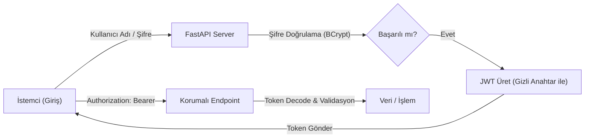

## 📌 Özet
Güvenlik ve Kimlik Doğrulama (JWT), modern web API'larının güvenliğini sağlamak için kullanılan en temel standartlardan biridir. FastAPI, OAuth2 protokolünü ve JSON Web Token (JWT) akışlarını yerleşik bağımlılık enjeksiyonu (dependency injection) sistemiyle entegre ederek geliştiricilere esnek ve güvenli bir yapı sunar. Kullanıcı şifrelerinin hash'lenmesi, erişim jetonlarının (access tokens) üretilmesi ve korunması gereken uç noktalara (endpoints) sadece yetkili kullanıcıların erişebilmesi, bu mimarinin temel direklerini oluşturur.

---

## 🧠 Detay

### 🔐 JWT Kimlik Doğrulama Akışı



### 1. OAuth2 ve Password Flow
FastAPI, `OAuth2PasswordBearer` sınıfı ile istemcinin token'ı "Authorization" başlığında (header) göndermesini bekleyen bir standart tanımlar. Bu yapı, Swagger UI ile entegre çalışarak dokümantasyon üzerinden test yapmayı kolaylaştırır.

### 2. JWT (JSON Web Token) Yapısı
JWT üç bölümden oluşur:
- **Header:** Algoritma ve tip bilgisi.
- **Payload:** Kullanıcı bilgileri (sub, exp vb.).
- **Signature:** Token'ın değiştirilmediğini garanti eden imza.

### 3. Şifreleme ve Güvenlik En İyi Uygulamaları
- **Hashing:** Şifreler asla düz metin olarak saklanmamalıdır. `passlib` kütüphanesi ile **BCrypt** algoritması kullanılmalıdır.
- **Secret Key:** JWT imzalamak için kullanılan anahtar çok güçlü olmalı ve `.env` dosyalarında saklanmalıdır.
- **Expiration:** Token'ların süresi (expire time) kısa tutulmalı (örn. 30 dakika), gerekirse "Refresh Token" yapısı kurulmalıdır.

### 🛠️ Kod Örneği: Bağımlılık Enjeksiyonu ile Kullanıcı Doğrulama
```python
from fastapi import Depends, HTTPException, status
from fastapi.security import OAuth2PasswordBearer
from jose import JWTError, jwt

oauth2_scheme = OAuth2PasswordBearer(tokenUrl="token")

async def get_current_user(token: str = Depends(oauth2_scheme)):
    credentials_exception = HTTPException(
        status_code=status.HTTP_401_UNAUTHORIZED,
        detail="Kimlik doğrulanamadı",
        headers={"WWW-Authenticate": "Bearer"},
    )
    try:
        payload = jwt.decode(token, SECRET_KEY, algorithms=[ALGORITHM])
        username: str = payload.get("sub")
        if username is None:
            raise credentials_exception
    except JWTError:
        raise credentials_exception
    
    return username

@app.get("/ozel-veri")
async def read_private_data(current_user: str = Depends(get_current_user)):
    return {"mesaj": f"Merhaba {current_user}, bu özel bir veridir."}
```

---

## 💡 Bağlantılar
- [[API - FastAPI Giriş]]
- [[API - FastAPI Middleware ve Güvenlik]]
- [[Cloud - Bulut Güvenliği ve IAM]]

## ❓ Sorular / Anlamadıklarım
- JWT ile Session tabanlı kimlik doğrulama arasındaki temel farklar nelerdir?
- CSRF saldırılarına karşı JWT nasıl korunur?

## 🔗 Kaynaklar
- FastAPI Security Tutorial: https://fastapi.tiangolo.com/tutorial/security/
- PyJWT / Jose Documentation
