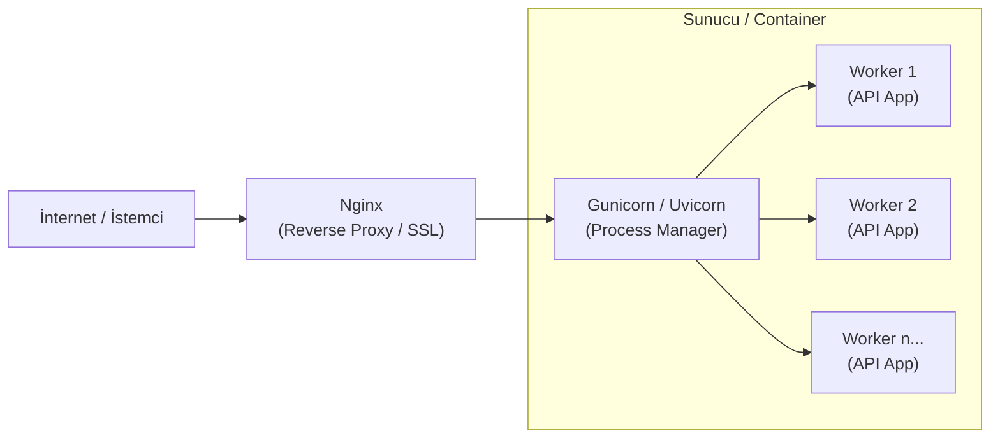

## 📌 Özet
Bir Python API'ını geliştirme aşamasından üretim (production) ortamına taşımak; sadece kodu çalıştırmanın ötesinde güvenlik, ölçeklenebilirlik ve performans optimizasyonlarını gerektirir. Python'un tek iş parçacıklı (single-threaded) yapısını aşmak için Gunicorn (WSGI) veya Uvicorn (ASGI) gibi sunucu yöneticileri (process managers) kullanılır. Bu sunucuların önüne eklenen Nginx gibi bir Reverse Proxy ise yük dengeleme, SSL yönetimi ve statik dosya sunumu gibi kritik görevleri üstlenir. Bu çok katmanlı mimari, API'ın yüksek trafik altında kararlı çalışmasını sağlar.

---

## 🧠 Detay

### 🗺️ Üretim Ortamı API Mimarisi



### 1. Web Sunucusu Arayüzleri: WSGI vs ASGI
- **WSGI (Gunicorn):** Flask ve Django gibi senkron çerçeveler için standarttır.
- **ASGI (Uvicorn):** FastAPI gibi asenkron çerçeveler için tasarlanmıştır. Yüksek eşzamanlılık (concurrency) sağlar.

### 2. Gunicorn ve Uvicorn Birlikteliği ⭐
Üretim ortamında genellikle Gunicorn, Uvicorn işçilerini (workers) yönetmek için bir "orkestra şefi" olarak kullanılır:
```bash
gunicorn -w 4 -k uvicorn.workers.UvicornWorker main:app
```
- `-w 4`: 4 adet işçi süreci başlatır (Genellikle: `2 * CPU_Çekirdek_Sayısı + 1`).
- `-k uvicorn.workers.UvicornWorker`: FastAPI'yi çalıştırmak için gerekli asenkron işçiyi belirtir.

### 3. Nginx: Neden Gerekli?
Gunicorn/Uvicorn doğrudan internete açılmak yerine bir Nginx arkasına saklanmalıdır çünkü:
- **Güvenlik:** Kötü niyetli isteklere karşı tampon görevi görür.
- **SSL/TLS:** HTTPS sertifikalarını yönetmek Python tarafında zordur, Nginx'te kolaydır.
- **Yük Dengeleme:** Gelen trafiği birden fazla uygulama sunucusuna dağıtır.
- **Buffering:** Yavaş istemcilerin (Slow clients) uygulama sunucusunu meşgul etmesini önler.

### 4. Dockerize Edilmiş Deployment
Modern dünyada bu yapı genellikle `docker-compose` ile ayağa kaldırılır:
```yaml
services:
  api:
    build: .
    command: gunicorn -w 4 -k uvicorn.workers.UvicornWorker main:app
  nginx:
    image: nginx:latest
    ports:
      - "80:80"
    depends_on:
      - api
```

---

## 💡 Bağlantılar
- [[API - Docker ile Deploy]]
- [[Docker - Giriş ve Temel Kavramlar]]
- [[MLOps - Giriş ve Temel Kavramlar]]

## ❓ Sorular / Anlamadıklarım
- Kubernetes üzerinde çalışırken Nginx hala gerekli midir? (Ingress Controller kavramı).
- Worker sayısı arttıkça bellek (RAM) tüketimi nasıl hesaplanır?

## 🔗 Kaynaklar
- [FastAPI Deployment Documentation](https://fastapi.tiangolo.com/deployment/)
- [Gunicorn Documentation](https://docs.gunicorn.org/en/stable/run.html)
