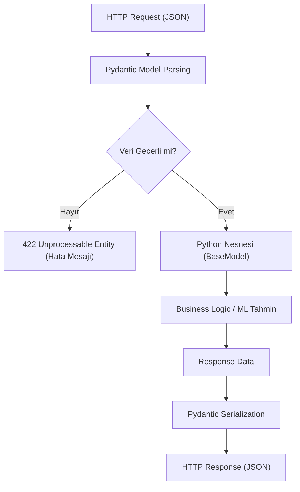

## 📌 Özet
Pydantic, Python tip ipuçlarını (type hints) kullanarak veri doğrulama ve ayarların yönetimini sağlayan, FastAPI'nin temelini oluşturan güçlü bir kütüphanedir. Gelen HTTP isteklerini (Request) tanımlanan şemalara göre otomatik olarak doğrular, hatalı veri girişlerinde anlamlı hata mesajları döner ve veriyi Python nesnelerine dönüştürür. Aynı zamanda API yanıtlarının (Response) yapısını belirleyerek sadece istenen verilerin dış dünyaya açılmasını sağlar. Bu süreç, veri güvenliğini artırırken geliştiricilere tip güvenliği ve otomatik dökümantasyon (Swagger) avantajı sağlar.

## 🧠 Detay



### Temel Pydantic Modeli
```python
from pydantic import BaseModel, Field, validator
from typing import Optional, List
from datetime import datetime

class MusteriGiris(BaseModel):
    ad: str
    soyad: str
    yas: int
    email: str
    sehir: Optional[str] = None
    aktif: bool = True

class MusteriCikis(BaseModel):
    id: int
    ad: str
    soyad: str
    email: str
    olusturma_tarih: datetime

    class Config:
        from_attributes = True  # ORM ile uyumluluk
```

### Field ile Doğrulama
```python
from pydantic import BaseModel, Field

class TahminGiris(BaseModel):
    yas: int = Field(..., ge=0, le=120, description="Yaş (0-120)")
    gelir: float = Field(..., gt=0, description="Aylık gelir (TL)")
    egitim: str = Field(..., min_length=2, max_length=50)
    sehir: str = Field("İstanbul", description="Şehir")
    kredi_skoru: int = Field(default=500, ge=300, le=850)

class TahminCikis(BaseModel):
    tahmin: int = Field(..., description="0=Ret, 1=Onay")
    olasilik: float = Field(..., ge=0, le=1)
    karar: str
    model_versiyonu: str = "v1.0"
```

### Custom Validator
```python
from pydantic import BaseModel, validator, root_validator
import re

class KullaniciKayit(BaseModel):
    kullanici_adi: str
    email: str
    sifre: str
    sifre_tekrar: str

    @validator("email")
    def email_dogrula(cls, v):
        pattern = r"[^@]+@[^@]+\.[^@]+"
        if not re.match(pattern, v):
            raise ValueError("Geçersiz email formatı")
        return v.lower()

    @validator("kullanici_adi")
    def kullanici_adi_dogrula(cls, v):
        if not v.isalnum():
            raise ValueError("Sadece harf ve rakam kullanılabilir")
        return v

    @root_validator
    def sifre_eslesme(cls, values):
        sifre = values.get("sifre")
        tekrar = values.get("sifre_tekrar")
        if sifre != tekrar:
            raise ValueError("Şifreler eşleşmiyor")
        return values
```

### FastAPI ile Kullanım
```python
from fastapi import FastAPI
from pydantic import BaseModel

app = FastAPI()

class TahminGiris(BaseModel):
    yas: int
    gelir: float
    egitim: str

class TahminCikis(BaseModel):
    tahmin: int
    olasilik: float
    karar: str

@app.post("/tahmin", response_model=TahminCikis)
def tahmin_yap(giris: TahminGiris):
    # model.predict burada
    return TahminCikis(
        tahmin=1,
        olasilik=0.85,
        karar="Onaylandı"
    )
```

### Nested Model ve List
```python
class Adres(BaseModel):
    sokak: str
    sehir: str
    posta_kodu: str

class Musteri(BaseModel):
    ad: str
    adres: Adres                    # nested
    telefon_listesi: List[str] = [] # list

class SiparisBatch(BaseModel):
    siparisler: List[TahminGiris]   # batch tahmin için
    model_adi: str = "varsayilan"
```

## 💡 Bağlantılar
- [[API - FastAPI Giriş]]
- [[API - ML Modeli Servis Etmek]]
- [[API - FastAPI Hata Yönetimi]]

## ❓ Sorular / Anlamadıklarım
- `validator` ile `field_validator` (v2) arasındaki fark?
- response_model ile gerçek return tipi çelişirse ne olur?

## 🔗 Kaynaklar
- https://docs.pydantic.dev/latest/
