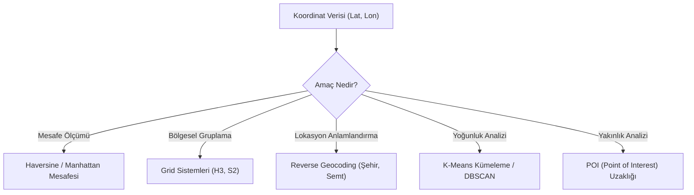

## 📌 Özet
Coğrafi veriler (enlem, boylam) ham haliyle model tarafından zor işlenir. Bu verileri mesafelere, bölgelere (grid sistemleri) veya anlamlı adres bileşenlerine dönüştürmek model performansını ciddi oranda artırır.

---

## 🧠 Detay

### 🗺️ Coğrafi FE Yol Haritası



### 1. Mesafe Hesaplamaları

#### Haversine Mesafesi (Küre Üzerindeki Kuş Uçuşu)

```python
import numpy as np

def haversine_vectorized(lat1, lon1, lat2, lon2):
    """Vektörize edilmiş Haversine mesafe hesaplaması (km)"""
    R = 6371  # Dünyanın yarıçapı
    phi1, phi2 = np.radians(lat1), np.radians(lat2)
    dphi = np.radians(lat2 - lat1)
    dlambda = np.radians(lon2 - lon1)
    
    a = np.sin(dphi/2)**2 + np.cos(phi1)*np.cos(phi2)*np.sin(dlambda/2)**2
    c = 2 * np.arctan2(np.sqrt(a), np.sqrt(1-a))
    return R * c

# Örnek: Merkeze uzaklık
df['merkeze_uzaklik'] = haversine_vectorized(df['lat'], df['lon'], 41.0082, 28.9784)
```

### 2. Grid Sistemleri (H3 & S2) ⭐
Koordinatları sabit alanlı altıgenlere (H3) veya karelere (S2) böler. Bu, yüksek kardinaliteyi yönetmek ve komşuluk ilişkilerini kurmak için en modern yöntemdir.

#### Uber H3 Örneği

```python
import h3

def lat_lon_to_h3(row, resolution=7):
    return h3.geo_to_h3(row['lat'], row['lon'], resolution)

# Koordinatı altıgen ID'ye dönüştür
df['h3_cell'] = df.apply(lat_lon_to_h3, axis=1)

# Altıgen bazlı agregasyon
h3_counts = df.groupby('h3_cell').size().to_dict()
df['bolge_yogunlugu'] = df['h3_cell'].map(h3_counts)
```

### 3. Kümeleme (Clustering)
Benzer lokasyonları otomatik olarak gruplandırmak için kullanılır.

```python
from sklearn.cluster import KMeans

# Lokasyonları 20 bölgeye ayır
coords = df[['lat', 'lon']]
kmeans = KMeans(n_clusters=20, random_state=42)
df['lokasyon_cluster'] = kmeans.fit_predict(coords)
```

### 4. POI (Point of Interest) Özellikleri
Belirli noktalara (AVM, Okul, Durak) olan yakınlıklar.

```python
# Her satır için en yakın durağa mesafe (örnek mantık)
from sklearn.neighbors import BallTree

tree = BallTree(np.radians(durak_coords), metric='haversine')
dist, ind = tree.query(np.radians(df[['lat', 'lon']]), k=1)
df['en_yakin_durak_mesafe'] = dist * 6371
```

### 5. Reverse Geocoding
Koordinattan adres bilgisi çıkarma.

```python
from geopy.geocoders import Nominatim

geolocator = Nominatim(user_agent="geo_app")
location = geolocator.reverse("41.0082, 28.9784")
# → İstanbul, Fatih, ...
```

---

## 💡 Bağlantılar
- [[FE - Özellik Türetme]]
- [[FE - Yüksek Kardinaliteli Kategorik Değişkenler]]
- [[ML - Kümeleme Algoritmaları]]

## ❓ Sorular / Anlamadıklarım
- H3 çözünürlüğü (resolution) seçimi modele nasıl etki eder?
- Koordinat verisinde aykırı değer tespiti nasıl yapılır?

## 🔗 Kaynaklar
- [Uber H3 Documentation](https://h3geo.org/)
- [Geopy Documentation](https://geopy.readthedocs.io/)
