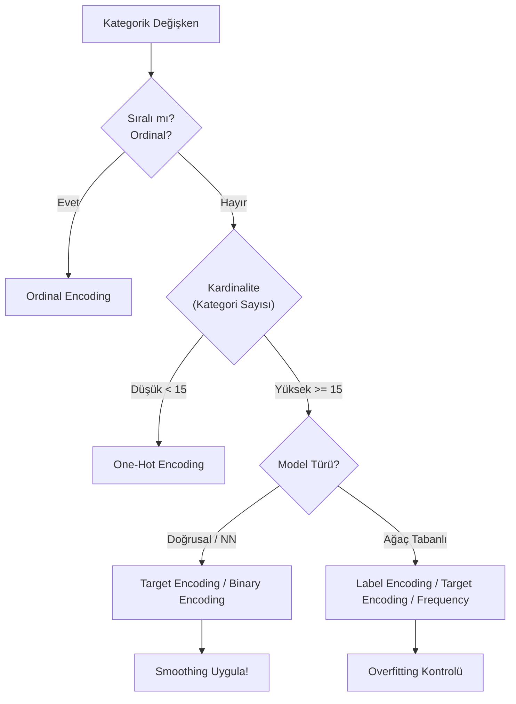

## 📌 Özet

Makine öğrenmesi modelleri sayısal veri bekler. Kategorik değişkenleri sayısala dönüştürme işlemine encoding denir. Yanlış encoding seçimi modeli olumsuz etkiler.

---

## 🧠 Detay

### 🗺️ Encoding Karar Ağacı (Yol Haritası)



---

### Encoding Seçim Rehberi

```
Kategorik Değişken
├── Ordinal (sıralı) → Ordinal Encoding
└── Nominal (sırasız)
    ├── Kardinalite düşük (< 10-15 kategori)
    │   └── One-Hot Encoding
    └── Kardinalite yüksek (≥ 15 kategori)
        ├── Sınıflandırma → Target Encoding
        ├── Ağaç modeli → Label Encoding
        └── NLP benzeri → Binary / Hashing
```

---

### 1. Label Encoding

Her kategoriye 0'dan başlayan tam sayı atar.

```python
from sklearn.preprocessing import LabelEncoder

le = LabelEncoder()
df['renk_enc'] = le.fit_transform(df['renk'])
# Kırmızı→0, Mavi→1, Yeşil→2

# Geri çevir
le.inverse_transform([0, 2])
```

⚠️ **Uyarı**: Ordinal olmayan değişkende sıra ilişkisi yaratır.
✅ **Doğru kullanım**: Ağaç tabanlı modeller (karar ağacı, RF, XGBoost) veya ordinal değişkenler.

---

### 2. One-Hot Encoding (OHE)

Her kategori için 0/1 ikili sütun oluşturur.

```python
# pandas
df_ohe = pd.get_dummies(df, columns=['renk'], drop_first=True)

# sklearn
from sklearn.preprocessing import OneHotEncoder

ohe = OneHotEncoder(handle_unknown='ignore', sparse_output=False, drop='first')
ohe.fit(X_train[['renk']])
encoded = ohe.transform(X_test[['renk']])
encoded_df = pd.DataFrame(encoded, columns=ohe.get_feature_names_out())
```

**drop='first'** → Dummy değişken tuzağını önler (k-1 sütun).

✅ **Doğru kullanım**: Düşük kardinaliteli nominal değişkenler, doğrusal modeller.
⚠️ **Sorun**: Yüksek kardinalitede boyut patlaması.

---

### 3. Ordinal Encoding

Sıralı kategorilere anlamlı sayılar atar.

```python
from sklearn.preprocessing import OrdinalEncoder

categories = [['İlkokul', 'Ortaokul', 'Lise', 'Üniversite', 'Yükseklisans']]
enc = OrdinalEncoder(categories=categories)
df['egitim_enc'] = enc.fit_transform(df[['egitim']])
# İlkokul→0, Ortaokul→1, ..., Yükseklisans→4

# Manuel
mapping = {'Düşük': 0, 'Orta': 1, 'Yüksek': 2}
df['oncelik_enc'] = df['oncelik'].map(mapping)
```

---

### 4. Target Encoding (Mean Encoding)

Her kategoriye hedef değişkenin ortalamasını atar.

```python
# Manuel
target_mean = df.groupby('sehir')['satis'].mean()
df['sehir_enc'] = df['sehir'].map(target_mean)

# category_encoders kütüphanesi (önerilen — smoothing var)
import category_encoders as ce

enc = ce.TargetEncoder(cols=['sehir'], smoothing=1.0)
enc.fit(X_train, y_train)
X_train_enc = enc.transform(X_train)
X_test_enc  = enc.transform(X_test)
```

**Smoothing**: Küçük gruplarda genel ortalamaya doğru çeker → overfit önler.

⚠️ **Kritik**: Sadece train üzerinde fit! Test sızıntısına dikkat.
✅ **Doğru kullanım**: Yüksek kardinaliteli değişkenler, ağaç modelleri.

---

### 5. Binary Encoding

Kategori sayısına göre log₂ bit kullanır. OHE'den daha az sütun.

```python
import category_encoders as ce

enc = ce.BinaryEncoder(cols=['sehir'])
df_enc = enc.fit_transform(df)
# 100 şehir → 7 binary sütun (2^7=128)
```

---

### 6. Frequency / Count Encoding

Kategorinin veri setindeki frekansını kullanır.

```python
freq_map = df['sehir'].value_counts(normalize=True)
df['sehir_freq'] = df['sehir'].map(freq_map)

# Count (frekans sayısı)
count_map = df['sehir'].value_counts()
df['sehir_count'] = df['sehir'].map(count_map)
```

✅ Kardinalite bilgisini taşır, boyut artışı yok.

---

### 7. Hashing Encoding

Yüksek kardinalitede hafıza dostu.

```python
import category_encoders as ce

enc = ce.HashingEncoder(cols=['urun_kodu'], n_components=8)
df_enc = enc.fit_transform(df)
```

⚠️ Hash çakışması (collision) olabilir → bilgi kaybı.

---

### 8. Leave-One-Out Encoding

Target encoding'in overfitting'e daha dayanıklı versiyonu.

```python
enc = ce.LeaveOneOutEncoder(cols=['sehir'])
enc.fit(X_train, y_train)
```

---

### 9. Weight of Evidence (WoE) — Binary Sınıflandırma

```
WoE = ln(Dağılım_Pozitif / Dağılım_Negatif)
```

```python
enc = ce.WOEEncoder(cols=['sehir'])
enc.fit(X_train, y_train)
```

Kredi skorlama, finansal modellerde yaygın.

---

### Karşılaştırma Tablosu

| Yöntem | Kardinalite | Model | Overfitting Riski |
|---|---|---|---|
| Label Encoding | Her türlü | Ağaç | Düşük |
| One-Hot | Düşük (<15) | Hepsi | Yok |
| Ordinal | Sıralı | Hepsi | Yok |
| Target | Yüksek | Hepsi | Yüksek ⚠️ |
| Binary | Orta-Yüksek | Hepsi | Düşük |
| Frequency | Her türlü | Hepsi | Düşük |
| Hashing | Çok yüksek | Hepsi | Orta |

---

### Yeni Kategoriler (Unknown) Sorunu

```python
# Test setinde görülmemiş kategoriler
ohe = OneHotEncoder(handle_unknown='ignore')   # Sıfır vektör
ohe = OneHotEncoder(handle_unknown='infrequent_if_exist')  # Nadir grubu

# Target encoding — default ortalama
enc = ce.TargetEncoder(handle_unknown='value', handle_missing='value')
```

---

## 💡 Bağlantılar
- [[FE - Giriş ve Genel Bakış]]
- [[FE - Özellik Türetme]]
- [[FE - Yüksek Kardinaliteli Kategorik Değişkenler]]
- [[ML - Veri Ön İşleme Pipeline]]

## ❓ Sorular / Anlamadıklarım


## 🔗 Kaynaklar
- category_encoders Documentation
- Kaggle: Categorical Variables (free course)
