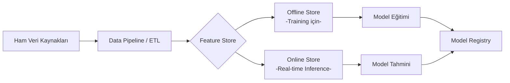

## 📌 Özet
Feature Store, makine öğrenmesi modelleri için özelliklerin (features) merkezi olarak depolandığı, yönetildiği ve servis edildiği bir sistemdir. "Training-serving skew" (eğitim-sunum sapması) sorununu çözer ve özelliklerin projeler arası tekrar kullanımını sağlar.

---

## 🧠 Detay

### 🗺️ Feature Store Çalışma Yapısı



### 1. Temel Bileşenler

| Bileşen | Tanım | Örnek Araç |
|---|---|---|
| **Offline Store** | Geçmiş verilerin (terabaytlarca) depolandığı yer. Model eğitimi için batch veri sağlar. | S3, BigQuery, Snowflake |
| **Online Store** | Düşük gecikme (low latency) ile en güncel özellik değerlerini sunan yer. | Redis, Cassandra, DynamoDB |
| **Feature Registry** | Özelliklerin tanımlarının, metadata'larının ve versiyonlarının tutulduğu katalog. | Feast Registry |
| **Ingestion Engine** | Veriyi ham halden özellik haline getirip depolara yazan mekanizma. | Spark, Flink, Python |

### 2. Çözdüğü Temel Sorunlar

- **Training-Serving Skew:** Model eğitilirken kullanılan Python kodu ile canlı sistemdeki kodun farklı olması. Feature Store ile her iki taraf da *aynı* özellik tanımını kullanır.
- **Feature Reuse:** Farklı veri bilimcilerin aynı "müşteri_yıllık_harcama" özelliğini tekrar tekrar hesaplaması yerine ortak havuzdan çekmesi.
- **Point-in-Time Correctness:** Geçmiş bir tarihteki model eğitimi için verinin o tarihteki halini (zaman yolculuğu) hatasız çekebilme.

### 3. Popüler Feature Store Araçları

- **Feast:** En popüler açık kaynaklı Feature Store (Python tabanlı).
- **Hopsworks:** Eksiksiz bir MLOps platformu sunan açık kaynaklı çözüm.
- **Tecton:** Kurumsal seviyede, yönetilen (managed) bir hizmet.
- **SageMaker Feature Store:** AWS ekosistemi içinde yerleşik çözüm.

### 4. Örnek Senaryo (Feast ile)

```python
from feast import FeatureView, Entity, Field
from feast.types import Int64, Float32

# 1. Varlık (Entity) Tanımla
musteri = Entity(name="musteri_id", join_keys=["musteri_id"])

# 2. Özellik Görünümü (Feature View)
musteri_stats_view = FeatureView(
    name="musteri_stats",
    entities=[musteri],
    schema=[
        Field(name="aylik_harcama", dtype=Float32),
        Field(name="toplam_siparis", dtype=Int64),
    ],
    source=source_path,
    online=True
)
```

---

## 💡 Bağlantılar
- [[FE - Giriş ve Genel Bakış]]
- [[FE - Data Leakage ve Pipeline Doğruluğu]]
- [[MLOps - Giriş]]

## ❓ Sorular / Anlamadıklarım
- Feature Store kullanmak küçük projeler için "over-engineering" midir?
- Batch vs Streaming veri girişi (ingestion) arasındaki farklar nelerdir?

## 🔗 Kaynaklar
- [Feast Documentation](https://docs.feast.dev/)
- [What is a Feature Store? (Tecton)](https://www.tecton.ai/blog/what-is-a-feature-store/)
