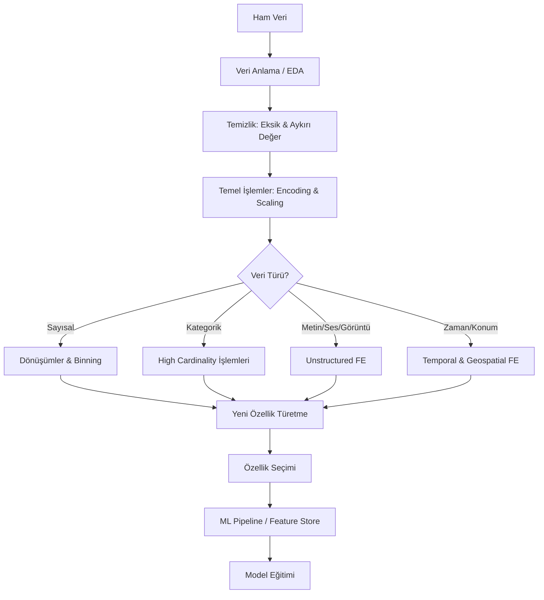

## 📌 Özet

Feature Engineering (Özellik Mühendisliği), ham veriden makine öğrenmesi modellerine uygun, anlamlı özellikler üretme sürecidir. "Garbage in, garbage out" — model kalitesi büyük ölçüde özelliklerin kalitesine bağlıdır.

---

## 🧠 Detay

### Neden Feature Engineering?

- Ham veri nadiren modele doğrudan verilebilir
- İyi özellikler basit modelleri güçlü kılar
- Kötü özellikler karmaşık modelleri bile çökertir
- Domain bilgisi + veri = güçlü özellikler

### 🗺️ Feature Engineering Ana Yol Haritası



### Feature Engineering Adımları

```
Ham Veri
   ↓
1. Veri Anlama (EDA)
   ↓
2. Eksik Veri İşleme
   ↓
3. Aykırı Değer İşleme
   ↓
4. Encoding (Kategorik → Sayısal)
   ↓
5. Ölçeklendirme / Normalizasyon
   ↓
6. Yeni Özellik Türetme
   ↓
7. Özellik Seçimi
   ↓
Model
```

### Özellik Türleri

| Tür | Örnek | İşlem |
|---|---|---|
| **Sayısal - Sürekli** | Yaş, Gelir, Sıcaklık | Ölçeklendirme, dönüşüm |
| **Sayısal - Kesikli** | Çocuk sayısı, Tıklama | Bağlama (binning) |
| **Kategorik - Nominal** | Şehir, Renk, Cinsiyet | One-Hot, Target Enc. |
| **Kategorik - Ordinal** | Eğitim, Memnuniyet | Label / Ordinal Enc. |
| **Metin** | Yorum, Açıklama | TF-IDF, Embedding |
| **Tarih/Zaman** | Sipariş tarihi | Ay, gün, hafta türetme |
| **Görüntü** | Fotoğraf | CNN özellikleri |
| **Coğrafi** | Koordinat | Mesafe, küme |

### Temel Kavramlar

- **Feature (Özellik)**: Modele verilen her bir giriş sütunu
- **Target (Hedef)**: Tahmin edilmek istenen değişken
- **Feature Space**: Tüm özelliklerin oluşturduğu uzay
- **Dimensionality**: Özellik sayısı
- **Curse of Dimensionality**: Çok fazla özellik → model bozulur
- **Multicollinearity**: Özellikler arası yüksek korelasyon

### Scikit-learn Pipeline Yapısı

```python
from sklearn.pipeline import Pipeline
from sklearn.compose import ColumnTransformer
from sklearn.preprocessing import StandardScaler, OneHotEncoder
from sklearn.impute import SimpleImputer

# Sayısal ve kategorik sütunlar
num_cols = ['yas', 'gelir', 'yas_kare']
cat_cols = ['sehir', 'meslek']

# Her tip için dönüştürücü
num_transformer = Pipeline([
    ('imputer', SimpleImputer(strategy='median')),
    ('scaler', StandardScaler())
])

cat_transformer = Pipeline([
    ('imputer', SimpleImputer(strategy='most_frequent')),
    ('onehot', OneHotEncoder(handle_unknown='ignore'))
])

# Birleştir
preprocessor = ColumnTransformer([
    ('num', num_transformer, num_cols),
    ('cat', cat_transformer, cat_cols)
])

# Modelle birleştir
full_pipeline = Pipeline([
    ('preprocessor', preprocessor),
    ('model', RandomForestClassifier())
])
```

### Feature Engineering Kontrol Listesi

- [ ] Eksik değerler var mı? Nasıl doldurulacak?
- [ ] Aykırı değerler var mı? Sınırlandırılacak mı?
- [ ] Kategorik değişkenler encode edildi mi?
- [ ] Sayısal değişkenler ölçeklendirildi mi?
- [ ] Tarih kolonları parçalandı mı?
- [ ] Etkileşim özellikleri oluşturuldu mu?
- [ ] Veri sızıntısı (data leakage) kontrolü yapıldı mı?
- [ ] Pipeline fit() sadece train'de çağrıldı mı?

---

## 💡 Bağlantılar
- [[FE - Eksik Veri İşleme]]
- [[FE - Aykırı Değer İşleme]]
- [[FE - Encoding Yöntemleri]]
- [[FE - Ölçeklendirme ve Normalizasyon]]
- [[FE - Özellik Türetme]]
- [[FE - Coğrafi Özellik Mühendisliği]]
- [[FE - Ses Özellikleri]]
- [[FE - Feature Store ve MLOps]]
- [[ML - Veri Ön İşleme Pipeline]]

## ❓ Sorular / Anlamadıklarım


## 🔗 Kaynaklar
- Feature Engineering for Machine Learning (Alice Zheng)
- Kaggle Feature Engineering Course (free)
