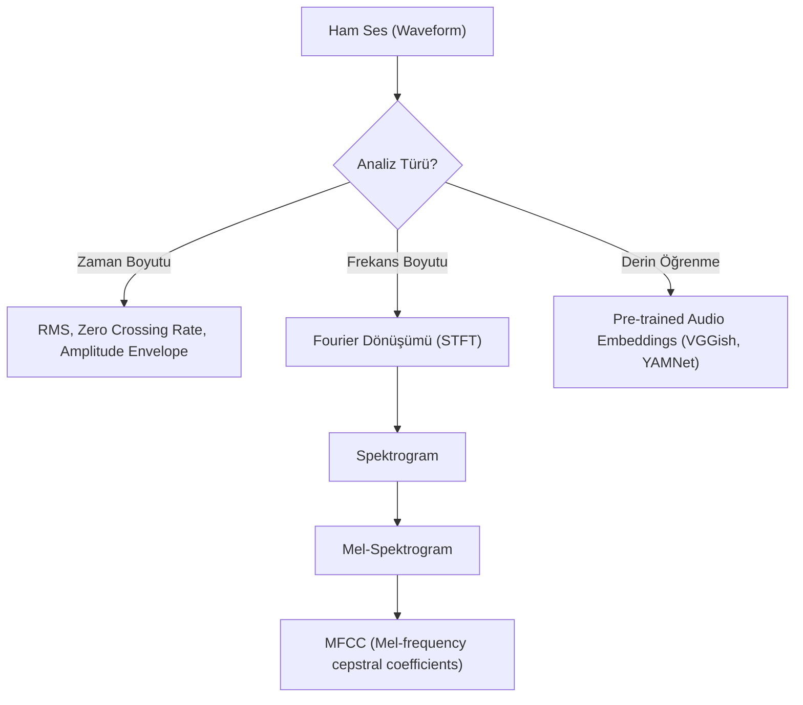

## 📌 Özet
Ses verileri, zaman içindeki basınç değişimlerini temsil eden dalga formlarıdır. Ham ses verisinden anlamlı özellikler çıkarmak için zaman domain'inden (time domain) frekans domain'ine (frequency domain) geçiş yapılır.

---

## 🧠 Detay

### 🗺️ Ses Özellikleri Çıkarım Akışı



### 1. Zaman Domain Özellikleri (Time-Domain)

```python
import librosa
import numpy as np

# Ses dosyasını yükle
y, sr = librosa.load("ses_dosyası.wav")

# Zero Crossing Rate (Sıfırı geçiş oranı) - Perde/Gürültü tespiti
zcr = librosa.feature.zero_crossing_rate(y)

# RMS (Enerji/Ses yüksekliği)
rms = librosa.feature.rms(y=y)
```

### 2. Frekans Domain Özellikleri (Frequency-Domain) ⭐

#### MFCC (Mel-frequency cepstral coefficients)
İnsan kulağının sesi algılama biçimini taklit eden, ses tanıma sistemlerinde en çok kullanılan özellik grubudur.

```python
# MFCC çıkarımı
mfccs = librosa.feature.mfcc(y=y, sr=sr, n_mfcc=13)
# Genellikle ilk 13-20 katsayı kullanılır

# MFCC İstatistikleri (Özellik vektörüne dönüştürme)
mfcc_mean = np.mean(mfccs, axis=1)
mfcc_std = np.std(mfccs, axis=1)
```

#### Spektrogram ve Mel-Spektrogram
Sesin frekans içeriğinin zaman içindeki değişimini gösteren görsel/matris temsilidir.

```python
# Mel-Spektrogram
mel_spec = librosa.feature.melspectrogram(y=y, sr=sr)
# Logaritmik ölçek (insan kulağına daha uygun)
mel_spec_db = librosa.power_to_db(mel_spec, ref=np.max)
```

### 3. Spektral Özellikler

- **Spectral Centroid:** Sesin "parlaklığını" (enerji merkezini) temsil eder.
- **Spectral Rolloff:** Toplam spektral enerjinin belirli bir yüzdesinin altında kaldığı frekanstır.
- **Chroma Features:** Müziğin armonik ve melodik içeriğini (12 nota üzerinden) temsil eder.

```python
# Spectral Centroid
centroid = librosa.feature.spectral_centroid(y=y, sr=sr)

# Chroma STFT
chroma = librosa.feature.chroma_stft(y=y, sr=sr)
```

### 4. Ses Verisi İçin Veri Artırma (Augmentation)

Modelin dayanıklılığını artırmak için ham sese müdahale edilir:
- **Noise Injection:** Beyaz gürültü ekleme.
- **Shifting:** Sesi zaman ekseninde kaydırma.
- **Pitch Shifting:** Sesin perdesini değiştirme.
- **Time Stretching:** Sesi hızlandırma veya yavaşlatma.

---

## 💡 Bağlantılar
- [[FE - Giriş ve Genel Bakış]]
- [[FE - Görüntü Özellikleri]]
- [[ML - Sinir Ağları Temel]]

## ❓ Sorular / Anlamadıklarım
- Örnekleme hızı (sampling rate - sr) neden 22050 Hz olarak standart kabul edilir?
- STFT pencere boyutu (n_fft) çözünürlüğü nasıl etkiler?

## 🔗 Kaynaklar
- [Librosa Documentation](https://librosa.org/doc/latest/index.html)
- [A Soft Introduction to Audio Processing](https://towardsdatascience.com/a-soft-introduction-to-audio-classification-with-deep-learning-7023363364f)
