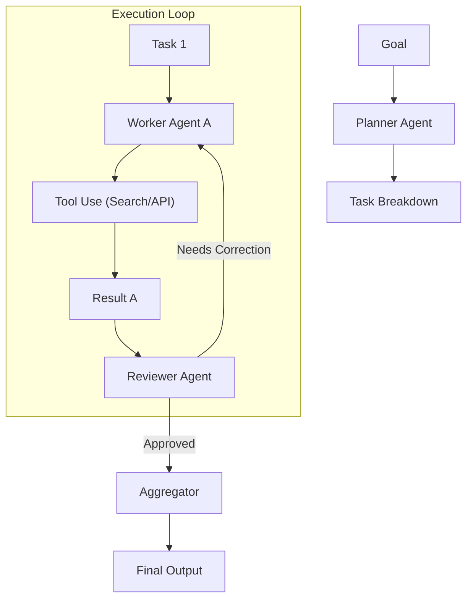

## 📌 Özet
Agentic Workflow (Ajan Temelli İş Akışı), LLM'lerin sadece metin üretmekle kalmayıp, belirli bir hedefi gerçekleştirmek için otonom kararlar alabildiği, araçları kullanabildiği ve hata yaptıklarında kendilerini düzeltebildiği (reasoning & acting) sistemlerdir. Bu yaklaşım, karmaşık görevleri daha küçük alt görevlere bölerek planlama (planning) ve yürütme (execution) süreçlerini birbirinden ayırır. Multi-agent sistemler ise farklı uzmanlık alanlarına sahip birden fazla ajanın birbiriyle işbirliği yaparak (collaboration) veya birbirini denetleyerek (oversight) daha yüksek başarı oranlarına ulaşmasını sağlar. Bu notta, ajan mimarileri, araç çağırma (tool calling) mekanizmaları ve modern multi-agent framework'leri incelenmektedir.

## 🧠 Detay



### 1. Ajan Bileşenleri
Andrew Ng ve diğer uzmanların tanımladığı modern ajan yapısı şu dört sütuna dayanır:
1.  **Reflection (Yansıma):** Modelin kendi çıktısını kontrol etmesi ve hataları düzeltmesi.
2.  **Tool Use (Araç Kullanımı):** Modelin harici dünyayla (hesap makinesi, web arama, SQL sorgulama) etkileşime girmesi.
3.  **Planning (Planlama):** Karmaşık bir isteği adım adım bir plana dönüştürme.
4.  **Multi-agent Collaboration:** Farklı rollerdeki ajanların bir ekip gibi çalışması.

### 2. Multi-agent Framework'leri
*   **LangGraph (LangChain):** Ajan akışlarını bir yönlü (directed) veya döngüsel (cyclic) grafik olarak tanımlar. State (durum) yönetimi çok güçlüdür.
*   **CrewAI:** Görev (Task) ve Rol (Role) tabanlı bir yapı sunar. Ajanlar arasındaki işbirliği süreçlerini (sequential, hierarchical) yönetir.
*   **AutoGen (Microsoft):** Ajanlar arasındaki diyaloğu (chat) temel alan bir framework'tür; karmaşık problem çözme süreçlerinde etkilidir.

### 3. Tool Calling (Function Calling)
Modern modeller (GPT-4o, Claude 3.5), bir soruyu yanıtlamak yerine, bir fonksiyonu çağırmaları gerektiğini anlar ve parametreleri JSON formatında üretir.

### 4. Kod Örneği: CrewAI ile Multi-agent Kurulumu (Conceptual)

```python
from crewai import Agent, Task, Crew


researcher = Agent(
    role="Araştırmacı",
    goal="Yapay zeka trendlerini analiz et",
    backstory="Sen bir teknoloji analistisin.",
    tools=[] # Arama araçları eklenebilir
)

writer = Agent(
    role="Yazar",
    goal="Araştırmayı bir makaleye dönüştür",
    backstory="Sen bir teknoloji yazarıydın.",
)


task1 = Task(description="2024 AI trendlerini bul.", agent=researcher)
task2 = Task(description="Bunu blog yazısı yap.", agent=writer)


crew = Crew(agents=[researcher, writer], tasks=[task1, task2])
result = crew.start()
print(result)
```

## 💡 Bağlantılar
*   [[LLM - Prompt Engineering Teknikleri]]
*   [[LLM - LangChain ve LlamaIndex ile Uygulama Geliştirme]]
*   [LangGraph: Multi-Agent Workflows](https://blog.langchain.dev/langgraph/)
