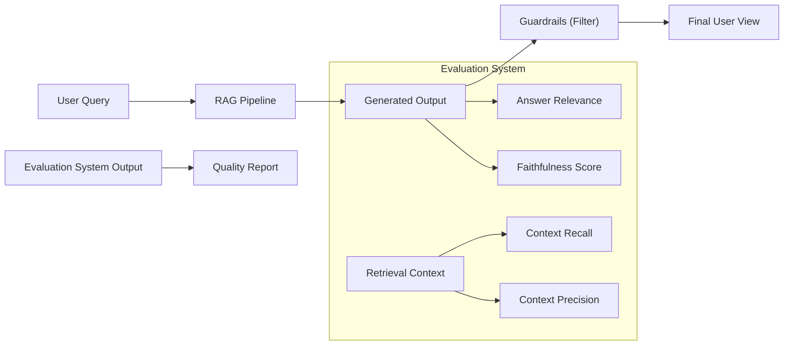

## 📌 Özet
LLM uygulamalarının başarısını ölçmek, çıktıların deterministik olmaması nedeniyle geleneksel yazılım testlerinden çok daha karmaşıktır. Değerlendirme (Evaluation) süreci, modelin yanıtlarının doğruluğunu, güvenliğini ve bağlamla uyumunu ölçmek için hem matematiksel metrikleri hem de "LLM-as-a-judge" (Hakem olarak LLM) yaklaşımını kullanır. Özellikle RAG sistemlerinde, erişilen bilginin kalitesi ve üretilen cevabın bu bilgiye sadık kalması (faithfulness) kritik öneme sahiptir. İzleme (Monitoring) aşaması ise modelin canlı ortamdaki performansını, maliyetini (token kullanımı) ve olası halüsinasyonlarını anlık olarak takip eder. Bu notta, RAGAS gibi modern değerlendirme çerçeveleri ve koruma kalkanı (guardrails) mekanizmaları teknik olarak incelenmektedir.

## 🧠 Detay



### 1. RAGAS Metrikleri (The RAG Triad)
RAG sistemlerini değerlendirmek için kullanılan standart metrikler:
*   **Faithfulness (Sadakat):** Yanıtın, sağlanan bağlamdan (context) ne kadar türetildiği. Halüsinasyon kontrolü yapar.
*   **Answer Relevance (Yanıt Uygunluğu):** Yanıtın kullanıcının sorusuna ne kadar doğrudan cevap verdiği.
*   **Context Precision (Bağlam Hassasiyeti):** Erişimde bulunan parçaların ne kadarının gerçekten soruyla ilgili olduğu.
*   **Context Recall (Bağlam Geri Çağırma):** Soruyu yanıtlamak için gereken tüm bilgilerin bağlamda mevcut olup olmadığı.

### 2. LLM-as-a-Judge
Güçlü bir modelin (örn. GPT-4o), daha küçük bir modelin veya bir pipeline'ın çıktısını belirli bir rubriğe göre puanlamasıdır. İnsan değerlendirmesine en yakın sonuçları verir ancak maliyetlidir.

### 3. İzleme ve Gözlemlenebilirlik (Observability)
Canlıdaki sistemler için takip edilmesi gerekenler:
*   **Token Usage:** Maliyet takibi.
*   **Latency:** Modelin yanıt verme hızı.
*   **Drift Detection:** Zamanla model performansının veya veri yapısının değişmesi.
*   **Traceability:** Bir yanıtın hangi prompt ve hangi context ile üretildiğinin LangSmith veya Arize Phoenix gibi araçlarla izlenmesi.

### 4. Kod Örneği: RAGAS ile Değerlendirme (Conceptual)

```python
from ragas import evaluate
from ragas.metrics import faithfulness, answer_relevancy
from datasets import Dataset


data_samples = {
    'question': ['Türkiye'nin başkenti neresidir?'],
    'answer': ['Ankara'dır.'],
    'contexts' : [['Ankara, Türkiye Cumhuriyeti'nin başkentidir.']],
    'ground_truth': ['Ankara']
}

dataset = Dataset.from_dict(data_samples)


score = evaluate(
    dataset,
    metrics=[faithfulness, answer_relevancy]
)

print(score.to_pandas())
```

### 5. Guardrails (Koruma Kalkanları)
*   **NeMo Guardrails:** NVIDIA tarafından geliştirilen, modelin belirli konular dışına çıkmasını veya zararlı içerik üretmesini engelleyen sistem.
*   **Llama Guard:** Meta tarafından yayınlanan, girdi ve çıktıların güvenliğini denetleyen sınıflandırıcı model.

## 💡 Bağlantılar
*   [[LLM - RAG (Retrieval Augmented Generation) Mimarisi]]
*   [RAGAS Documentation](https://docs.ragas.io/)
*   [DeepEval Framework](https://github.com/confident-ai/deepeval)
