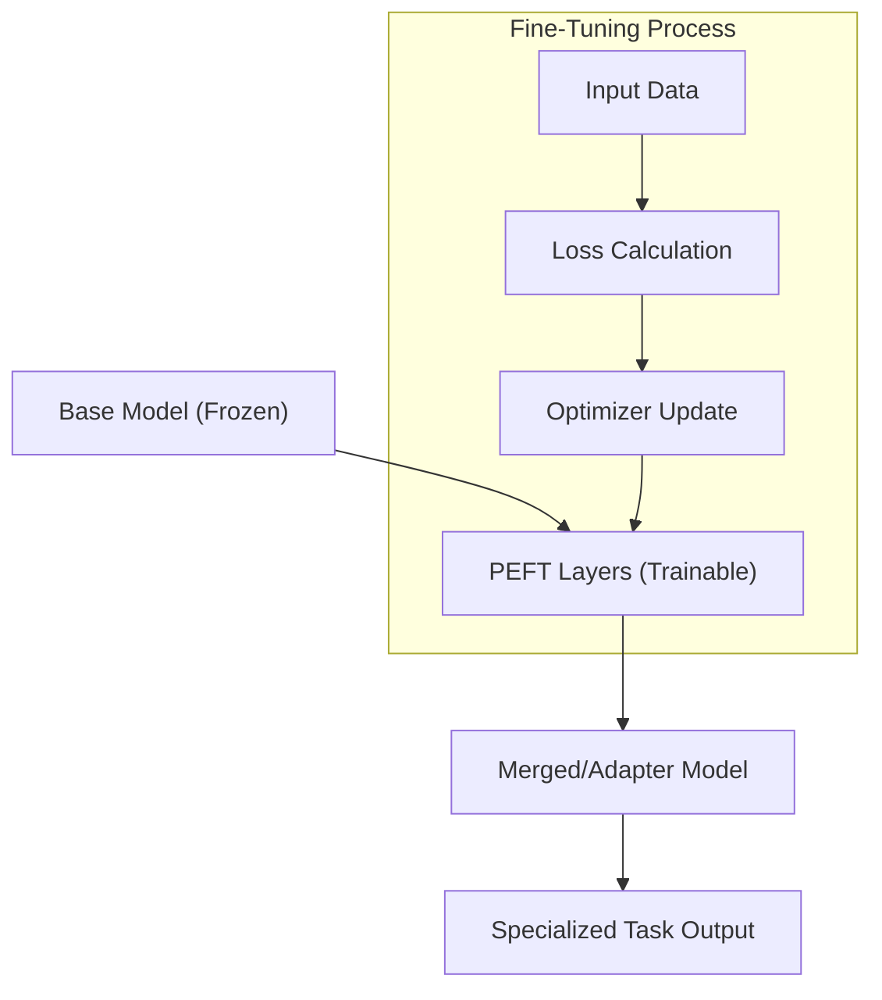

## 📌 Özet
Fine-tuning, önceden eğitilmiş (pre-trained) bir temel modelin (base model), belirli bir görev veya alan (domain) için özelleştirilmesi sürecidir. Bu süreç, modelin mevcut genel bilgilerini korurken, yeni verilerle stilini, formatını veya teknik bilgi derinliğini güncellemesini sağlar. Günümüzde tüm parametrelerin eğitilmesi yerine, bellek verimliliği sağlayan PEFT (Parameter-Efficient Fine-Tuning) teknikleri, özellikle LoRA ve QLoRA, yaygın olarak kullanılmaktadır. Ayrıca, modelin insan tercihlerine göre hizalanması (alignment) için RLHF ve DPO gibi gelişmiş yöntemler uygulanır. Bu notta, eğitim stratejileri ve donanım optimizasyonları teknik detaylarıyla ele alınmaktadır.

## 🧠 Detay



### 1. Fine-tuning Yöntemleri
*   **Full Fine-tuning:** Modelin tüm ağırlıklarının güncellendiği yöntemdir. Çok fazla GPU belleği (VRAM) ve zaman gerektirir.
*   **SFT (Supervised Fine-tuning):** Modelin girdi-çıktı çiftlerinden oluşan temiz bir veri setiyle eğitilmesi. Genellikle ilk adımdır.
*   **PEFT (Parameter-Efficient Fine-Tuning):** Sadece belirli bir grup parametrenin (genellikle %1'den az) eğitilmesi.
    *   **LoRA (Low-Rank Adaptation):** Model ağırlıklarına küçük, düşük dereceli matrisler ekler. Orijinal ağırlıklar dondurulur (frozen).
    *   **QLoRA:** LoRA'nın 4-bit kuantize edilmiş versiyonudur; devasa modellerin tüketici sınıfı GPU'larda eğitilmesini sağlar.

### 2. Hizalama (Alignment) Teknikleri
Modeli daha güvenli ve yardımsever hale getirmek için kullanılır:
*   **RLHF (Reinforcement Learning from Human Feedback):** İnsan geri bildirimlerinden bir ödül modeli (reward model) eğitilir ve ana model PPO algoritmasıyla optimize edilir.
*   **DPO (Direct Preference Optimization):** RLHF'e daha basit ve stabil bir alternatiftir; ödül modeli olmadan doğrudan insan tercihlerini optimize eder.

### 3. Donanım ve Bellek Gereksinimleri
| Model Boyutu | Full FT (VRAM) | LoRA (VRAM) | QLoRA (VRAM) |
| :--- | :--- | :--- | :--- |
| **7B Parametre** | ~140 GB | ~20 GB | ~8 GB |
| **70B Parametre** | ~1400 GB | ~160 GB | ~48 GB |

### 4. Kod Örneği: Hugging Face ile LoRA Kurulumu (Conceptual)

```python
from peft import LoraConfig, get_peft_model
from transformers import AutoModelForCausalLM

model = AutoModelForCausalLM.from_pretrained("meta-llama/Llama-2-7b-hf")


config = LoraConfig(
    r=8, # Rank
    lora_alpha=32,
    target_modules=["q_proj", "v_proj"],
    lora_dropout=0.05,
    bias="none",
    task_type="CAUSAL_LM"
)


peft_model = get_peft_model(model, config)
peft_model.print_trainable_parameters()
```

## 💡 Bağlantılar
*   [[LLM - Giriş ve Temel Kavramlar (Transformer, Tokens)]]
*   [LoRA: Low-Rank Adaptation Paper](https://arxiv.org/abs/2106.09685)
*   [Hugging Face PEFT Library](https://github.com/huggingface/peft)
