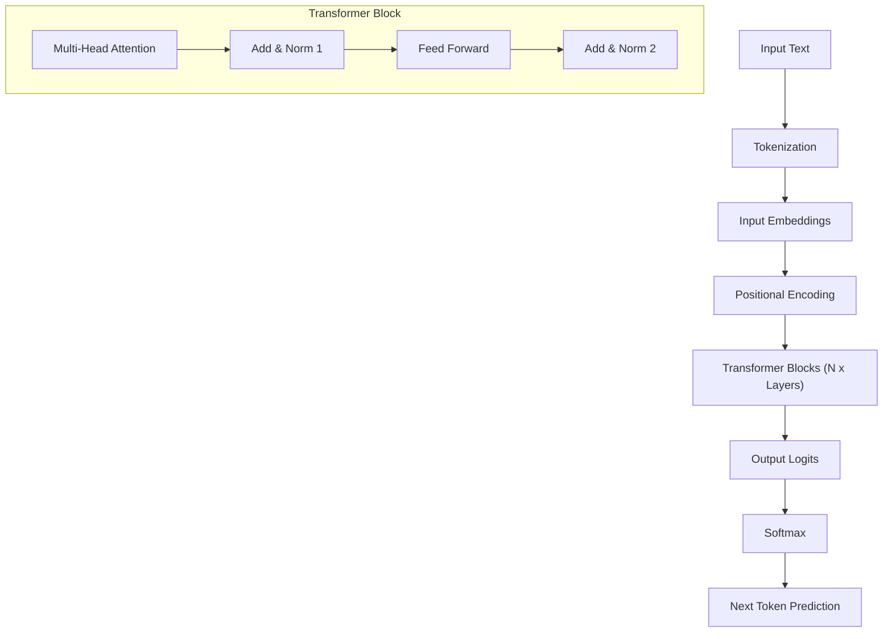

## 📌 Özet
Büyük Dil Modelleri (LLM), modern yapay zekanın temel taşı olup, temelde 2017 yılında tanıtılan Transformer mimarisine dayanmaktadır. Bu modeller, metni anlamlandırmak için sayısal temsilciler olan token'ları kullanır ve "Attention" (Dikkat) mekanizması sayesinde kelimeler arasındaki uzun vadeli bağımlılıkları yakalar. LLM'lerin başarısı, devasa veri kümeleri üzerinde eğitilmeleri ve milyarlarca parametreye sahip olmalarıyla doğru orantılıdır. Tokenizasyon süreci, metnin modelin işleyebileceği parçalara bölünmesini sağlar ve modelin kelime dağarcığı kapasitesini belirler. Bu notta, Transformer mimarisinin bileşenleri, self-attention mekanizması ve tokenizasyon stratejileri teknik derinlikle incelenmektedir.

## 🧠 Detay



### 1. Transformer Mimarisi
Transformer, RNN ve LSTM'lerin aksine veriyi paralel olarak işleyebilir. Ana bileşenleri şunlardır:

*   **Self-Attention (Öz-Dikkat):** Bir cümledeki her kelimenin, cümledeki diğer tüm kelimelerle olan ilişkisini hesaplar. Query (Sorgu), Key (Anahtar) ve Value (Değer) matrisleri üzerinden yürütülür.
    *   Formül: $Attention(Q, K, V) = softmax(\frac{QK^T}{\sqrt{d_k}})V$
*   **Positional Encoding:** Transformer'lar sıralı veri işlemediği için, kelimelerin cümle içindeki konum bilgisini sinüs ve kosinüs dalgaları kullanarak embedding vektörlerine ekler.
*   **Multi-Head Attention:** Modelin farklı "dikkat" alanlarına odaklanmasını sağlar (örneğin biri dilbilgisine odaklanırken diğeri anlama odaklanır).

### 2. Tokenizasyon Teknikleri
Modeller metni doğrudan okuyamaz; "token" adı verilen birimlere ayırır.
*   **Byte Pair Encoding (BPE):** GPT modellerinde kullanılır. En sık geçen karakter dizilerini birleştirerek bir sözlük oluşturur.
*   **WordPiece:** BERT tarafından kullanılır. Benzer şekilde alt kelime (sub-word) birimlerine odaklanır.
*   **Context Window:** Modelin bir seferde işleyebileceği maksimum token sayısıdır (örn. GPT-4 için 128k).

### 3. Kod Örneği: Token Sayımı (Python)
OpenAI'ın `tiktoken` kütüphanesini kullanarak token sayısını hesaplama:

```python
import tiktoken

def count_tokens(text: str, model="gpt-4"):
    encoding = tiktoken.encoding_for_model(model)
    tokens = encoding.encode(text)
    return len(tokens)

example_text = "Transformer mimarisi yapay zekada devrim yarattı."
print(f"Token Sayısı: {count_tokens(example_text)}")
```

## 💡 Bağlantılar
*   [[LLM - Prompt Engineering Teknikleri]]
*   [[LLM - Fine-tuning Stratejileri]]
*   [Attention Is All You Need Paper](https://arxiv.org/abs/1706.03762)
