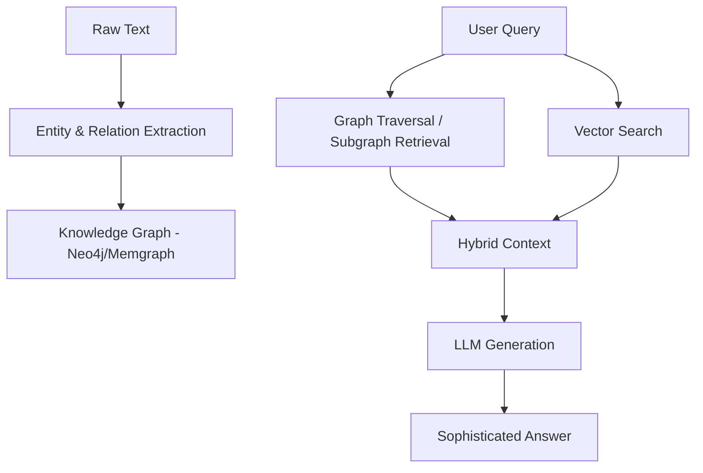

## 📌 Özet
GraphRAG, standart Vektör tabanlı RAG (Retrieval-Augmented Generation) yöntemini, Bilgi Grafları (Knowledge Graphs) ile birleştiren ileri düzey bir mimaridir. Sadece metin parçacıklarını aramak yerine, veriler arasındaki yapısal ilişkileri (Entities & Relations) kullanarak LLM lere çok daha derin ve bağlamsal bilgi sağlar.

## 🧠 Detay

### 1. Neden GraphRAG?
- **Global Context:** Standart RAG "bu belgede ne yazıyor?" sorusuna iyi yanıt verirken, GraphRAG "tüm veritabanındaki ana tema nedir?" gibi bütünsel soruları daha iyi yanıtlar.
- **İlişkisel Çıkarım:** Vektör benzerliğinin yakalayamadığı uzak ama mantıksal bağlantıları (örneğin A şahsı ile D şahsı arasındaki 3. derece bağlantı) bulur.
- **Daha Az Halüsinasyon:** Bilgi grafı, LLM için doğrulanmış bir gerçeklik tabanı (Ground Truth) sunar.

### 2. Çalışma Mantığı
1. **İndeksleme:** Metinden varlıklar (Entities) ve ilişkiler (Claims/Relations) çıkarılır.
2. **Topluluk Tespiti (Community Detection):** Benzer varlıklar gruplanır ve özetlenir (Microsoft GraphRAG yaklaşımı).
3. **Sorgulama:** Kullanıcı sorusu hem vektör uzayında hem de graf üzerinde aranır.

### 3. Kullanılan Araçlar
- **Neo4j:** En popüler graf veritabanı.
- **LangChain/LlamaIndex:** Graf ve LLM entegrasyonu için.
- **Microsoft GraphRAG:** Microsoft un bu konuda yayınladığı kütüphane.

## 💡 Bağlantılar
- [[LLM - RAG (Retrieval Augmented Generation) Mimarisi]]
- [[DB - Graph Veritabanları (Neo4j, Memgraph)]]

## ❓ Sorular / Anlamadıklarım
- Graf oluşturma (Extraction) maliyeti vektör embedding maliyetine göre ne kadar yüksektir?
- Küçük veri setlerinde GraphRAG anlamlı mıdır?

## 🔗 Kaynaklar
- Microsoft Research: GraphRAG
- Neo4j: What is GraphRAG?
