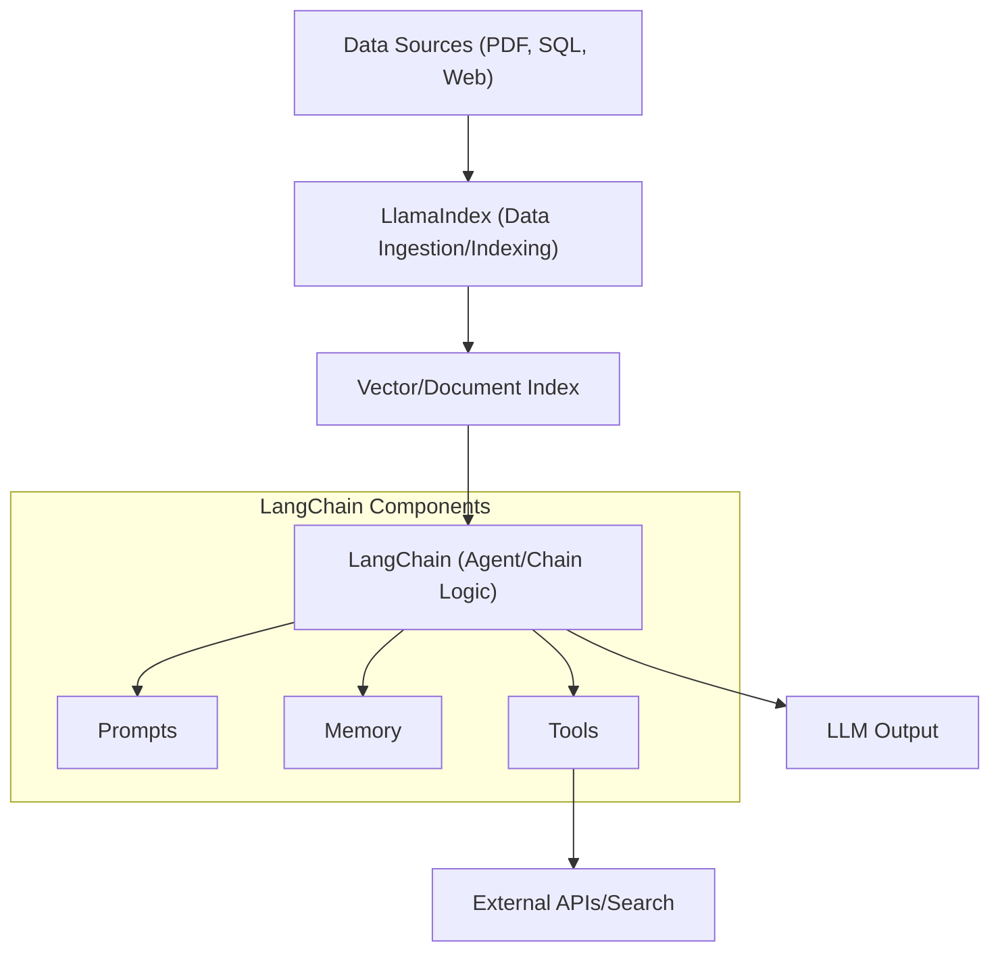

## 📌 Özet
LangChain ve LlamaIndex, LLM tabanlı uygulamalar geliştirmek için kullanılan en popüler iki orkestrasyon çerçevesidir (framework). LangChain, genel amaçlı uygulamalar, karmaşık zincirler (chains) ve agentik iş akışları oluşturmak için esnek bir modüler yapı sunar. LlamaIndex ise özellikle veri yoğunluklu uygulamalara odaklanarak, verilerin indekslenmesi ve akıllı sorgulama motorları (query engines) oluşturulması konusunda uzmanlaşmıştır. Her iki kütüphane de veri yükleyiciler, bellek yönetimi ve model entegrasyonları sunarak geliştirme sürecini standartlaştırır. Bu notta, bu iki aracın temel farkları, mimari bileşenleri ve kullanım senaryoları detaylandırılmaktadır.

## 🧠 Detay



### 1. LangChain Temel Bileşenleri
*   **Chains:** Birden fazla adımı (Prompt -> LLM -> Output Parser) birbirine bağlayan yapılar. (örn: LCEL - LangChain Expression Language).
*   **Memory:** Konuşma geçmişini takip ederek modelin önceki mesajları hatırlamasını sağlar (örn: `ConversationBufferMemory`).
*   **Agents:** Hangi aracın (tool) ne zaman kullanılacağına modelin karar verdiği otonom yapılar.

### 2. LlamaIndex Temel Bileşenleri
*   **Data Connectors (LlamaHub):** 100'den fazla kaynaktan veri okumayı sağlar.
*   **Indexes:** Veriyi sorgulanabilir hale getiren yapılar (VectorStoreIndex, SummaryIndex, TreeIndex).
*   **Query Engines:** Doğal dildeki soruları indekslenmiş veriye yönlendiren ve yanıt üreten arayüz.

### 3. Hangi Framework Seçilmeli?
| Durum | Tercih Edilen | Neden? |
| :--- | :--- | :--- |
| **Veri Sorgulama Odaklı** | **LlamaIndex** | Gelişmiş indeksleme ve retrieval yetenekleri. |
| **Otonom Ajanlar / Akışlar** | **LangChain** | Esnek agent yapısı ve geniş araç ekosistemi. |
| **Karmaşık Logic / State** | **LangChain** | LangGraph ile gelişmiş state yönetimi. |
| **Hızlı RAG Prototipleme** | **LlamaIndex** | Out-of-the-box RAG solutions. |

### 4. Kod Örneği: LangChain LCEL Kullanımı

```python
from langchain_openai import ChatOpenAI
from langchain_core.prompts import ChatPromptTemplate
from langchain_core.output_parsers import StrOutputParser

model = ChatOpenAI(model="gpt-4")
prompt = ChatPromptTemplate.from_template("{topic} hakkında kısa bir bilgi ver.")
output_parser = StrOutputParser()


chain = prompt | model | output_parser

response = chain.invoke({"topic": "Quantum Computing"})
print(response)
```

## 💡 Bağlantılar
*   [[LLM - Agentic Workflow ve Multi-agent Sistemler]]
*   [[LLM - RAG (Retrieval Augmented Generation) Mimarisi]]
*   [LangChain Documentation](https://python.langchain.com/)
