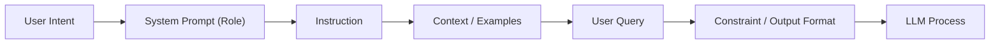

## 📌 Özet
Prompt Engineering, LLM'lerin performansını optimize etmek için girdi metinlerini stratejik olarak tasarlama sanatıdır. İyi yapılandırılmış bir prompt, modelin halüsinasyonlarını azaltabilir, doğruluğunu artırabilir ve belirli formatlarda çıktı vermesini sağlayabilir. Bu disiplin, basit talimatlardan "Chain-of-Thought" (Düşünce Zinciri) gibi karmaşık mantıksal yürütme tekniklerine kadar geniş bir yelpazeyi kapsar. Gelişmiş teknikler arasında modelin kendi kendine sorgulama yapmasını sağlayan ReAct ve örneklerle öğrenmeyi destekleyen Few-shot öğrenme bulunur. Bu notta, uygulama geliştiricileri için kritik olan en iyi uygulama yöntemleri ve mimari yaklaşımlar ele alınmaktadır.

## 🧠 Detay



### 1. Temel Teknikler
*   **Zero-shot Prompting:** Modele herhangi bir örnek vermeden doğrudan talimat verme.
*   **Few-shot Prompting:** Modele istenen çıktı formatına veya mantığına dair birkaç örnek (1-5 arası) ekleme.
*   **Role Prompting:** Modele bir kimlik atama (örn: "Kıdemli bir Python geliştiricisi gibi davran").

### 2. Gelişmiş Stratejiler
*   **Chain-of-Thought (CoT):** Modelin bir soruyu çözmeden önce adım adım düşünmesini sağlama ("Adım adım düşün" ifadesiyle tetiklenebilir).
*   **Self-Consistency:** Modelin aynı soruya farklı yollarla birden fazla cevap üretmesi ve en tutarlı olanı seçmesi.
*   **ReAct (Reason + Act):** Modelin hem mantık yürütmesini hem de harici araçları (Arama, API vb.) kullanmasını sağlayan döngüsel bir yapı.

### 3. Prompt Yapılandırma Bileşenleri
1.  **Instruction (Talimat):** Modelin yapmasını istediğiniz ana görev.
2.  **Context (Bağlam):** Görevi tamamlamak için gereken ek bilgi.
3.  **Input Data (Girdi Verisi):** İşlenecek asıl metin veya soru.
4.  **Output Indicator (Çıktı Belirteci):** Cevabın formatı (JSON, Markdown, Liste).

### 4. Kod Örneği: Yapılandırılmış Çıktı (OpenAI Pydantic)
Modern sistemlerde prompt'lar genellikle kod tarafından yönetilir:

```python
from openai import OpenAI
from pydantic import BaseModel

client = OpenAI()

class SentimentResponse(BaseModel):
    sentiment: str
    confidence: float
    reasoning: str

prompt = """
Aşağıdaki müşteri yorumunu analiz et. 
Cevabı JSON formatında sentiment, confidence ve reasoning alanlarıyla ver.

Yorum: "Ürün harika ancak kargo çok yavaştı, beklemekten yoruldum."
"""

completion = client.chat.completions.create(
    model="gpt-4o",
    messages=[{"role": "user", "content": prompt}],
    response_format={ "type": "json_object" }
)

print(completion.choices[0].message.content)
```

## 💡 Bağlantılar
*   [[LLM - LangChain ve LlamaIndex ile Uygulama Geliştirme]]
*   [[LLM - Agentic Workflow ve Multi-agent Sistemler]]
*   [Learn Prompting Guide](https://learnprompting.org/)
