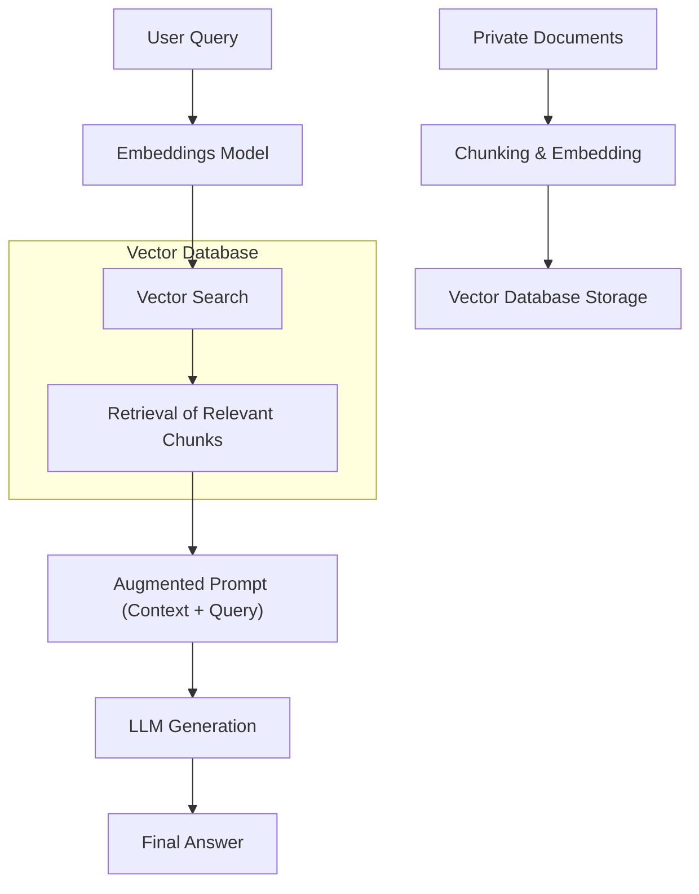

## 📌 Özet
RAG (Retrieval-Augmented Generation), LLM'lerin önceden eğitilmedikleri güncel veya özel verilere erişmesini sağlayan bir mimari yaklaşımdır. Bu sistem, kullanıcının sorusuna yanıt üretmeden önce ilgili belgeleri bir veri havuzundan (genellikle vektör veritabanı) bulur ve bu bilgileri modelin bağlam penceresine (context window) ekler. RAG, modellerin halüsinasyon görme riskini azaltır ve bilgi kaynaklarının doğrulanabilir olmasını sağlar. Modern kurumsal LLM uygulamalarının %90'ı, veritabanı veya doküman yönetimi için RAG mimarisini kullanmaktadır. Bu notta, veri parçalama (chunking), embedding oluşturma ve erişim (retrieval) süreçleri teknik olarak incelenmektedir.

## 🧠 Detay



### 1. RAG İş Akışı (Pipeline)
1.  **Ingestion (Veri Hazırlama):** Dokümanlar küçük parçalara (chunks) bölünür.
2.  **Embedding:** Her parça bir embedding modeline (örn: `text-embedding-3-small`) gönderilerek vektörlere dönüştürülür.
3.  **Storage:** Vektörler bir vektör veritabanında (Pinecone, Chroma, Milvus) saklanır.
4.  **Retrieval (Erişim):** Kullanıcı sorusu vektöre dönüştürülür ve veritabanında en yakın vektörler (Cosine Similarity) aranır.
5.  **Generation (Üretim):** Bulunan metin parçaları ve orijinal soru LLM'e gönderilir.

### 2. Kritik Başarı Faktörleri
*   **Chunking Strategy:** Metnin nasıl bölündüğü (karakter sayısı, paragraf bazlı, overlapping) erişim kalitesini doğrudan etkiler.
*   **Vector Similarity:** Genellikle Cosine Similarity veya Euclidean Distance kullanılır.
*   **Re-ranking:** Erişilen ilk sonuçların (örn. top 10) daha küçük ve güçlü bir modelle tekrar sıralanması.

### 3. Kod Örneği: Basit Bir RAG Akışı (Conceptual LangChain)

```python
from langchain_community.vectorstores import FAISS
from langchain_openai import OpenAIEmbeddings, ChatOpenAI
from langchain.chains import RetrievalQA


embeddings = OpenAIEmbeddings()
texts = ["Şirketimizin yıllık izni 20 gündür.", "Mesai saatleri 09:00 - 18:00 arasıdır."]
vectorstore = FAISS.from_texts(texts, embeddings)


llm = ChatOpenAI(model_name="gpt-4")
qa_chain = RetrievalQA.from_chain_type(
    llm=llm,
    chain_type="stuff",
    retriever=vectorstore.as_retriever()
)


query = "Yıllık izin kaç gün?"
response = qa_chain.invoke(query)
print(response["result"])
```

## 💡 Bağlantılar
*   [[LLM - Vektör Veritabanları (Pinecone, Milvus)]]
*   [[LLM - Değerlendirme (Evaluation) ve İzleme]]
*   [RAG Paper - Lewis et al.](https://arxiv.org/abs/2005.11401)
