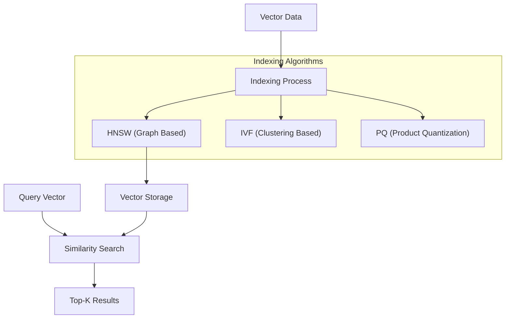

## 📌 Özet
Vektör veritabanları, verileri çok boyutlu uzayda vektörler (sayı dizileri) olarak saklamak ve bu vektörler arasında "benzerlik araması" yapmak için optimize edilmiş özel sistemlerdir. Geleneksel SQL veritabanlarının aksine, tam eşleşme yerine anlamsal yakınlığı (semantic similarity) temel alırlar. LLM projelerinde, devasa doküman yığınlarını hızlıca tarayıp ilgili bağlamı bulmak için RAG mimarisinin kalbi olarak kullanılırlar. Pinecone gibi bulut tabanlı (managed) çözümler kolaylık sağlarken, Milvus ve Weaviate gibi açık kaynaklı sistemler yüksek ölçeklenebilirlik ve kontrol sunar. Bu notta, vektör indeksleme algoritmaları ve benzerlik metriği teknik detayları incelenmektedir.

## 🧠 Detay



### 1. Temel Benzerlik Metrikleri
Vektörler arasındaki mesafeyi ölçmek için kullanılan matematiksel yöntemler:
*   **Cosine Similarity:** Vektörler arasındaki açının kosinüsünü ölçer. Magnitüd (uzunluk) yerine yön odaklıdır. En yaygın kullanılanıdır.
*   **L2 (Euclidean Distance):** İki nokta arasındaki doğrudan mesafeyi ölçer.
*   **Inner Product (Dot Product):** Vektörlerin karşılıklı elemanlarının çarpımlarının toplamıdır.

### 2. İndeksleme Algoritmaları
Hız ve doğruluk dengesini kurmak için kullanılırlar:
*   **HNSW (Hierarchical Navigable Small World):** Verileri katmanlı bir graf yapısında tutar. Çok hızlı ve yüksek doğruluk oranına sahiptir (state-of-the-art).
*   **IVF (Inverted File Index):** Veri uzayını hücrelere (voronoi cells) böler. Arama sadece ilgili hücrelerde yapılır.
*   **PQ (Product Quantization):** Vektörleri sıkıştırarak bellek kullanımını azaltır, ancak bir miktar hassasiyet kaybına yol açar.

### 3. Karşılaştırma: Pinecone vs Milvus
| Özellik | Pinecone | Milvus |
| :--- | :--- | :--- |
| **Model** | Managed (SaaS) | Open Source / Cloud |
| **Ölçekleme** | Otomatik (Serverless) | Yatayda sınırsız (Kubernetes) |
| **Kurulum** | Çok Kolay | Orta/Zor |
| **Kullanım Alanı** | Startup, Hızlı Prototip | Kurumsal, On-prem, Big Data |

### 4. Kod Örneği: Pinecone ile İndeksleme (Conceptual)

```python
from pinecone import Pinecone, ServerlessSpec

pc = Pinecone(api_key="YOUR_API_KEY")


pc.create_index(
    name="documents-index",
    dimension=1536, # OpenAI embedding boyutu
    metric="cosine",
    spec=ServerlessSpec(cloud="aws", region="us-east-1")
)

index = pc.Index("documents-index")


index.upsert(
    vectors=[
        ("id1", [0.1, 0.2, ...], {"text": "Örnek veri 1"}),
        ("id2", [0.3, 0.4, ...], {"text": "Örnek veri 2"}),
    ]
)


results = index.query(vector=[0.1, 0.2, ...], top_k=2, include_metadata=True)
```

## 💡 Bağlantılar
*   [[LLM - RAG (Retrieval Augmented Generation) Mimarisi]]
*   [HNSW Algorithm Explained](https://arxiv.org/abs/1603.09320)
