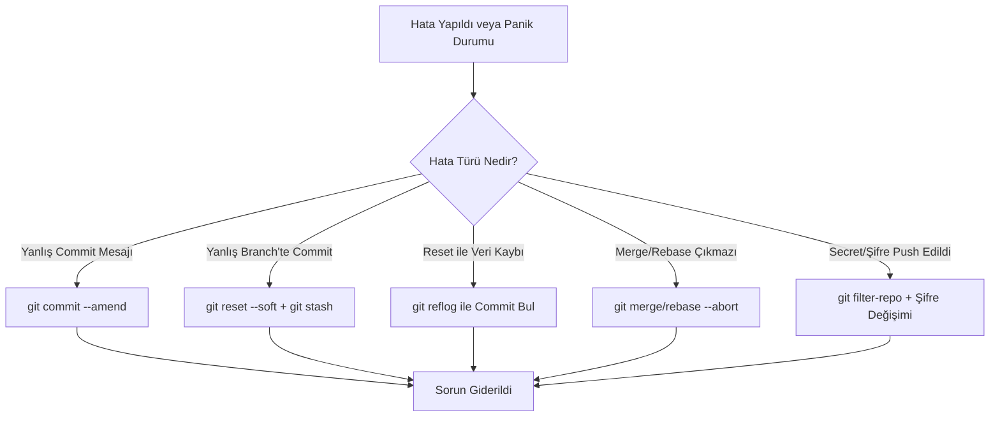

## 📌 Özet

Git kullanırken yapılan hatalar, geliştirme sürecinin doğal bir parçasıdır ancak bu hatalardan veri kaybı yaşamadan geri dönmek kritik bir beceridir. Bu rehber, yanlış branch'te commit yapmaktan, hassas verilerin (secret) yanlışlıkla uzak depoya gönderilmesine kadar geniş bir yelpazedeki gerçek dünya senaryolarını ve çözüm yollarını kapsamaktadır. `reflog`, `reset`, `amend` ve `filter-repo` gibi araçların kullanımıyla, en karmaşık hata durumlarında bile kontrolün nasıl yeniden sağlanacağı adım adım açıklanmıştır. Ayrıca, sunulan iyi uygulama (best practices) örnekleri, bu hataların henüz oluşmadan engellenmesini sağlayacak bir disiplin kazandırmayı amaçlar.

---

## 🧠 Detay

### Git Hata Kurtarma Karar Ağacı



### Hata 1: Yanlış Branch'te Commit

```bash
# Durumu gör
git log --oneline -3

# Seçenek A: Değişiklikleri doğru branch'e taşı (commit yeni)
git reset --soft HEAD~1              # Son commit'i geri al, değişiklikler staging'de kalır
git stash                            # Değişiklikleri sakla
git checkout dogru-branch
git stash pop                        # Değişiklikleri uygula
git commit -m "feat: doğru branch'e commit"

# Seçenek B: Cherry-pick
git log --oneline -3                 # Taşınacak commit hash'ini bul: abc1234
git checkout dogru-branch
git cherry-pick abc1234

# Yanlış branch'ten commit'i sil
git checkout yanlis-branch
git reset --hard HEAD~1              # (Eğer push etmediysen)
```

### Hata 2: Yanlış Mesajlı Commit

```bash
# Sadece son commit mesajını düzelt (push etmediysen)
git commit --amend -m "feat: doğru mesaj"

# Push edildiyse — force push gerekir (dikkatli!)
git commit --amend -m "feat: doğru mesaj"
git push --force-with-lease origin branch-adi

# Daha eski bir commit'in mesajını değiştir
git rebase -i HEAD~3
# → reword ile değiştirmek istediğin commit'i işaretle
```

### Hata 3: git reset --hard Sonrası Kurtarma

```bash
# Panik yapma! reflog her şeyi kaydeder
git reflog

# Çıktı:
# abc1234 HEAD@{0}: reset: moving to HEAD~3
# def5678 HEAD@{1}: commit: feat: önemli özellik  ← Bu kayboldu!

# O commit'e geri dön
git reset --hard HEAD@{1}
# veya:
git reset --hard def5678
```

### Hata 4: Yanlışlıkla Silinen Dosya

```bash
# 1. Sadece working directory'den silindiyse
git restore silinen-dosya.py          # Git 2.23+
git checkout -- silinen-dosya.py      # Eski yöntem

# 2. git rm ile silindiyse (staging'e eklendi)
git restore --staged silinen-dosya.py  # Önce unstage
git restore silinen-dosya.py           # Sonra geri al

# 3. Commit edilmiş silinmişse — geçmişten kurtar
git log --diff-filter=D --summary -- silinen-dosya.py
# Son commit'i bul: abc1234
git checkout abc1234^ -- silinen-dosya.py  # ^ = bir önceki commit
git commit -m "restore: silinen dosya geri alındı"

# 4. Tüm silinen dosyaları bul
git log --diff-filter=D --name-only --pretty=format: | sort -u
```

### Hata 5: Push Edilen Şifre/Secret

```bash
# ACİL! Bu adımları hemen uygula:

# 1. Secret'ı hemen iptal et (API key, DB şifresi, token vb.)
# → AWS Console / GitHub Settings / vb.

# 2. Geçmişten dosyayı sil (git filter-repo — önerilen)
pip install git-filter-repo
git filter-repo --path gizli-dosya.env --invert-paths

# veya belirli bir string'i sil
git filter-repo --replace-text <(echo 'ESKISECRET==>REDACTED')

# 3. Force push (tüm branch'ler)
git push --force --all origin
git push --force --tags origin

# 4. GitHub'a bildir (cache temizleme için)
# GitHub Support → "cached views" temizleme talebi

# 5. Tüm collaborate'lara bildir — onların yerel kopyaları eski!
```

### Hata 6: Merge Conflict Karmaşası

```bash
# Merge'i tamamen iptal et
git merge --abort

# Rebase'i iptal et
git rebase --abort

# Birleştirmeden önceki duruma dön
git reset --hard ORIG_HEAD          # ORIG_HEAD merge/rebase öncesini gösterir

# Conflict'li dosyaları listele
git diff --name-only --diff-filter=U

# Belirli bir tarafı seç
git checkout --ours .               # Tümünde bizim versiyonu kullan
git checkout --theirs .             # Tümünde karşı tarafı kullan
git add .
git commit -m "resolve: conflict çözüldü"
```

### Hata 7: Uzak Repo ile Senkronizasyon

```bash
# "refusing to merge unrelated histories" hatası
git pull origin main --allow-unrelated-histories

# "Updates were rejected" — uzak ilerledi
git fetch origin
git rebase origin/main              # Tercih edilen
# veya:
git merge origin/main

# Yerel değişiklikleri tamamen ezip uzak ile eşitle
git fetch origin
git reset --hard origin/main
# ⚠️ Yerel tüm değişiklikler gider!

# Uzak branch'i sıfırla (force)
git push --force-with-lease origin branch-adi
```

### Hata 8: Büyük Dosya Push Hatası

```bash
# "File too large" hatası (GitHub 100MB sınırı)
# Git LFS kullan

# Kurulum
git lfs install

# Büyük dosya tiplerine LFS ekle
git lfs track "*.psd"
git lfs track "*.zip"
git lfs track "data/*.csv"
git add .gitattributes

# Normal şekilde devam
git add buyuk-dosya.psd
git commit -m "add: tasarım dosyaları"
git push

# Mevcut geçmişten büyük dosyaları sil
git filter-repo --strip-blobs-bigger-than 50M
```

### Hata 9: Detached HEAD

```bash
# "HEAD is now at abc1234" — Detached HEAD modu
git log --oneline -5
# Bu commit üzerinde geliştirme yaptın

# Branch oluşturarak kaydet
git checkout -b kurtarma-dali       # Ya da:
git switch -c kurtarma-dali

# Commit'leri al ve ana branch'e merge et
git checkout main
git merge kurtarma-dali
```

### Hata 10: Yanlış Tag

```bash
# Yerel tag sil
git tag -d v1.0.0

# Uzak tag sil
git push origin --delete v1.0.0

# Doğru commit'e tag ekle
git tag -a v1.0.0 abc1234 -m "Doğru sürüm"
git push origin v1.0.0
```

### Gerçek Dünya Senaryo: Hotfix

```bash
# Production'da kritik bug var, feature geliştiriyorsun

# 1. Mevcut çalışmayı sakla
git stash push -m "yarım kalan özellik"

# 2. Main'den hotfix branch'i aç
git checkout main
git pull origin main
git checkout -b hotfix/kritik-bug

# 3. Düzelt ve commit et
git commit -m "fix: null pointer hatası düzeltildi"

# 4. Test et
python -m pytest tests/

# 5. Main'e merge et
git checkout main
git merge --no-ff hotfix/kritik-bug -m "Merge: kritik bug düzeltmesi"
git tag -a v1.0.1 -m "Hotfix sürümü"
git push origin main --tags

# 6. Develop'a da uygula
git checkout develop
git merge --no-ff hotfix/kritik-bug
git push origin develop

# 7. Hotfix branch sil
git branch -d hotfix/kritik-bug
git push origin --delete hotfix/kritik-bug

# 8. Kaldığın yere dön
git checkout feature/yeni-ozellik
git stash pop
```

### Git Best Practices Özeti

```bash
# ✅ Küçük, odaklı commit'ler yap
# ✅ Anlamlı commit mesajları yaz (Conventional Commits)
# ✅ main/develop'a doğrudan push etme
# ✅ PR açmadan önce self-review yap
# ✅ .gitignore dosyasını proje başında oluştur
# ✅ Secret'ları asla commit etme
# ✅ Feature branch'lerini kısa tut (< 1 hafta)
# ✅ git pull --rebase kullan (temiz geçmiş)
# ✅ force push öncesi --force-with-lease kullan
# ✅ Merge conflict'leri hemen çöz, biriktirme

# ❌ git commit -m "düzeltme" veya "wip" veya "asdf"
# ❌ 1000 satırlık tek commit
# ❌ main'i force push etme
# ❌ Şifre, API key commit etme
# ❌ Conflict'li dosyayı çözmeden commit etme
# ❌ git add . yapmadan önce kontrol etmeme
```

### Yararlı Git Konfigürasyonları

```bash
# ~/.gitconfig — Önerilen ayarlar
[core]
  autocrlf = input          # Linux/Mac için
  editor = code --wait
  pager = delta             # pip install delta — güzel diff

[merge]
  conflictstyle = diff3     # Conflict'te ortak ancestor'ı da göster

[pull]
  rebase = true             # git pull → git pull --rebase

[push]
  default = current         # Sadece mevcut branch'i push et
  autoSetupRemote = true    # -u origin otomatik

[rebase]
  autosquash = true         # fixup! / squash! otomatik

[alias]
  st    = status -s
  lg    = log --oneline --graph --decorate --all
  undo  = reset --soft HEAD~1
  oops  = commit --amend --no-edit
  unstage = restore --staged
  aliases = !git config --get-regexp alias

[diff]
  tool = vscode

[merge]
  tool = vscode

[rerere]
  enabled = true            # Conflict çözümlerini hatırla (reuse recorded resolution)
```

---

## 💡 Bağlantılar
- [[Git - Temel Komutlar ve Workflow]]
- [[Git - Branching ve Merging]]
- [[Git - Geçmişi Yeniden Yazma ve İleri Düzey]]

## ❓ Sorular / Anlamadıklarım

## 🔗 Kaynaklar
- ohshitgit.com
- dangitgit.com (Türkçe dahil çok dil)
- gitexplorer.com
