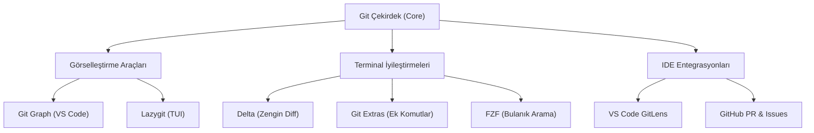

## 📌 Özet

Git'in ham gücünü ekosistemindeki yardımcı araçlarla birleştirmek, geliştirici verimliliğini ve deneyimini bir üst seviyeye taşır. `delta` ile daha okunabilir diff çıktıları alabilir, `lazygit` gibi terminal kullanıcı arayüzleriyle (TUI) karmaşık işlemleri görselleştirebilir ve `git-extras` sayesinde Git'e düzinelerce yeni ve pratik komut ekleyebilirsiniz. Ayrıca, VS Code gibi IDE entegrasyonları, `fzf` tabanlı bulanık arama betikleri ve Git LFS gibi eklentiler, günlük iş akışınızı hızlandırırken büyük ölçekli projeleri yönetmeyi kolaylaştırır. Bu rehber, Git yapılandırmanızı özelleştirerek kendinize en uygun ve profesyonel çalışma ortamını kurmanız için kapsamlı bir yol haritası sunmaktadır.

---

## 🧠 Detay

### Git Araçlar Ekosistemi



### delta — Güzel Diff Görünümü

```bash
# Kurulum
brew install git-delta          # Mac
cargo install git-delta         # Rust
sudo apt install git-delta      # Ubuntu

# ~/.gitconfig
[core]
    pager = delta

[interactive]
    diffFilter = delta --color-only

[delta]
    navigate = true             # n/N ile dosyalar arası git
    side-by-side = true         # Yan yana diff
    line-numbers = true
    syntax-theme = "Dracula"    # Tema: GitHub, Monokai Extended vb.
    plus-style = "syntax #1a3a1a"   # Eklenen satır rengi
    minus-style = "syntax #3a1a1a"  # Silinen satır rengi

[merge]
    conflictstyle = diff3       # 3-way conflict görünümü
```

### lazygit — Terminal Git UI

```bash
# Kurulum
brew install lazygit
sudo apt install lazygit

# Kullanım
lazygit           # Proje klasöründe

# Tuş kısayolları:
# 1,2,3,4,5 → Paneller arası geç
# Space → Stage/unstage
# c → Commit
# p → Push
# P → Pull
# b → Branch işlemleri
# x → Menü (daha fazla seçenek)
# q → Çık

# VS Code terminalde
code --install-extension formulahendry.lazygit
```

### git-extras — Ek Komutlar

```bash
# Kurulum
brew install git-extras
sudo apt-get install git-extras

# En kullanışlı komutlar:

# Commit'lere göre katkı istatistikleri
git summary
git line-summary

# Hangi dosya en çok değişti?
git effort

# Belirli tarih aralığında neler oldu
git changelog --since "2 weeks ago"

# Repo'yu temizle
git clear                          # Takip edilmeyen dosyaları sil

# Feature branch workflow
git feature start yeni-ozellik     # git checkout -b feature/yeni-ozellik
git feature finish yeni-ozellik    # Merge et, branch sil

# Upstream ile senkronize et
git sync                           # fetch + rebase

# Commit sayısı
git count

# Yazar katkıları
git authors

# Boş commit (CI trigger)
git touch

# Son commit'in dosyalarını listele
git show-files

# Belirli commit'teki dosyayı aç
git show HEAD~2:src/main.py
```

### VS Code Git Entegrasyonu

```jsonc
// .vscode/settings.json
{
  // Git
  "git.autofetch": true,
  "git.confirmSync": false,
  "git.enableSmartCommit": true,
  "git.postCommitCommand": "sync",
  "git.defaultCloneDirectory": "~/projects",
  "git.openRepositoryInParentFolders": "always",

  // Diff editor
  "diffEditor.renderSideBySide": true,
  "diffEditor.ignoreTrimWhitespace": false,

  // GitLens
  "gitlens.hovers.currentLine.over": "line",
  "gitlens.codeLens.enabled": true,
  "gitlens.blame.format": "${author|10} ${agoOrDate|14-}"
}
```

**Önerilen VS Code Eklentileri:**
```
GitLens       — Satır bazlı blame, geçmiş, karşılaştırma
Git Graph     — Dal grafiği görselleştirme
Git History   — Dosya geçmişi
GitHub Pull Requests — PR/Issue yönetimi
Remote Repositories  — URL'den repo aç
```

### fzf ile Git Arama

```bash
# fzf kurulumu
brew install fzf
$(brew --prefix)/opt/fzf/install

# ~/.bashrc veya ~/.zshrc içine ekle:

# Fuzzy branch seçici
fgit() {
    git branch --all | fzf | xargs git checkout
}

# Fuzzy log ile commit seçici
flog() {
    git log --oneline --color | \
    fzf --ansi --preview 'git show {1}' \
        --bind 'enter:execute(git show {1})'
}

# Fuzzy stash seçici
fstash() {
    git stash list | \
    fzf --preview 'git stash show -p $(echo {} | cut -d: -f1)' \
        --bind 'enter:execute(git stash pop $(echo {} | cut -d: -f1))'
}
```

### Faydalı Git Script'leri

```bash
# ~/.bashrc veya ~/.zshrc

# Tüm repo'larda git pull
pull-all() {
    find . -name ".git" -type d | while read gitdir; do
        repo=$(dirname "$gitdir")
        echo "📦 $repo güncelleniyor..."
        git -C "$repo" pull --rebase 2>/dev/null || echo "⚠️ $repo atlandı"
    done
}

# Branch temizleme (merge edilmiş branch'ler)
git-clean-branches() {
    git fetch --prune
    git branch -vv | grep ': gone]' | awk '{print $1}' | xargs git branch -d
    echo "✅ Eski branch'ler temizlendi"
}

# Son N commit'i güzel formatla göster
git-recent() {
    local n=${1:-10}
    git log --oneline --color -${n} | cat
}

# Belirli string'i içeren commit'leri bul
git-find() {
    git log --oneline -S "$1" --diff-filter=A
}

# Hızlı backup commit
git-save() {
    git add -A && git commit -m "WIP: $(date '+%Y-%m-%d %H:%M')"
}

# İki branch arasındaki dosyaları listele
git-changed-files() {
    git diff --name-only "${1:-main}".."${2:-HEAD}"
}
```

### Commit Hook'ları

```bash
# .git/hooks/pre-commit (otomatik çalışır)
#!/bin/bash
echo "🔍 Pre-commit kontrolleri..."

# Lint çalıştır
if ! flake8 src/; then
    echo "❌ Lint hatası — commit iptal edildi"
    exit 1
fi

# Test çalıştır
if ! python -m pytest tests/ -q; then
    echo "❌ Test başarısız — commit iptal edildi"
    exit 1
fi

echo "✅ Tüm kontroller geçti"
exit 0
```

```bash
# .git/hooks/commit-msg (commit mesajı kontrolü)
#!/bin/bash
COMMIT_MSG=$(cat "$1")
PATTERN='^(feat|fix|docs|style|refactor|test|chore|ci|perf)(\(.+\))?: .{1,80}$'

if ! echo "$COMMIT_MSG" | grep -qE "$PATTERN"; then
    echo "❌ Commit mesajı formatı hatalı!"
    echo "Doğru format: feat(scope): kısa açıklama"
    echo "Tipler: feat fix docs style refactor test chore ci perf"
    exit 1
fi
```

```bash
# .git/hooks/pre-push (push öncesi)
#!/bin/bash
BRANCH=$(git rev-parse --abbrev-ref HEAD)

if [ "$BRANCH" = "main" ]; then
    echo "⚠️ main'e doğrudan push!"
    read -p "Devam etmek istiyor musun? (y/N): " yn
    if [[ "$yn" != "y" ]]; then
        echo "Push iptal edildi"
        exit 1
    fi
fi

# Kapsamlı test çalıştır
python -m pytest tests/ -v || exit 1
```

### Git LFS (Large File Storage)

```bash
# Kurulum
brew install git-lfs
git lfs install  # Kullanıcı için global kurulum

# Büyük dosya tiplerini izle
git lfs track "*.psd"
git lfs track "*.zip"
git lfs track "*.pdf"
git lfs track "data/*.csv"
git lfs track "models/*.pkl"   # ML modelleri

# .gitattributes oluşturulur (commit edilmeli!)
git add .gitattributes

# Normal git workflow devam eder
git add design.psd
git commit -m "add: tasarım dosyası"
git push   # LFS storage'a yüklenir

# İstatistikler
git lfs ls-files        # LFS izlenen dosyalar
git lfs status         # LFS durumu

# Prune (eski versiyonları sil)
git lfs prune
```

### Performans Optimizasyonu

```bash
# Büyük repolar için

# Kısmi clone (sadece son geçmiş)
git clone --depth=1 https://github.com/user/repo.git

# Tek branch clone
git clone --single-branch --branch main https://...

# Sparse checkout (sadece gerekli klasörler)
git clone --sparse https://github.com/user/huge-mono-repo.git
cd huge-mono-repo
git sparse-checkout set src/myapp infra/k8s

# Shallow'dan full clone'a geç
git fetch --unshallow

# Git maintenance (periyodik optimizasyon)
git maintenance start  # Arka planda otomatik maintenance

# Manuel optimize et
git gc --aggressive    # Garbage collect
git repack -Ad         # Pack objects
git prune              # Unreachable objects temizle
```

---

## 💡 Bağlantılar
- [[Git - Giriş ve Temel Kavramlar]]
- [[Git - Temel Komutlar ve Workflow]]
- [[Git - Gerçek Dünya Senaryoları ve Sık Hatalar]]

## ❓ Sorular / Anlamadıklarım

## 🔗 Kaynaklar
- github.com/dandavison/delta
- github.com/jesseduffield/lazygit
- github.com/tj/git-extras
- marketplace.visualstudio.com/items?itemName=eamodio.gitlens
