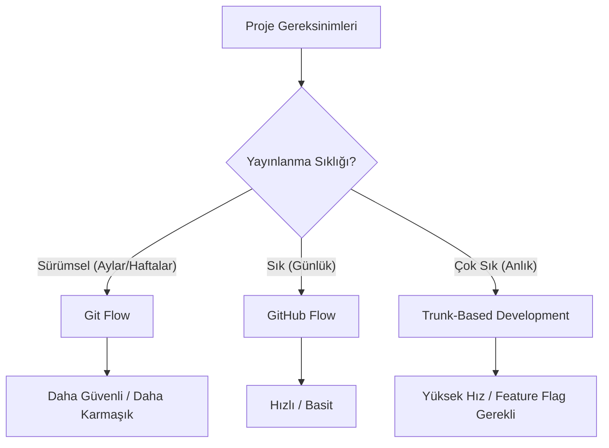

## 📌 Özet

Ekip çalışmasında Git kullanımı, sadece komutları bilmekten öte, projenin hızı ve kalitesini doğrudan etkileyen stratejik bir karardır. Git Flow, GitHub Flow ve Trunk-Based Development gibi farklı iş akışı modelleri, projenin büyüklüğüne ve yayınlanma (deployment) sıklığına göre optimize edilmiş çözümler sunar. Bu rehberde, hangi stratejinin hangi durumlarda avantaj sağladığı, sürekli entegrasyon (CI) süreçlerinin bu modellere nasıl entegre edileceği ve mono-repo gibi modern yaklaşımların nasıl yönetileceği detaylıca ele alınmıştır. Doğru Git stratejisi seçimi, geliştirme süreçlerini standartlaştırarak karmaşayı önler ve ekiplerin odak noktasını kod kalitesine kaydırmasını sağlar.

---

## 🧠 Detay

### Git İş Akış Modelleri Karşılaştırması



### Git Flow

**Ne zaman kullanılır?**
- Belirli sürüm döngüleri olan ürünler (mobile app, desktop software)
- Aynı anda birden fazla sürüm desteği
- Büyük ekipler, uzun feature geliştirme

```
main ─────────────────────────────────── v1.0 ── v1.1 ──►
     \                                  /   \     /
develop ─────────────────────────────────     hotfix
        \              \          \
      feature/A     feature/B    release/1.0
```

**Branch'ler:**
```bash
main        # Sadece production-ready kod
develop     # Entegrasyon branch'i
feature/*   # Özellik geliştirme (develop'tan)
release/*   # Sürüm hazırlığı (develop'tan, main'e merge)
hotfix/*    # Acil düzeltme (main'den, hem main hem develop'a merge)
```

```bash
# Araç setiyle
brew install git-flow-avh

git flow init

# Feature başlat
git flow feature start login
# → develop'tan feature/login branch'i açar

# Feature bitir
git flow feature finish login
# → develop'a merge eder, branch siler

# Release başlat
git flow release start 1.0.0
# → develop'tan release/1.0.0 açar, versiyon güncelle
git flow release finish 1.0.0
# → main ve develop'a merge, tag atar

# Hotfix
git flow hotfix start kritik-bug
git flow hotfix finish kritik-bug
# → main ve develop'a merge, tag atar
```

**Artıları/Eksileri:**
```
✅ Net branch yapısı, herkes nerede olduğunu bilir
✅ Çoklu sürüm desteği
✅ Sürüm aşamaları net ayrılmış
❌ Karmaşık, overhead fazla
❌ Sürekli deployment için uygun değil
❌ Uzun yaşayan branch'ler = büyük merge conflict
```

### GitHub Flow

**Ne zaman kullanılır?**
- SaaS / web uygulamaları
- Sürekli deployment (CD)
- Küçük-orta ekipler
- Main her zaman production-ready

```
main ──────────────────────────────────────────►
      \         /      \              /
    feature   PR+Merge  feature    PR+Merge
              Deploy              Deploy
```

```bash
# 1. main'den branch aç
git checkout main && git pull
git checkout -b feature/yeni-ozellik

# 2. Geliştir
git add . && git commit -m "feat: ..."
git push -u origin feature/yeni-ozellik

# 3. PR aç (GitHub'da)
gh pr create --base main --title "feat: yeni özellik"

# 4. CI geçince review al
# 5. Merge et (Squash veya Rebase)
# 6. Otomatik deploy tetiklenir
# 7. Branch sil
git branch -d feature/yeni-ozellik
```

**Artıları/Eksileri:**
```
✅ Basit, anlaşılır
✅ Sürekli deployment
✅ Kısa yaşayan branch'ler
✅ Küçük PR'lar = kolay review
❌ Sürüm yönetimi yok
❌ Feature flag gerektiriyor (yarım özellik için)
```

### Trunk-Based Development (TBD)

**Ne zaman kullanılır?**
- Yüksek frekanslı deployment (günde N kez)
- Deneyimli ekipler
- Güçlü CI/CD altyapısı
- Feature flag sistemi var

```
main (trunk) ──────────────────────────────────►
             ↑  ↑  ↑  ↑  ↑  ↑  ↑  ↑  ↑  ↑  ↑
             Küçük commit'ler, sık push

veya kısa branch'ler (< 1-2 gün):
main ──────────────────────────────────────────►
      \   /    \   /     \      /
    fix bugA  feat X    feat Y (1 gün)
```

```bash
# Direkt main'e (küçük ekip, deneyimli)
git checkout main && git pull
# Değişiklik yap
git commit -m "feat: küçük değişiklik"
git push  # CI çalışır, başarılı ise deploy

# Kısa branch (max 1-2 gün)
git checkout -b feat/x
git commit && git commit
git push
# PR aç, hızlı review, merge
```

**Feature Flags:**
```python
# Yarım özelliği production'a gönderirken flag ile sakla
if feature_flags.is_enabled("yeni_odeme_akisi", user):
    return yeni_odeme_akisi()
else:
    return eski_odeme_akisi()
```

**Artıları/Eksileri:**
```
✅ En hızlı delivery
✅ Merge conflict minimumd
✅ Sürekli entegrasyon gerçekten sürekli
❌ Feature flag yönetimi gerekli
❌ Güçlü test kültürü şart
❌ Deneyimsiz ekiplerde riskli
```

### Karşılaştırma Tablosu

| Kriter | Git Flow | GitHub Flow | TBD |
|---|---|---|---|
| **Uygun Ekip** | Büyük | Küçük-Orta | Deneyimli |
| **Deploy Sıklığı** | Sürümsel | Sık | Çok sık |
| **PR Boyutu** | Büyük | Orta | Küçük |
| **Karmaşıklık** | Yüksek | Düşük | Orta |
| **Feature Flag** | Gerekmez | Bazen | Şart |
| **CI/CD** | İsteğe bağlı | Gerekli | Zorunlu |

### Mono-Repo Stratejisi

Tüm projeler tek bir repo'da:

```
myorg/
├── apps/
│   ├── web/          # Next.js
│   ├── mobile/       # React Native
│   └── api/          # FastAPI
├── packages/
│   ├── ui/           # Paylaşılan UI bileşenleri
│   ├── utils/        # Ortak yardımcı fonksiyonlar
│   └── types/        # TypeScript tipleri
├── infra/            # Terraform, Helm
└── docs/
```

```bash
# Araçlar
# Turborepo (JS/TS)
npx create-turbo@latest

# Nx (JS/TS, Java, Python)
npx create-nx-workspace@latest

# Bazel (Büyük ölçek — Google, Uber)

# Turborepo kullanımı
turbo run build                # Tüm uygulamaları build et
turbo run build --filter=web   # Sadece web
turbo run test --filter=...api # api ve bağımlılıkları

# Nx kullanımı
nx build api
nx test ui
nx affected:test               # Sadece değişen projeleri test et
nx graph                       # Bağımlılık grafiği
```

**Mono-repo Artıları/Eksileri:**
```
✅ Paylaşılan kod kolay
✅ Tek PR'da birden fazla proje değişikliği
✅ Tutarlı araçlar ve standartlar
✅ Kod keşfi kolay
❌ Repo çok büyüyünce yavaşlar (git sparse-checkout)
❌ CI/CD karmaşıklaşır (affected değişiklikler)
❌ İzin yönetimi zorlaşır
```

### Commit Stratejisi

```bash
# Atomic Commits — Tek mantıksal değişiklik
git add src/auth/login.py
git commit -m "feat(auth): email doğrulama eklendi"

git add src/auth/login.py tests/test_login.py
git commit -m "test(auth): email doğrulama testleri"

# Squash vs No-Squash kararı
# Squash merge: Feature branch → tek temiz commit (main için)
# No-FF merge: Feature geçmişi görünür (büyük özellikler için)

# Pre-commit hooks ile kalite kontrolü
pip install pre-commit

# .pre-commit-config.yaml
repos:
  - repo: https://github.com/pre-commit/pre-commit-hooks
    rev: v4.5.0
    hooks:
      - id: trailing-whitespace
      - id: end-of-file-fixer
      - id: check-yaml
      - id: check-json
      - id: check-merge-conflict
      - id: detect-private-key

  - repo: https://github.com/psf/black
    rev: 23.12.0
    hooks:
      - id: black

  - repo: https://github.com/pycqa/isort
    rev: 5.13.2
    hooks:
      - id: isort

  - repo: https://github.com/pycqa/flake8
    rev: 7.0.0
    hooks:
      - id: flake8

# Kur ve aktifleştir
pre-commit install
pre-commit run --all-files  # Tüm dosyalara uygula
```

### Sürüm Numaralandırma

```bash
# Semantic Versioning: MAJOR.MINOR.PATCH
# 1.0.0 → 1.0.1 (Hata düzeltme)
# 1.0.1 → 1.1.0 (Yeni özellik, geriye uyumlu)
# 1.1.0 → 2.0.0 (Breaking change)

# Pre-release
1.0.0-alpha.1
1.0.0-beta.1
1.0.0-rc.1

# Otomatik versiyonlama (Conventional Commits'e göre)
pip install python-semantic-release

# pyproject.toml
[tool.semantic_release]
version_variable = "src/__init__.py:__version__"
branch = "main"
changelog_file = "CHANGELOG.md"
build_command = "pip install build && python -m build"

# GitHub Actions'da
- uses: python-semantic-release/python-semantic-release@master
  with:
    github_token: ${{ secrets.GITHUB_TOKEN }}
```

### .gitconfig Tam Önerilen Ayarlar

```ini
[user]
    name = Ali Yılmaz
    email = ali@example.com
    signingkey = GPG_KEY_ID

[core]
    editor = code --wait
    autocrlf = input
    pager = delta
    excludesfile = ~/.gitignore_global

[init]
    defaultBranch = main

[pull]
    rebase = true

[push]
    default = current
    autoSetupRemote = true

[merge]
    conflictstyle = diff3
    tool = vscode

[diff]
    tool = vscode

[rebase]
    autosquash = true

[commit]
    gpgsign = true

[rerere]
    enabled = true

[alias]
    st    = status -s
    co    = checkout
    br    = branch
    ci    = commit
    lg    = log --oneline --graph --decorate --all
    last  = log -1 HEAD --stat
    undo  = reset --soft HEAD~1
    oops  = commit --amend --no-edit
    unstage = restore --staged
    save  = stash push -m
    aliases = config --get-regexp alias

[delta]
    navigate = true
    side-by-side = true
    line-numbers = true
```

---

## 💡 Bağlantılar
- [[Git - Branching ve Merging]]
- [[GitHub - Actions ve CI-CD]]
- [[GitHub - Pull Request ve Code Review]]

## ❓ Sorular / Anlamadıklarım

## 🔗 Kaynaklar
- trunkbaseddevelopment.com
- nvie.com/posts/a-successful-git-branching-model (Git Flow orijinal)
- turbo.build/repo
