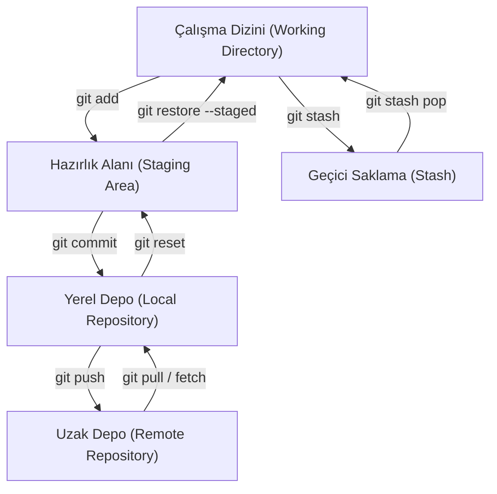

## 📌 Özet

Git temel komutları ve iş akışı, bir projenin yaşam döngüsü boyunca yapılan değişikliklerin yönetimini sağlar. Bu süreç; dosyaların takibi (status), değişikliklerin sahnelenmesi (add), kalıcı hale getirilmesi (commit) ve geçmişin incelenmesi (log/diff) gibi kritik adımları kapsar. Ayrıca, çalışma alanındaki karmaşıklığı yönetmek için stash kullanımı ve hatalı işlemlerin geri alınması (reset/restore) gibi ileri düzey araçlar geliştirici verimliliğini artırır. Bu komutların etkili kullanımı, hem bireysel çalışmalarda hem de ekip içi entegrasyonlarda veri bütünlüğünü korumanın temelidir.

---

## 🧠 Detay



### git status

```bash
git status              # Tam bilgi
git status -s           # Kısa format
git status --short

# Kısa format semboller:
# M  = Modified (staging'de)
#  M = Modified (working directory'de)
# MM = Her ikisinde
# A  = Added (yeni dosya, staging'de)
# ?? = Untracked (takip edilmiyor)
# D  = Deleted
# R  = Renamed
```

### git add

```bash
git add dosya.py              # Tek dosya
git add src/                  # Klasör
git add .                     # Tüm değişiklikler (önerilen)
git add -A                    # Tüm (silmeler dahil)
git add -u                    # Sadece takip edilenler (silmeler dahil)
git add *.js                  # Desen

# Etkileşimli — parça parça ekle (hunk)
git add -p
git add --patch
# → y: Ekle, n: Atlat, s: Böl, e: Düzenle, q: Çık
```

### git commit

```bash
git commit -m "mesaj"
git commit -am "mesaj"        # add + commit (takip edilenler)
git commit --amend            # Son commit'i düzelt (mesaj veya içerik)
git commit --amend -m "yeni mesaj"
git commit --amend --no-edit  # Mesajı değiştirmeden düzelt

# Boş commit (CI/CD tetiklemek için)
git commit --allow-empty -m "ci: yeniden çalıştır"

# GPG imzalı commit
git commit -S -m "güvenli commit"
```

### git log

```bash
# Temel
git log
git log --oneline                          # Her commit tek satır
git log --oneline --graph                  # Dal grafiği
git log --oneline --graph --all            # Tüm dallar
git log --oneline --decorate --graph --all # Tam görsel

# Filtreler
git log -5                                 # Son 5 commit
git log --since="2 weeks ago"
git log --since="2024-01-01" --until="2024-06-30"
git log --author="Ali"
git log --grep="fix:"                      # Mesaj içeriği
git log -- dosya.py                        # Belirli dosyanın geçmişi
git log -p dosya.py                        # Değişikliklerle birlikte
git log --stat                             # Değişen dosyalar ve satır sayısı
git log --follow -- eski_ad.py             # Yeniden adlandırmayı takip et

# Format
git log --format="%h %an %ar %s"          # hash, yazar, ne zaman, mesaj
git log --format="%C(yellow)%h%Creset %s" # Renkli

# Belirli commit
git show abc1234                           # Commit detayı
git show HEAD                             # Son commit
git show HEAD~2                           # İki önceki
```

### git diff

```bash
# Working directory → Staging arasındaki fark
git diff

# Staging → Son commit arasındaki fark
git diff --staged
git diff --cached            # Aynı şey

# İki commit arasındaki fark
git diff abc1234 def5678
git diff HEAD~3 HEAD
git diff main feature-branch

# Belirli dosya
git diff HEAD -- dosya.py

# İstatistik özeti
git diff --stat
git diff --stat main..feature

# Kelime bazlı diff (satır yerine kelime)
git diff --word-diff

# Harici diff aracı
git difftool
```

### git stash — Değişiklikleri Geçici Sakla

```bash
# Değişiklikleri sakla (çalışma dizinini temizle)
git stash
git stash push -m "login formunu yarıda bıraktım"
git stash push --include-untracked   # Takip edilmeyenler dahil

# Stash listesi
git stash list
# stash@{0}: On main: login formunu yarıda bıraktım
# stash@{1}: WIP on feature/auth: abc1234 ...

# Uygula ve listeden sil
git stash pop                        # En son stash
git stash pop stash@{2}              # Belirli stash

# Uygula ama listede bırak
git stash apply
git stash apply stash@{1}

# Stash içeriğini gör
git stash show
git stash show -p stash@{1}          # Diff olarak

# Branch olarak aç
git stash branch yeni-dal stash@{0}

# Sil
git stash drop stash@{0}
git stash clear                      # Tümünü sil
```

### git restore ve git reset

```bash
# ─── Değişiklikleri Geri Al ──────────────────

# Working directory'deki değişikliği geri al
git restore dosya.py                 # Git 2.23+
git checkout -- dosya.py             # Eski yöntem

# Staging'den geri al (unstage)
git restore --staged dosya.py
git reset HEAD dosya.py              # Eski yöntem

# Tüm değişiklikleri geri al
git restore .

# ─── git reset ────────────────────────────────

# Soft: Commit geri al, değişiklikler staging'de
git reset --soft HEAD~1
git reset --soft abc1234

# Mixed (varsayılan): Commit geri al, değişiklikler working dir'de
git reset HEAD~1
git reset --mixed HEAD~2

# Hard: Commit VE değişiklikleri tamamen sil (dikkat!)
git reset --hard HEAD~1
git reset --hard origin/main         # Uzak ile eşitle

# ─── git revert ───────────────────────────────
# Commit'i geri almak için yeni commit oluştur (geçmişi değiştirmez)
git revert abc1234                   # Tek commit
git revert HEAD~3..HEAD             # Son 3 commit
git revert --no-commit abc1234      # Commit etmeden
```

### git rm ve git mv

```bash
# Dosyayı sil (hem disk hem Git'ten)
git rm dosya.py
git rm -r klasor/

# Sadece Git'ten sil (disk'te bırak)
git rm --cached dosya.py           # .gitignore'a eklendiyse kullan
git rm --cached -r __pycache__/

# Dosyayı taşı / yeniden adlandır
git mv eski_ad.py yeni_ad.py
git mv src/utils.py lib/utils.py
```

### git clean

```bash
# Takip edilmeyen dosyaları göster
git clean -n                         # dry-run (silmez)
git clean -nd                        # Klasörler dahil

# Takip edilmeyen dosyaları sil
git clean -f                         # Dosyalar
git clean -fd                        # Dosyalar + klasörler
git clean -fdx                       # .gitignore'dakileri de sil
git clean -fdi                       # Etkileşimli
```

### Dosya Geçmişi ve Arama

```bash
# Belirli dosyanın tam geçmişi
git log --follow -p -- dosya.py

# Kimin hangi satırı yazdığı
git blame dosya.py
git blame -L 10,20 dosya.py          # Satır 10-20
git blame --date=short dosya.py

# Belirli string'i commit geçmişinde ara
git log -S "function login"          # İçerikte arama (pickaxe)
git log -G "regex_pattern"           # Regex

# Tüm dosyalarda arama
git grep "search_term"
git grep -n "function login"         # Satır numarasıyla
git grep -l "TODO"                   # Sadece dosya adları
```

### Alias Önerileri

```bash
# ~/.gitconfig
[alias]
  st   = status -s
  co   = checkout
  br   = branch
  ci   = commit
  lg   = log --oneline --graph --decorate --all
  last = log -1 HEAD --stat
  unstage = restore --staged
  undo    = reset --soft HEAD~1
  aliases = config --get-regexp alias
  whoami  = config user.email
```

---

## 💡 Bağlantılar
- [[Git - Giriş ve Temel Kavramlar]]
- [[Git - Branching ve Merging]]
- [[Git - Geçmişi Yeniden Yazma]]

## ❓ Sorular / Anlamadıklarım

## 🔗 Kaynaklar
- git-scm.com/docs
- git-scm.com/book/tr/v2
