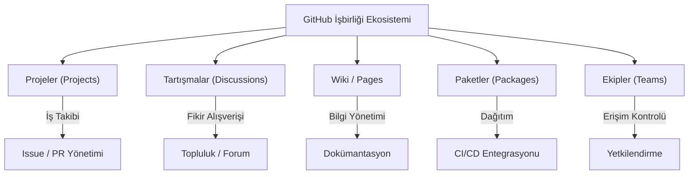

## 📌 Özet

GitHub, sadece bir kod deposu olmanın ötesinde, ekiplerin uçtan uca işbirliği yapabileceği kapsamlı bir proje yönetimi ekosistemi sunar. Projects aracıyla işler kanban veya yol haritası (roadmap) şeklinde görselleştirilirken, Discussions özelliği topluluk katılımını ve fikir alışverişini kolaylaştırır. Wiki ve GitHub Pages dokümantasyon ihtiyacını karşılarken, Packages özelliği projeye özgü paketlerin ve konteyner imajlarının güvenli bir şekilde saklanmasını sağlar. Bu araçların entegre kullanımı, yazılım geliştirme sürecinin her aşamasında şeffaflığı ve ekip içi koordinasyonu en üst düzeye çıkarır.

---

## 🧠 Detay



### GitHub Projects (v2)

GitHub Projects, repo veya organizasyon düzeyinde çalışan esnek bir proje yönetimi aracıdır.

```bash
# CLI ile proje yönetimi
gh project list
gh project create --owner "@me" --title "Sprint 1"
gh project view 1 --owner "@me"

# Issue'yu projeye ekle
gh project item-add 1 --owner "@me" --url https://github.com/user/repo/issues/42

# Item güncelle
gh project item-edit --id ITEM_ID --field-id FIELD_ID --project-id PROJECT_ID --text "In Progress"

# API ile item oluştur
gh api graphql -f query='
  mutation {
    addProjectV2ItemById(input: {projectId: "PVT_xxx", contentId: "I_xxx"}) {
      item { id }
    }
  }
'
```

**Özel Alanlar (Custom Fields):**
- Text, Number, Date
- Single Select (Status, Priority)
- Iteration (Sprint)

**Görünümler:**
- Board (Kanban)
- Table (Spreadsheet gibi)
- Roadmap (Zaman çizelgesi)

**Otomasyonlar:**
```yaml
# Issue açıldığında otomatik "Todo" statüsü ata
# Issue kapandığında "Done" yap
# PR merge olunca "Done" yap
# Tüm bunlar Projects ayarlarından yapılabilir
```

### Discussions

Repo veya organizasyon düzeyinde forum/topluluk aracı.

```bash
# Discussions listele
gh api repos/USER/REPO/discussions

# Yeni discussion oluştur (API ile)
gh api repos/USER/REPO/discussions \
  --method POST \
  --field title="RFC: Yeni API tasarımı" \
  --field body="Tartışmak istediğim..." \
  --field category_id="DIC_xxx"
```

**Kategori Tipleri:**
- `announcement` — Duyuru (maintainer'lar yazar)
- `general` — Genel sohbet
- `ideas` — Özellik fikirleri
- `q-and-a` — Soru & Cevap (cevap işaretlenebilir)
- `show-and-tell` — Proje paylaşımı

### Wiki

```bash
# Wiki'yi klonla
git clone https://github.com/USER/REPO.wiki.git

# Düzenle ve push et
cd REPO.wiki
git add .
git commit -m "Kurulum talimatları güncellendi"
git push

# Sayfa oluştur (dosya adı = URL)
# Home.md → /wiki/Home
# Getting-Started.md → /wiki/Getting-Started
# API-Reference.md → /wiki/API-Reference
```

**Wiki vs Docs klasörü:**
- Wiki: Herkes düzenleyebilir (ayarlanabilir), UI dostu
- `/docs` klasörü: Kod ile birlikte versiyonlanır, PR'a dahil olur
- Büyük projeler için `/docs` + GitHub Pages tercih edilir

### GitHub Pages

```bash
# Statik site yayınlama
# 1. Repository'de Pages aktifleştir
#    Settings → Pages → Source: Deploy from branch
#    Branch: gh-pages veya main/docs

# 2. Actions ile otomatik deploy
```

```yaml
# .github/workflows/pages.yml
name: Deploy Pages

on:
  push:
    branches: [main]

permissions:
  contents: read
  pages: write
  id-token: write

jobs:
  build:
    runs-on: ubuntu-latest
    steps:
      - uses: actions/checkout@v4
      - uses: actions/setup-python@v5
        with:
          python-version: '3.11'
      - run: pip install mkdocs-material
      - run: mkdocs build --site-dir site
      - uses: actions/upload-pages-artifact@v3
        with:
          path: site/

  deploy:
    needs: build
    runs-on: ubuntu-latest
    environment:
      name: github-pages
      url: ${{ steps.deployment.outputs.page_url }}
    steps:
      - uses: actions/deploy-pages@v4
        id: deployment
```

### GitHub Packages

```bash
# Python paketi yayınlama (PyPI yerine GitHub Packages)
# ~/.pypirc
[distutils]
index-servers = github

[github]
repository = https://upload.pypi.org/legacy/
username = __token__
password = ghp_TOKEN

# pyproject.toml
[tool.poetry]
name = "mypackage"

[[tool.poetry.source]]
name = "github"
url = "https://pypi.pkg.github.com/USERNAME/"

# Yayınla
poetry publish --repository github
```

```bash
# npm paketi yayınlama
# .npmrc
@SCOPE:registry=https://npm.pkg.github.com
//npm.pkg.github.com/:_authToken=ghp_TOKEN

# package.json
{
  "name": "@scope/mypackage",
  "publishConfig": {
    "registry": "https://npm.pkg.github.com"
  }
}

npm publish
```

```bash
# Docker image (GitHub Container Registry — GHCR)
echo $GITHUB_TOKEN | docker login ghcr.io -u USERNAME --password-stdin

docker build -t ghcr.io/USERNAME/myapp:latest .
docker push ghcr.io/USERNAME/myapp:latest
docker pull ghcr.io/USERNAME/myapp:latest
```

### Teams ve Organizasyonlar

```bash
# Organizasyon kurulumu
gh org list
gh api orgs/ORG/teams

# Takım oluştur
gh api orgs/ORG/teams \
  --method POST \
  --field name="backend-team" \
  --field description="Backend geliştiriciler" \
  --field privacy="closed"

# Takıma üye ekle
gh api orgs/ORG/teams/backend-team/memberships/username \
  --method PUT \
  --field role="member"  # veya "maintainer"

# Takıma repo erişimi ver
gh api orgs/ORG/teams/backend-team/repos/ORG/myrepo \
  --method PUT \
  --field permission="push"  # pull, push, admin, maintain, triage
```

**Takım İzin Seviyeleri:**

| İzin | Pull | Push | Admin |
|---|---|---|---|
| **Read** | ✅ | ❌ | ❌ |
| **Triage** | ✅ | ❌ | ❌ |
| **Write** | ✅ | ✅ | ❌ |
| **Maintain** | ✅ | ✅ | Kısmi |
| **Admin** | ✅ | ✅ | ✅ |

### Dependabot

```yaml
# .github/dependabot.yml
version: 2
updates:
  # Python bağımlılıkları
  - package-ecosystem: pip
    directory: "/"
    schedule:
      interval: weekly
      day: monday
      time: "09:00"
    open-pull-requests-limit: 5
    labels:
      - "dependencies"
      - "python"
    ignore:
      - dependency-name: "django"
        versions: ["4.x"]  # Major güncellemeyi atla

  # npm bağımlılıkları
  - package-ecosystem: npm
    directory: "/frontend"
    schedule:
      interval: daily
    groups:
      react-packages:
        patterns:
          - "react*"
          - "@testing-library/*"

  # Docker base image
  - package-ecosystem: docker
    directory: "/"
    schedule:
      interval: weekly

  # GitHub Actions
  - package-ecosystem: github-actions
    directory: "/"
    schedule:
      interval: weekly
```

### Security Features

```bash
# Secret scanning — push edilen token'ları otomatik algılar
# Settings → Code security → Secret scanning

# Code scanning (CodeQL)
# Security → Code scanning → Set up code scanning
```

```yaml
# .github/workflows/codeql.yml
name: CodeQL

on:
  push:
    branches: [main]
  schedule:
    - cron: '0 0 * * 1'

jobs:
  analyze:
    runs-on: ubuntu-latest
    permissions:
      security-events: write
    strategy:
      matrix:
        language: [python, javascript]
    steps:
      - uses: actions/checkout@v4
      - uses: github/codeql-action/init@v3
        with:
          languages: ${{ matrix.language }}
      - uses: github/codeql-action/autobuild@v3
      - uses: github/codeql-action/analyze@v3
```

### Repo Görünürlüğü ve Özelleştirme

```bash
# README profiline özel repo
# kullanıcı_adi/kullanıcı_adi reposu → Profil README

# .github repo (organizasyon için)
# ORG/.github/profile/README.md → Org profili
# ORG/.github/ISSUE_TEMPLATE/ → Tüm repolar için issue şablonu

# Repo ayarları
gh repo edit \
  --description "Harika proje açıklaması" \
  --homepage "https://myproject.com" \
  --add-topic "python,api,fastapi" \
  --enable-issues \
  --enable-wiki=false \
  --enable-discussions
```

---

## 💡 Bağlantılar
- [[GitHub - Repository Yönetimi]]
- [[GitHub - Actions ve CI-CD]]
- [[GitHub - Pull Request ve Code Review]]

## ❓ Sorular / Anlamadıklarım

## 🔗 Kaynaklar
- docs.github.com/en/issues/planning-and-tracking-with-projects
- docs.github.com/en/packages
