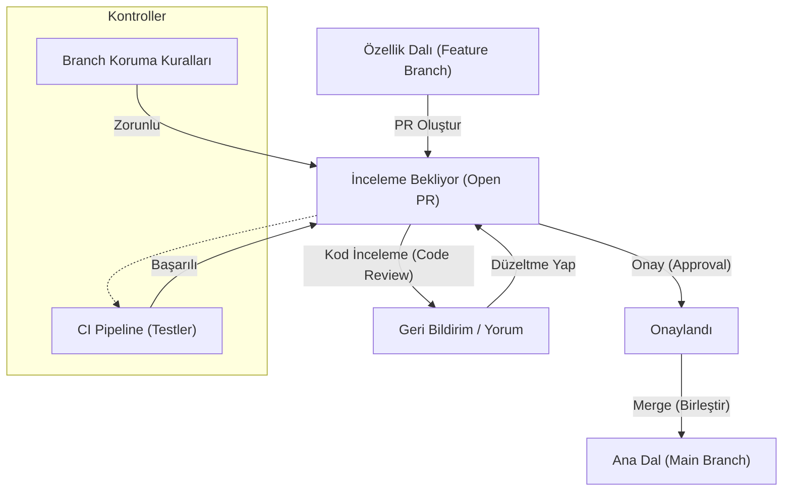

## 📌 Özet

Pull Request (PR) süreci, yazılım geliştirmede kalite kontrolünün ve ekip içi bilgi paylaşımının merkezinde yer alan kritik bir iş akışıdır. Bir geliştirici, tamamladığı özellikleri veya hata düzeltmelerini ana kod tabanına dahil etmeden önce, diğer ekip üyelerinin incelemesine ve geri bildirimine sunar. Bu aşama sadece hataların ayıklanmasını sağlamakla kalmaz, aynı zamanda kod standartlarının korunmasına, dokümantasyonun güncel tutulmasına ve projenin genel mimarisine uyumun denetlenmesine olanak tanır. Etkili bir Code Review (Kod İnceleme) kültürü, teknik borcun azalmasını ve daha sürdürülebilir bir yazılım ekosisteminin oluşmasını sağlar.

---

## 🧠 Detay



### PR Oluşturma Adımları

```bash
# 1. Feature branch'te çalış
git checkout -b feature/odeme-sistemi

# 2. Geliştir ve commit et
git add .
git commit -m "feat(payment): Stripe entegrasyonu eklendi"
git commit -m "test(payment): Ödeme testleri yazıldı"

# 3. Push et
git push -u origin feature/odeme-sistemi

# 4. PR oluştur (GitHub CLI)
gh pr create \
  --title "feat: Stripe ödeme entegrasyonu" \
  --body "## Ne değişti?
Stripe API entegrasyonu eklendi.

## Test Edildi mi?
- [x] Unit testler geçiyor
- [x] Manuel test yapıldı

## Ekran Görüntüleri
(varsa)

Closes #45" \
  --base main \
  --reviewer ali,veli \
  --label "feature,payment"

# Draft PR (henüz hazır değil)
gh pr create --draft --title "WIP: Ödeme sistemi"

# PR'ı hazır işaretle
gh pr ready 23
```

### PR Şablonu

```markdown
<!-- .github/pull_request_template.md -->
## 📋 Değişiklik Özeti
<!-- Ne değişti? Neden? -->

## 🔗 İlgili Issue
Closes #

## 🧪 Test Edildi mi?
- [ ] Unit testler yazıldı/güncellendi
- [ ] Integration testler çalıştı
- [ ] Manuel test yapıldı

## 📸 Ekran Görüntüleri
<!-- UI değişikliği varsa -->

## ✅ Onay Listesi
- [ ] Kod stili kurallarına uygun
- [ ] Gerekli dokümantasyon güncellendi
- [ ] Geriye uyumluluk korundu
- [ ] Güvenlik etkileri değerlendirildi

## 🚀 Deploy Notu
<!-- Özel deployment adımı var mı? -->
```

### Code Review Best Practices

```
İnceleyici İçin:
✅ 24-48 saat içinde yanıt ver
✅ "Neden" değil, "Bu approach yerine şunu deneyebilirsin" de
✅ Nitpick'leri etiketle: "nit: ..."
✅ Positif feedback de ver
✅ Context olmadan code sadece judge etme
✅ 400 satırın üstünde PR için daha fazla zaman ayır

PR Açan İçin:
✅ PR'ı küçük tut (< 400 satır ideal)
✅ Bağlamı PR açıklamasında ver
✅ Self-review yap, önce kendin incele
✅ Test coverage'ı göster
✅ Breaking change varsa belirt
```

### Review Yorumları

```bash
# gh ile PR inceleme
gh pr review 23 --approve --body "LGTM! 🚀"
gh pr review 23 --request-changes --body "Birkaç nokta var..."
gh pr review 23 --comment --body "Genel bakış iyi, sorular var"

# PR yorumları görüntüle
gh pr view 23 --comments

# PR diff incele
gh pr diff 23
gh pr checkout 23              # Yerel olarak test et
```

### GitHub Review Seçenekleri

```
GitHub Review Types:
┌─────────────────────────────────────┐
│ ✅ Approve           → Merge edilebilir
│ 🔄 Request Changes   → Düzeltme gerekli
│ 💬 Comment           → Yorum, bloklamaz
└─────────────────────────────────────┘

Yorum Türleri:
- Satır yorumu: Belirli kod satırına
- Dosya yorumu: Dosyanın tamamına
- Genel yorum: PR seviyesinde
- Öneri (Suggestion): Kod değişikliği öner
```

```markdown
<!-- Öneri (Suggestion) — Reviewer şunu yapar: -->
```suggestion
def calculate_tax(price: float) -> float:
    return price * 0.18
```
<!-- PR sahibi "Apply suggestion" ile direkt uygular -->
```

### Branch Protection Rules

```yaml
# GitHub → Settings → Branches → Add Rule

Branch name pattern: main

Koruma kuralları:
✅ Require pull request reviews before merging
  └─ Required approving reviews: 1 (veya 2)
  └─ Dismiss stale pull request approvals when new commits are pushed
  └─ Require review from Code Owners

✅ Require status checks to pass before merging
  └─ Require branches to be up to date
  └─ Status checks: ci/tests, lint, coverage

✅ Require conversation resolution before merging
✅ Require signed commits
✅ Include administrators
✅ Restrict who can push to matching branches
✅ Allow force pushes: HAYIR
✅ Allow deletions: HAYIR
```

### CODEOWNERS

```
# .github/CODEOWNERS
# Belirli dosyaların sahibi → PR'da otomatik reviewer

# Tüm repo
* @ali @veli

# Backend klasörü
/backend/ @backend-team

# Frontend
/frontend/ @frontend-team

# Kritik dosyalar
/src/payment/ @ali @payment-team
/deploy/ @devops-team
*.tf @devops-team                  # Terraform dosyaları
/docs/ @technical-writer

# Paket bağımlılıkları
package.json @frontend-lead
requirements.txt @backend-lead
```

### Merge Stratejileri

```bash
# 1. Merge Commit (--no-ff)
# Tüm geçmişi korur, merge commit oluşturur
# main: A──B──M
#              /
# feature: C──D

# 2. Squash and Merge
# Feature'daki tüm commit'leri tek commit yapar
# main: A──B──C' (squashed)
# ✅ Temiz main geçmişi
# ❌ Feature commit'leri kaybolur

# 3. Rebase and Merge
# Feature commit'lerini main'in üstüne yazar
# main: A──B──C──D──E (linear)
# ✅ En temiz geçmiş
# ❌ Orijinal commit hash'leri değişir

# Tavsiye:
# Küçük feature   → Squash (1-3 commit)
# Büyük feature   → Merge commit (geçmiş önemli)
# Hotfix          → Merge veya Cherry-pick
# Internal branch → Rebase
```

### Otomatik PR Etiketleme

```yaml
# .github/labeler.yml (actions/labeler)
backend:
  - changed-files:
    - any-glob-to-any-file:
      - "backend/**"
      - "api/**"

frontend:
  - changed-files:
    - any-glob-to-any-file:
      - "frontend/**"
      - "*.css"

documentation:
  - changed-files:
    - any-glob-to-any-file:
      - "docs/**"
      - "*.md"

dependencies:
  - changed-files:
    - any-glob-to-any-file:
      - "requirements*.txt"
      - "package*.json"
      - "pyproject.toml"
```

### PR Metrikleri ve Kalite

```bash
# Ortalama PR boyutu
gh pr list --state merged --limit 100 --json additions,deletions \
  --jq '[.[].additions + .[].deletions] | add / length'

# Açık PR'ların yaşı
gh pr list --state open --json createdAt,title \
  --jq '.[] | {title, age: (now - (.createdAt | fromdateiso8601) | . / 86400 | floor)}'

# İnceleme süresi
gh pr list --state merged --json createdAt,mergedAt,title \
  --jq '.[] | {title, days: ((.mergedAt | fromdateiso8601) - (.createdAt | fromdateiso8601) | . / 86400 | floor)}'
```

---

## 💡 Bağlantılar
- [[GitHub - Repository Yönetimi]]
- [[GitHub - Actions ve CI-CD]]
- [[Git - Branching ve Merging]]

## ❓ Sorular / Anlamadıklarım

## 🔗 Kaynaklar
- docs.github.com/en/pull-requests
- google.github.io/eng-practices/review/
