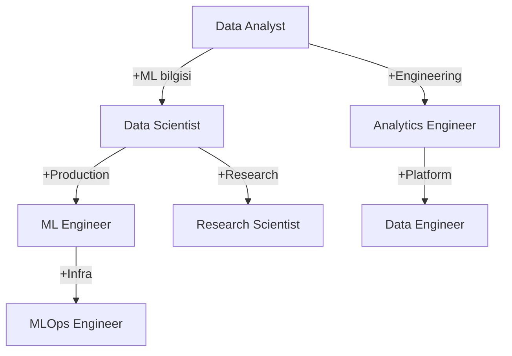

## 📌 Özet

Data Science & ML kariyer yolculuğuna başlama veya yön bulma rehberi. Bu klasördeki notlar, teknik bilgini iş fırsatına dönüştürmek için gereken her adımı kapsar: portfolio'dan mülakata, LinkedIn'den Kaggle'a.

---

## 🧠 Detay

### Bu Klasörde Ne Var?

| Not | Konu |
|-----|------|
| [[Kariyer - Data Science Portfolio Proje Fikirleri]] | Etkili portfolio projeleri nasıl seçilir |
| [[Kariyer - GitHub Profil Optimizasyonu]] | GitHub'ı işe alım silahına çevir |
| [[Kariyer - CV ve LinkedIn Hazırlama]] | DS/ML CV ve LinkedIn profili |
| [[Kariyer - Mülakat Süreci ve Hazırlık Stratejisi]] | Teknik mülakat taktikleri |
| [[Kariyer - Kaggle Strateji Rehberi]] | Kaggle'ı kariyer fırsatına çevir |
| [[Kariyer - Freelance vs Tam Zamanlı Karar Rehberi]] | İş modeli seçimi |
| [[Kariyer - Networking ve Topluluk Katılımı]] | Topluluk ve ağ kurma |

---

### DS/ML Kariyer Yolları



### Rol Karşılaştırması

| Rol | Odak | Araçlar | Ortalama Maaş (TR) |
|-----|------|---------|---------------------|
| **Data Analyst** | Rapor, dashboard | SQL, Excel, BI | ₺70-120K |
| **Data Scientist** | Model kurma, analiz | Python, sklearn, Statistics | ₺100-200K |
| **ML Engineer** | Model deploy, scale | PyTorch, Docker, MLOps | ₺150-300K |
| **Data Engineer** | Pipeline, altyapı | Spark, dbt, Kafka | ₺130-250K |
| **MLOps Engineer** | CI/CD, monitoring | K8s, MLflow, Airflow | ₺150-280K |

### Kariyer Aşamaları

**Junior (0-2 yıl):** Temel Python, SQL, birkaç ML algoritması, 2-3 portfolio projesi
**Mid-level (2-4 yıl):** Uçtan uca ML pipeline, deploy deneyimi, domain bilgisi
**Senior (4+ yıl):** Sistem tasarımı, ekip liderliği, iş etkisi ölçümü

### Nerede İş Ara?

```
Türkiye:
  - Kariyer.net, LinkedIn, Indeed
  - Startuplar: getir, Trendyol, Peak, Insider
  - Danışmanlık: Deloitte, McKinsey Analytics
  - Fintech: Akbank, Garanti BBVA teknoloji

Remote/Global:
  - LinkedIn (Remote filtresi)
  - Toptal, Upwork (freelance)
  - Wellfound (startuplar)
  - HackerNews "Who's Hiring" (her ay 1.'si)
```

---

## 💡 Bağlantılar
- [[DATA SCIENCE & ML ÖĞRENME YOL HARİTASI]]
- [[00 - ML Mülakat Hazırlık Rehberi]]
- [[Kariyer - Data Science Portfolio Proje Fikirleri]]

## ❓ Sorular / Anlamadıklarım

## 🔗 Kaynaklar
- [Ken Jee - Data Science Career](https://www.youtube.com/@KenJee_DS)
- [Sundas Khalid - DS Career](https://www.youtube.com/@SundasKhalid)
