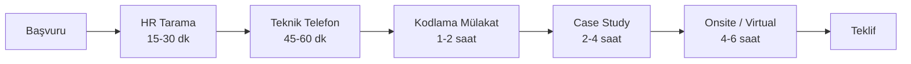

## 📌 Özet

DS/ML mülakat süreci çok katmanlıdır: HR mülakat, teknik tarama, kodlama mülakat, case study, sistem tasarımı ve kültür uyum. Her aşama farklı hazırlık gerektirir. Bu not her aşama için strateji ve örnek soru setleri içerir.

---

## 🧠 Detay

### Tipik DS/ML Mülakat Süreci



### Aşama 1: HR Tarama

Sorular: "Kendini anlat", "Neden bu şirketi seçtin?", "Nerede görmek istiyorsun kendin?"

**Cevap stratejisi — "Kendini anlat" için:**
```
Geçmiş → Şu an → Gelecek formatı:

"[X yıl önce] [başlangıç noktası] ile başladım.
 O günden bugüne [somut proje/başarı] yaptım.
 Şu an [mevcut pozisyon/proje] üzerinde çalışıyorum.
 Bu pozisyon bana [spesifik neden] için çok uygun görünüyor."

Süre: 2 dakika max
```

### Aşama 2: Teknik Telefon

**Sıkça sorulan teknik sorular:**

```python
# 1. Algoritma soruları
"Precision ve Recall arasındaki fark ne?"
"Overfitting nasıl önlenir?"
"Cross-validation neden kullanılır?"
"Gradient Descent vs Stochastic Gradient Descent?"

# 2. Proje bazlı sorular  
"En zorlu ML projenizi anlatın."
"Model production'a nasıl aldınız?"
"Feature selection nasıl yaptınız?"

# 3. SQL soruları
"GROUP BY vs HAVING farkı?"
"Window Function örneği ver."
```

### Aşama 3: Kodlama Mülakat

**DS/ML için sıkça gelen konular:**

```python
# pandas manipülasyonu
df.groupby('segment')['revenue'].agg(['mean', 'sum', 'count'])

# NumPy ile matris işlemi
X = np.random.randn(100, 5)
cov = np.cov(X.T)

# Kendi algoritmanı yaz — örnek: K-Means
class KMeans:
    def __init__(self, k, max_iter=100):
        self.k = k
        self.max_iter = max_iter
    
    def fit(self, X):
        # Random init
        idx = np.random.choice(len(X), self.k, replace=False)
        self.centers = X[idx]
        
        for _ in range(self.max_iter):
            # Assign
            distances = np.linalg.norm(X[:, None] - self.centers, axis=2)
            self.labels = np.argmin(distances, axis=1)
            
            # Update
            new_centers = np.array([X[self.labels == i].mean(axis=0) 
                                   for i in range(self.k)])
            if np.allclose(self.centers, new_centers):
                break
            self.centers = new_centers
```

**LeetCode yerine hangi soruları çöz:**
- Array/String manipülasyonu (Easy-Medium)
- Hash map soruları
- Sliding window
- İki pointer

### Aşama 4: Case Study

Şirkete özgü iş problemi verilir, 2-4 saat süre.

**Yaklaşım çerçevesi:**

```
ADIM 1 — Problemi tanımla (5 dk)
  → Hedef metrik nedir?
  → Başarı nasıl ölçülür?
  → Kısıtlar neler?

ADIM 2 — Veriyi anla (10 dk)
  → Hangi veriye erişimim var?
  → Kalite sorunları?
  → Leakage riski?

ADIM 3 — Model yaklaşımı (15 dk)
  → Baseline önce
  → Karmaşıklık gerekçesi
  → Alternatifler

ADIM 4 — Değerlendirme (10 dk)
  → Offline metrik
  → Online metrik (A/B testi)
  → İzleme planı
```

**Sık verilen case'ler:** [[Interview - Data Science Vaka Çalışmaları]]

### Aşama 5: Sistem Tasarımı

"Öneri sistemi kur", "Fraud detection sistemi tasarla"

```
Temel cevap yapısı:
1. Gereksinim toplama (functional + non-functional)
2. Yüksek seviye mimari
3. Veri katmanı
4. Model katmanı
5. Serving katmanı
6. Monitoring
7. Scale ve bottleneck'ler

Örnek: ML tabanlı öneri sistemi
  Veri: User-item interaction log (Kafka → S3)
  Feature Store: Redis (real-time) + Hive (batch)
  Model: Two-tower neural network (recall) + LambdaMART (ranking)
  Serving: FastAPI + Redis cache + A/B test
  Monitoring: CTR, nDCG, latency, data drift
```

### Mülakat Öncesi Şirket Araştırması

```
1. Şirketin tech blog'u → kullandıkları araçlar
2. LinkedIn → ekip üyelerinin geçmişi
3. Glassdoor → mülakat soruları
4. GitHub → açık kaynak projeleri
5. ArXiv → araştırma şirketiyse paper'ları
```

### Teklif Müzakeresi

```python
teklif_alma_sonrasi = {
    "bekle": "72 saat düşünme hakkın var, kullan",
    "araştır": "Glassdoor, levels.fyi ile benchmark al",
    "karşı_teklif": "Mevcut teklifin %15-20 üstünü iste",
    "kapsamı_gör": "Sadece maaş değil: hisse, prim, izin, eğitim bütçesi",
    "yazılı_iste": "Sözlü teklifi asla kabul etme"
}
```

### Reddedilince

```
✓ "Feedback alabilir miyim?" → Her zaman sor
✓ 6 ay sonra tekrar başvur — politika değişir, ekip değişir
✓ Her red bir tur hazırlık eksikliğini gösterir → not al
✗ Sosyal medyada şirketi kötüleme
✗ Aynı hatayla tekrar başvur
```

---

## 💡 Bağlantılar
- [[00 - ML Mülakat Hazırlık Rehberi]]
- [[Interview - Makine Öğrenmesi Temel Sorular]]
- [[Interview - Data Science Vaka Çalışmaları]]
- [[Interview - MLOps ve Sistem Tasarımı Soruları]]
- [[Kariyer - CV ve LinkedIn Hazırlama]]

## ❓ Sorular / Anlamadıklarım

## 🔗 Kaynaklar
- [Emma Ding - Data Interview Pro](https://www.youtube.com/@DataInterviewPro)
- [Glassdoor Interview Questions](https://www.glassdoor.com/)
- [Exponent - System Design](https://www.tryexponent.com/)
