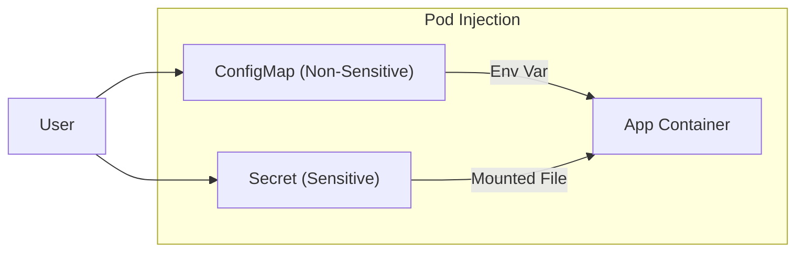

## 📌 Özet
Kubernetes, uygulama kodunu konfigürasyondan ayırmak için ConfigMap ve Secret objelerini sunar. ConfigMap, şifrelenmemiş verileri (ayarlar, parametreler) saklamak için kullanılırken; Secret, hassas verileri (şifreler, API anahtarları, sertifikalar) bazlı (base64) kodlanmış şekilde tutar. Bu objeler sayesinde aynı uygulama imajı farklı ortamlarda (dev, test, prod) sadece konfigürasyon değiştirilerek çalıştırılabilir. Veriler Pod'lara çevre değişkeni (environment variable) veya dosya sistemi (volume mount) olarak aktarılabilir. Bu ayrıştırma, güvenlik ve esneklik açısından kritik bir best-practice'dir.

## 🧠 Detay



### 1. ConfigMap Kullanımı
Uygulama ayarlarını tutar.
```yaml
apiVersion: v1
kind: ConfigMap
metadata:
  name: app-config
data:
  DB_URL: "jdbc:mysql://db-host:3306"
  LOG_LEVEL: "INFO"
```

### 2. Secret Kullanımı
Hassas veriler için kullanılır. K8s içinde base64 ile saklanır (güvenlik için ek olarak şifrelenmelidir).
```yaml
apiVersion: v1
kind: Secret
metadata:
  name: db-secret
type: Opaque
data:
  password: bXlwYXNzd29yZA== # "mypassword" base64 hali
```

### 3. Pod'a Enjekte Etme
```yaml
spec:
  containers:
  - name: my-app
    env:
      - name: DATABASE_PASSWORD
        valueFrom:
          secretKeyRef:
            name: db-secret
            key: password
    volumeMounts:
    - name: config-volume
      mountPath: /etc/config
  volumes:
  - name: config-volume
    configMap:
      name: app-config
```

### 🛠️ Temel Kubectl Komutları
```bash
kubectl get cm,secrets


kubectl create secret generic my-secret --from-literal=user=admin --from-literal=pass=123


kubectl get secret db-secret -o jsonpath='{.data.password}' | base64 --decode

# Mevcut bir ConfigMap'i düzenle
kubectl edit cm app-config
```

## 💡 Bağlantılar
- [[K8s - Pods ve Konteyner Yönetimi]]
- [[K8s - Ingress ve Trafik Yönetimi]]
