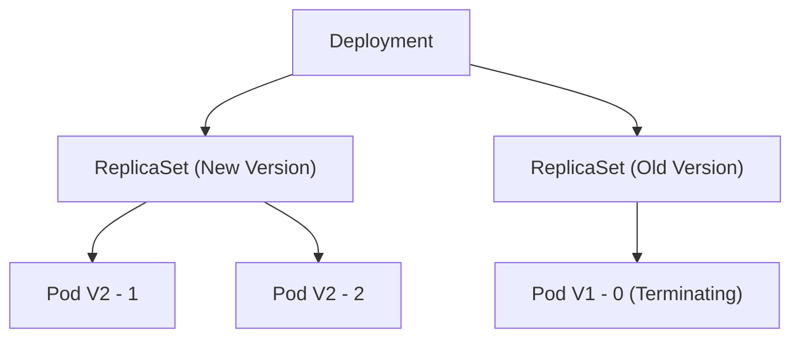

## 📌 Özet
Deployment, Kubernetes'te stateless (durumsuz) uygulamaların yayınlanması ve yönetilmesi için kullanılan en yaygın üst düzey objedir. Uygulamanın kaç adet kopyasının (replica) çalışacağını, güncellemelerin nasıl yapılacağını (RollingUpdate) ve hata durumunda nasıl geri dönüleceğini (Rollback) yönetir. Arka planda ReplicaSet'leri kullanarak pod'ların sürekliliğini sağlar. Deployment sayesinde sıfır kesinti süresi (zero-downtime) ile yeni versiyonlara geçiş yapmak ve trafiği yönetmek mümkün hale gelir. Ayrıca, yük artışı durumunda manuel veya otomatik olarak (HPA) ölçeklendirme imkanı sunar.

## 🧠 Detay



### 1. Deployment Stratejileri
Kubernetes iki ana güncelleme stratejisi sunar:
*   **RollingUpdate (Varsayılan):** Eski pod'ları kademeli olarak silerken yeni pod'ları ayağa kaldırır. Kesinti yaşanmaz.
*   **Recreate:** Önce tüm eski pod'ları siler, sonra yenilerini oluşturur. Kısa süreli kesinti yaşanır ancak aynı anda iki versiyonun çalışması istenmeyen durumlar için idealdir.

### 2. Deployment Manifest Örneği
```yaml
apiVersion: apps/v1
kind: Deployment
metadata:
  name: web-app-deployment
spec:
  replicas: 3
  selector:
    matchLabels:
      app: web-app
  strategy:
    type: RollingUpdate
    rollingUpdate:
      maxSurge: 1
      maxUnavailable: 0
  template:
    metadata:
      labels:
        app: web-app
    spec:
      containers:
      - name: web-app
        image: nginx:1.21
        ports:
        - containerPort: 80
```

### 3. Scaling (Ölçeklendirme)
*   **Manual Scaling:** `kubectl scale` komutu ile replica sayısı değiştirilir.
*   **Horizontal Pod Autoscaler (HPA):** CPU veya Bellek kullanımına göre replica sayısını otomatik ayarlar.

### 🛠️ Temel Kubectl Komutları
```bash
kubectl apply -f deployment.yaml


kubectl rollout status deployment/web-app-deployment


kubectl scale deployment/web-app-deployment --replicas=5

# Bir önceki versiyona geri dön
kubectl rollout undo deployment/web-app-deployment

# Deployment geçmişini listele
kubectl rollout history deployment/web-app-deployment
```

## 💡 Bağlantılar
- [[K8s - Pods ve Konteyner Yönetimi]]
- [[K8s - Services ve Networking]]
