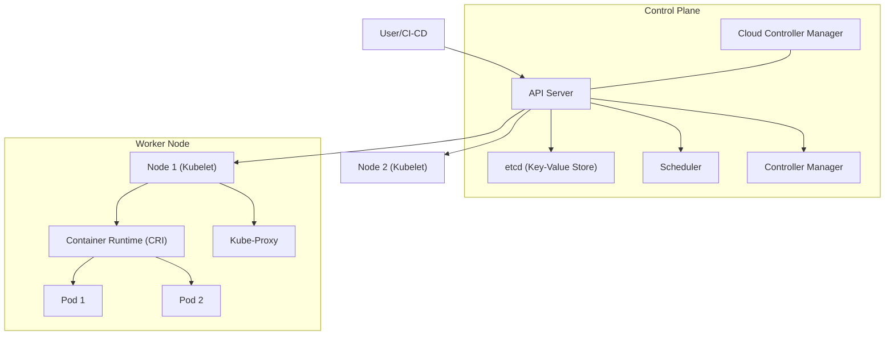

## 📌 Özet
Kubernetes (K8s), konteynerize edilmiş iş yüklerini yönetmek için tasarlanmış açık kaynaklı bir orkestrasyon platformudur. Sistemin kalbinde, tüm cluster'ın durumunu yöneten bir "Control Plane" ve uygulama yüklerini fiilen taşıyan "Worker Nodes" bulunur. Control Plane, cluster'ın arzulanan durumunu (desired state) takip eder ve API server üzerinden gelen istekleri koordine eder. Worker Node'lar ise konteynerleri çalıştıran kubelet, kube-proxy ve runtime bileşenlerini barındırır. Bu ayrıştırılmış yapı, yüksek erişilebilirlik, ölçeklenebilirlik ve hata toleransı sağlar. Kubernetes mimarisini anlamak, karmaşık mikroservis ekosistemlerini güvenle yönetmenin ilk adımıdır.

## 🧠 Detay



### 1. Control Plane Bileşenleri
Control Plane, cluster kararlarını verir (örneğin planlama) ve cluster olaylarını algılayıp bunlara yanıt verir.

*   **kube-apiserver:** Kubernetes control plane'inin ön yüzüdür. Tüm iletişim bu API üzerinden döner.
*   **etcd:** Tüm cluster verilerinin (durum bilgisi, konfigürasyon) tutulduğu tutarlı ve yüksek erişilebilir anahtar-değer deposudur.
*   **kube-scheduler:** Yeni oluşturulan ve henüz bir node'a atanmamış Pod'ları izler ve üzerinde çalışacakları node'u seçer.
*   **kube-controller-manager:** Node, Job, Endpoint ve Service Account controller'larını çalıştıran bileşendir.

### 2. Worker Node Bileşenleri
Node bileşenleri her node üzerinde çalışır, çalışan pod'ları korur ve Kubernetes çalışma ortamını sağlar.

*   **kubelet:** Cluster içindeki her node'da çalışan bir ajandır. Konteynerlerin bir Pod içinde çalıştığından emin olur.
*   **kube-proxy:** Her node'da çalışan bir network proxy'sidir. Kubernetes Service konseptinin bir parçasını gerçekleştirir.
*   **Container Runtime:** Konteynerleri çalıştırmaktan sorumlu yazılımdır (örn: Docker, containerd, CRI-O).

### 🛠️ Temel Kubectl Komutları
```bash
kubectl cluster-info


kubectl get nodes


kubectl describe node <node-name>

# Tüm bileşenlerin sağlık durumunu kontrol et
kubectl get componentstatuses
```

## 💡 Bağlantılar
- [[K8s - Pods ve Konteyner Yönetimi]]
- [[K8s - Services ve Networking]]
