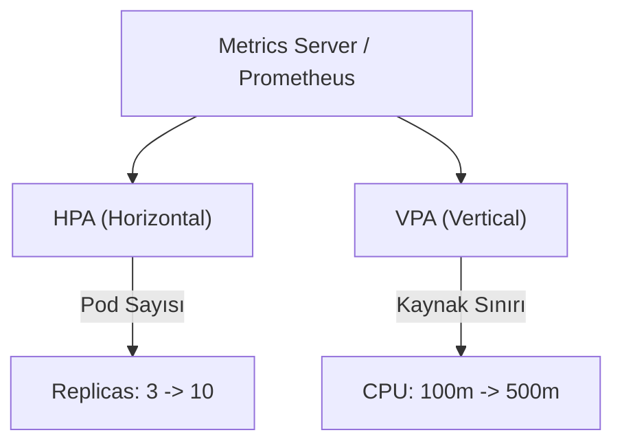

## 📌 Ozet
Kubernetes te ölçeklendirme iki ana boyutta yapılır: HPA (Horizontal Pod Autoscaler) pod sayısını artırıp azaltırken, VPA (Vertical Pod Autoscaler) mevcut podların kaynak limitlerini (CPU/Memory) dinamik olarak ayarlar.

## 🧠 Detay

### 1. HPA (Yatay Ölçekleme)
- Genellikle CPU veya Memory kullanımına göre çalışır.
- Uygulamanın statik değil, değişken trafik altında stabil kalmasını sağlar.

### 2. VPA (Dikey Ölçekleme)
- Pod sayısını değiştirmez, podun içindeki kaynak sınırlarını günceller.
- Doğru kaynak tahmini yapamayan uygulamalar için idealdir.

### 3. Kritik Not: HPA vs VPA
- Aynı metrik (örn CPU) üzerinde hem HPA hem de VPA kullanmak çatışmaya (oscillation) neden olabilir. Genellikle birini seçmek veya farklı metrikler kullanmak gerekir.

## 💡 Baglantilar
- [[K8s - Deployments ve Scaling]]
- [[MO - Prometheus ile Metrik Toplama]]
