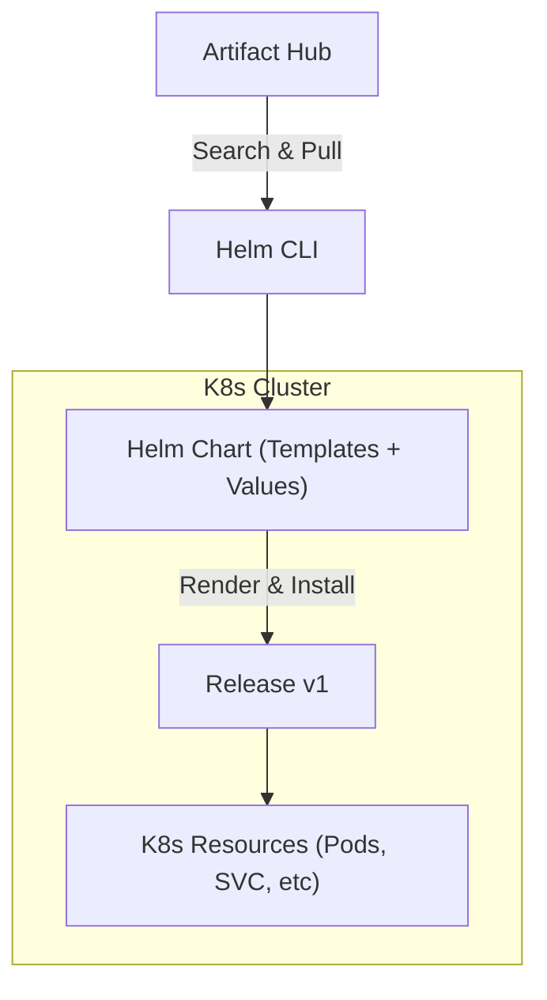

## 📌 Özet
Helm, Kubernetes için geliştirilmiş bir paket yöneticisidir (K8s'in apt/yum'u gibi düşünülebilir). Karmaşık Kubernetes manifest dosyalarını (Deployment, Service, Ingress vb.) "Chart" adı verilen paketler halinde gruplayarak yönetmeyi sağlar. Helm'in en güçlü özelliği "Templating" yapısıdır; bu sayede aynı Chart'ı farklı parametrelerle (values.yaml) farklı ortamlar için özelleştirebilirsiniz. Sürümlendirme desteği ile uygulamalar kolayca güncellenebilir veya eski versiyonlara geri döndürülebilir. Helm, Kubernetes uygulama dağıtımını standartlaştırarak CI/CD süreçlerini büyük ölçüde kolaylaştırır.

## 🧠 Detay



### 1. Helm Chart Yapısı
Bir Chart klasörü genellikle şu dosyaları içerir:
*   **Chart.yaml:** Paket hakkında metadata (isim, versiyon).
*   **values.yaml:** Şablonda kullanılan değişkenlerin varsayılan değerleri.
*   **templates/:** K8s manifest şablonlarının bulunduğu klasör.
*   **charts/:** Bu chart'ın bağımlı olduğu diğer chart'lar.

### 2. Templating Örneği
`templates/deployment.yaml` içinde:
```yaml
apiVersion: apps/v1
kind: Deployment
metadata:
  name: {{ .Values.appName }}-deploy
spec:
  replicas: {{ .Values.replicaCount }}
  ...
```

`values.yaml` içinde:
```yaml
appName: "my-web-app"
replicaCount: 3
```

### 3. Helm Temel Kavramları
*   **Chart:** Bir paketin kendisi.
*   **Repository:** Chart'ların paylaşıldığı depo (örn: Artifact Hub).
*   **Release:** Bir Chart'ın cluster üzerinde çalışan spesifik bir örneği.

### 🛠️ Temel Helm Komutları
```bash
helm create my-chart


helm repo add bitnami https://charts.bitnami.com/bitnami
helm repo update


helm install my-release bitnami/nginx

# Kurulu release'leri listele
helm list

# Bir release'i güncelle
helm upgrade my-release ./my-chart --set replicaCount=5

# Release'i sil
helm uninstall my-release
```

## 💡 Bağlantılar
- [[K8s - Deployments ve Scaling]]
- [[K8s - ConfigMaps ve Secrets]]
