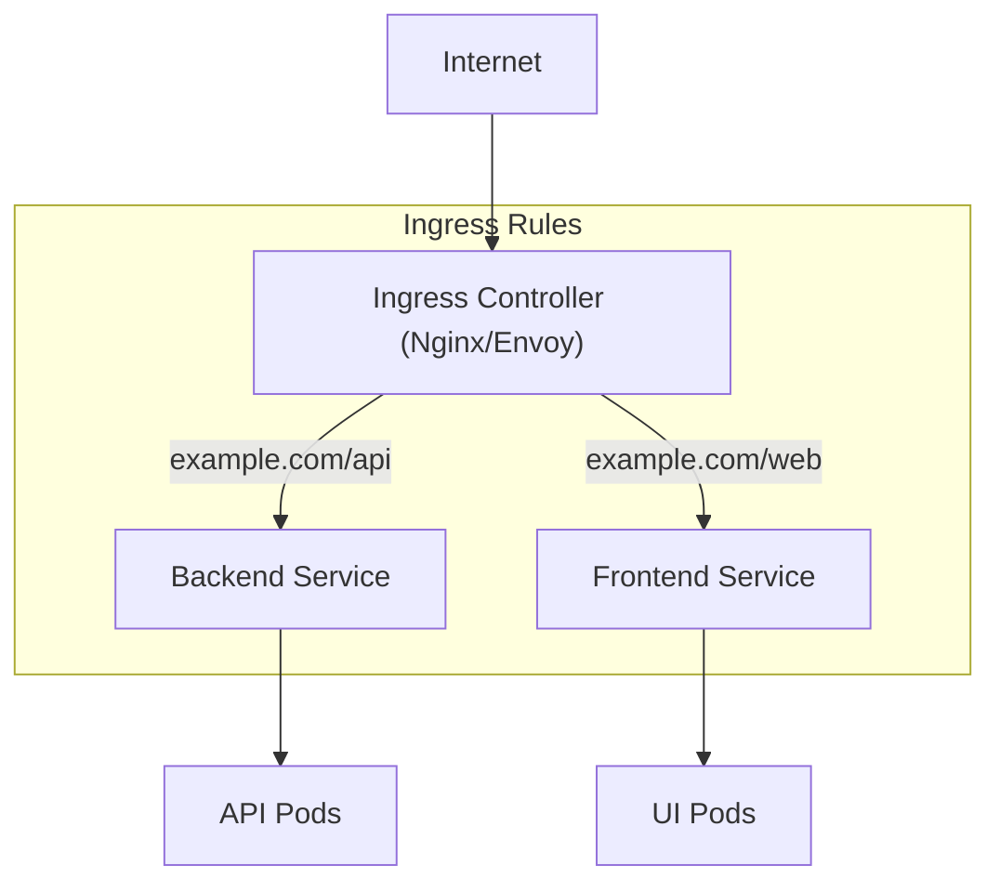

## 📌 Özet
Ingress, cluster dışından gelen HTTP ve HTTPS trafiğini cluster içindeki servislere yönlendiren bir API objesidir. Service (özellikle LoadBalancer tipi) her servis için ayrı bir IP maliyeti oluştururken, Ingress tek bir IP üzerinden host veya path bazlı yönlendirme (routing) yaparak maliyet ve yönetim avantajı sağlar. Ingress'in çalışabilmesi için bir "Ingress Controller" (örn: Nginx, Traefik, Istio) gereklidir. Ayrıca SSL/TLS sertifika yönetimi ve SSL termination işlemleri de merkezi olarak Ingress seviyesinde gerçekleştirilebilir. Karmaşık trafik kuralları ve modern web mimarileri için Ingress vazgeçilmez bir bileşendir.

## 🧠 Detay



### 1. Ingress vs Service (LoadBalancer)
*   **Service (L4):** Sadece IP ve Port bazlı yönlendirme yapar. Her uygulama için yeni bir LoadBalancer IP'si gerekir.
*   **Ingress (L7):** Domain adı ve URL dizini (path) bazlı akıllı yönlendirme yapar. Tek bir LoadBalancer arkasında yüzlerce servis barındırılabilir.

### 2. Ingress Manifest Örneği
```yaml
apiVersion: networking.k8s.io/v1
kind: Ingress
metadata:
  name: main-ingress
  annotations:
    nginx.ingress.kubernetes.io/rewrite-target: /
spec:
  ingressClassName: nginx
  rules:
  - host: myapp.com
    http:
      paths:
      - path: /api
        pathType: Prefix
        backend:
          service:
            name: api-service
            port:
              number: 80
      - path: /
        pathType: Prefix
        backend:
          service:
            name: web-service
            port:
              number: 80
```

### 3. TLS / SSL Yönetimi
Ingress üzerinden HTTPS desteği sağlamak için `tls` bloğu kullanılır ve sertifikalar bir K8s `Secret` objesinde saklanır.

### 🛠️ Temel Kubectl Komutları
```bash
kubectl get ingress


kubectl logs -n ingress-nginx -l app.kubernetes.io/name=ingress-nginx


kubectl describe ingress main-ingress

# Mevcut Ingress Class'ları görüntüle
kubectl get ingressclass
```

## 💡 Bağlantılar
- [[K8s - Services ve Networking]]
- [[K8s - ConfigMaps ve Secrets]]
