## 📌 Ozet
Kubernetes Operatörleri, karmaşık uygulamaların (veritabanları, mesaj kuyrukları vb.) kurulumunu ve yönetimini otomatize eden yöntemdir. Operatörler, Custom Resource Definitions (CRD) kullanarak Kubernetes API sini genişletir ve bir "Control Loop" (Kontrol Döngüsü) aracılığıyla uygulamanın istenen durumunu (Desired State) sürekli denetler.

## 🧠 Detay

```mermaid
graph LR
    User["User (kubectl apply)"] --> API["K8s API Server"]
    API --> CRD["Custom Resource (CR)"]
    CRD --> Op["Operator (Control Loop)"]
    Op --> Observe["Observe (Mevcut Durum)"]
    Observe --> Analyze["Analyze (Farkı Bul)"]
    Analyze --> Act["Act (Düzelt/Uygula)"]
    Act --> App["Application Instances"]
```

### 1. Temel Bileşenler
- **CRD (Custom Resource Definition):** Kubernetes e tanıtılan yeni veri tipi (Örn: "PostgresCluster").
- **Custom Resource (CR):** Bu tipten oluşturulan spesifik bir nesne.
- **Controller:** Sürekli çalışan ve CR nin durumunu izleyip gerekli işlemleri yapan kod.

### 2. Neden Kullanılır?
- Karmaşık stateful uygulamaların (yedekleme, ölçekleme, güncelleme) insan müdahalesi olmadan yönetilmesi.
- Altyapının "kod olarak uygulama" (Application as Code) felsefesiyle yönetimi.

## 💡 Baglantilar
- [[K8s - Giriş ve Mimari (Control Plane, Worker Nodes)]]
- [[System Design & Mimari - Tasarım Desenleri (Gang of Four)]]
