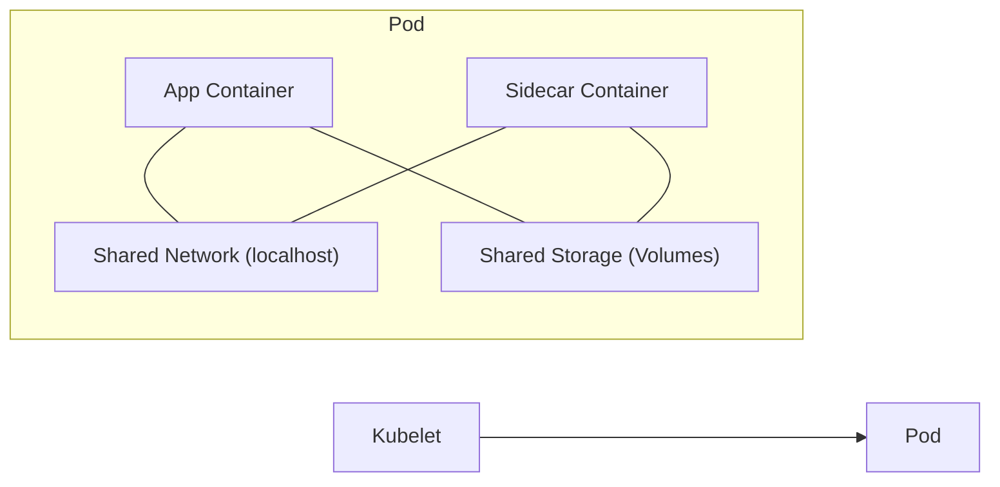

## 📌 Özet
Pod, Kubernetes mimarisindeki en küçük ve temel atomik birimdir. Bir veya birden fazla konteyneri (genellikle Docker) içerisinde barındırır ve bu konteynerler aynı ağ namespace'ini, IP adresini ve depolama birimlerini paylaşır. Pod'lar geçici (ephemeral) yapılardır; yani doğrudan tamir edilmezler, hata durumunda silinip yenisi oluşturulur. Tek konteynerli Pod'lar en yaygın kullanım şekliyken, yardımcı fonksiyonlar için Sidecar deseni ile çoklu konteyner yapıları da kurgulanabilir. Pod yönetimi, uygulama ölçeklendirmenin ve yüksek erişilebilirliğin temelini oluşturur.

## 🧠 Detay



### 1. Pod Manifest Yapısı
Bir Pod'un nasıl çalışacağını belirleyen temel YAML bileşenleri:

```yaml
apiVersion: v1
kind: Pod
metadata:
  name: nginx-pod
  labels:
    app: web
spec:
  containers:
  - name: nginx-container
    image: nginx:1.21
    ports:
    - containerPort: 80
    resources:
      requests:
        memory: "64Mi"
        cpu: "250m"
      limits:
        memory: "128Mi"
        cpu: "500m"
```

### 2. Multi-Container Pod Desenleri
*   **Sidecar:** Ana konteynerin işlevini tamamlayan yardımcı konteyner (örn: log toplama, proxy).
*   **Init Containers:** Ana uygulama başlamadan önce çalışan ve hazırlık yapan (örn: DB migration) konteynerler.
*   **Adapter:** Ana konteynerin çıktısını dış dünyaya standardize eden yapılar.

### 3. Sağlık Kontrolleri (Probes)
Pod'un durumunu izlemek için kullanılan üç ana mekanizma:
*   **Liveness Probe:** Konteynerin yaşıp yaşamadığını kontrol eder. Başarısız olursa K8s konteyneri restart eder.
*   **Readiness Probe:** Konteynerin trafik almaya hazır olup olmadığını kontrol eder.
*   **Startup Probe:** Uygulama ilk açılışını tamamlayana kadar diğer probları devre dışı bırakır.

### 🛠️ Temel Kubectl Komutları
```bash
kubectl apply -f pod.yaml


kubectl get pods -o wide


kubectl logs -f <pod-name>

# Pod içine girip terminal aç
kubectl exec -it <pod-name> -- /bin/bash

# Pod'u sil
kubectl delete pod <pod-name>
```

## 💡 Bağlantılar
- [[K8s - Giriş ve Mimari (Control Plane, Worker Nodes)]]
- [[K8s - Deployments ve Scaling]]
