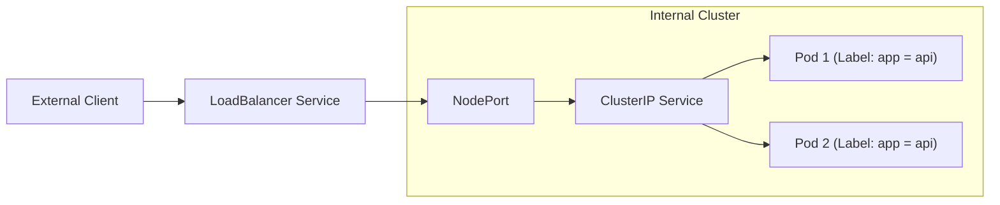

## 📌 Özet
Kubernetes'te Pod'lar geçicidir ve her yeniden başladıklarında farklı IP adresleri alırlar. Service objesi, bu değişken IP'lerin önüne sabit bir DNS adı ve IP adresi koyarak mantıksal bir soyutlama sağlar. "Selector" mekanizması sayesinde servis, hangi Pod grubuna trafik göndereceğini belirler ve gelen istekleri bu Pod'lar arasında yük dengeleyici (load balancer) mantığıyla dağıtır. Service türleri (ClusterIP, NodePort, LoadBalancer), trafiğin sadece cluster içinde mi yoksa dış dünyadan mı erişilebilir olacağını belirler. Bu yapı, mikroservisler arası iletişimin stabil ve ölçeklenebilir olmasını sağlar.

## 🧠 Detay



### 1. Service Türleri
*   **ClusterIP (Varsayılan):** Servise sadece cluster içinden erişilebilir. Dahili mikroservis iletişimi için kullanılır.
*   **NodePort:** Servisi her bir Node'un belirli bir portu (30000-32767) üzerinden dış dünyaya açar.
*   **LoadBalancer:** Bulut sağlayıcının (AWS, GCP, Azure) yük dengeleyicisini kullanarak servisi dış dünyaya açar.
*   **ExternalName:** Servisi bir DNS ismine (örn: my.db.com) map eder, selector kullanmaz.

### 2. Service Manifest Örneği
```yaml
apiVersion: v1
kind: Service
metadata:
  name: backend-service
spec:
  type: ClusterIP
  selector:
    app: backend
  ports:
    - protocol: TCP
      port: 80          # Servis portu
      targetPort: 8080  # Pod içindeki uygulamanın portu
```

### 3. DNS ve Keşif (Discovery)
Kubernetes içerisinde her servis için otomatik bir DNS kaydı oluşturulur:
`<service-name>.<namespace>.svc.cluster.local` formatı ile servisler birbirlerine isim üzerinden erişebilirler.

### 🛠️ Temel Kubectl Komutları
```bash
kubectl get svc


kubectl describe svc <service-name>


kubectl expose deployment <deploy-name> --port=80 --target-port=8080 --type=NodePort

# Geçici bir pod ile DNS testi yap
kubectl run curl-test --image=radial/busyboxplus:curl -i --tty
```

## 💡 Bağlantılar
- [[K8s - Deployments ve Scaling]]
- [[K8s - Ingress ve Trafik Yönetimi]]
