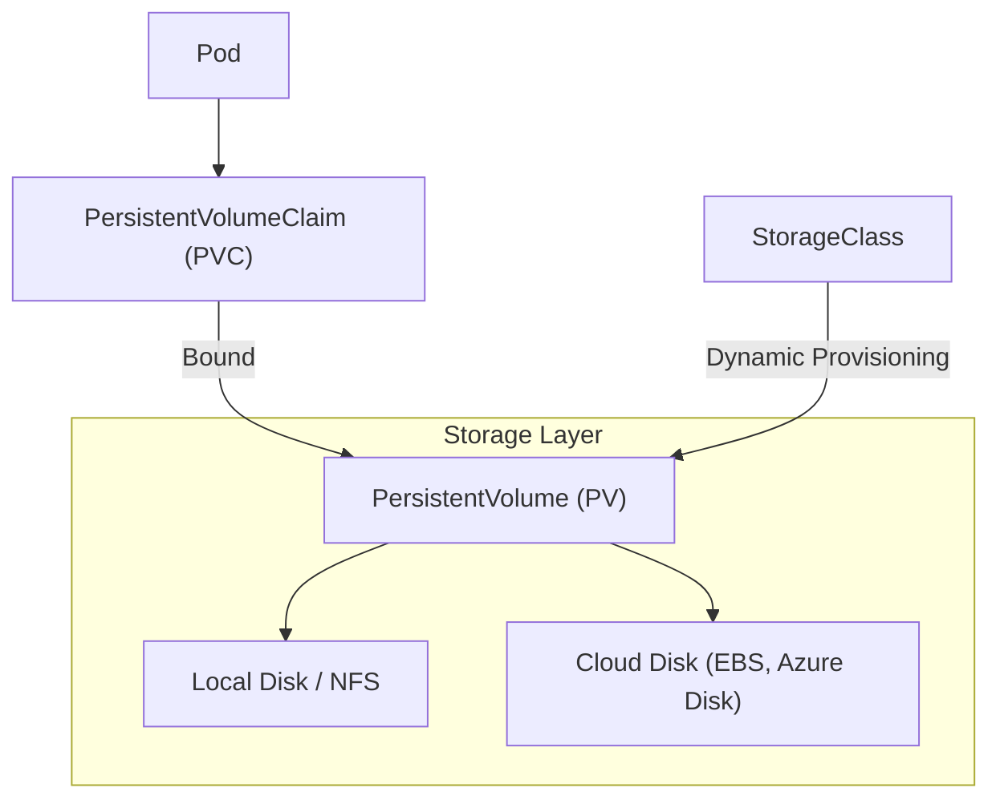

## 📌 Özet
Kubernetes'te Pod'lar geçici olduğu için içlerindeki veriler Pod silindiğinde kaybolur. Veri kalıcılığını sağlamak için PersistentVolume (PV) ve PersistentVolumeClaim (PVC) mimarisi kullanılır. PV, cluster içindeki gerçek depolama kaynağını (disk, NFS, cloud storage) temsil ederken; PVC, kullanıcıların bu kaynaktan belirli bir boyutta yer talep etmesidir. Bu ayrım, yazılımcıların altyapı detaylarını bilmeden depolama alanı kullanabilmesini sağlar. StorageClass ise depolama alanlarının dinamik olarak (ihtiyaç anında) oluşturulmasına imkan tanıyarak yönetimi otomatikleştirir.

## 🧠 Detay



### 1. Temel Kavramlar
*   **PersistentVolume (PV):** Yönetici tarafından oluşturulan veya dinamik olarak sağlanan gerçek depolama birimi. Pod'dan bağımsız bir yaşam döngüsüne sahiptir.
*   **PersistentVolumeClaim (PVC):** Bir kullanıcının depolama isteğidir. "Bana 5GB, ReadWriteOnce modunda disk ver" der.
*   **Access Modes:**
    *   **ReadWriteOnce (RWO):** Sadece tek bir node tarafından okunabilir/yazılabilir.
    *   **ReadOnlyMany (ROX):** Birçok node tarafından sadece okunabilir.
    *   **ReadWriteMany (RWX):** Birçok node tarafından okunabilir/yazılabilir (örn: NFS).

### 2. PVC ve Pod Kullanım Örneği
```yaml
apiVersion: v1
kind: PersistentVolumeClaim
metadata:
  name: mysql-pvc
spec:
  accessModes:
    - ReadWriteOnce
  resources:
    requests:
      storage: 10Gi
---

spec:
  containers:
  - name: mysql
    image: mysql:8.0
    volumeMounts:
    - name: mysql-storage
      mountPath: /var/lib/mysql
  volumes:
  - name: mysql-storage
    persistentVolumeClaim:
      claimName: mysql-pvc
```

### 3. StorageClass
Depolama alanlarının manuel oluşturulması yerine, PVC isteği geldiğinde diskin otomatik yaratılmasını sağlar (Dynamic Provisioning).

### 🛠️ Temel Kubectl Komutları
```bash

kubectl get pv,pvc

# Storage Class'ları listele
kubectl get sc

# Bir PVC'nin neden "Pending" durumda olduğunu anla
kubectl describe pvc <pvc-name>

# Volume kapasitelerini kontrol et
kubectl get pvc --all-namespaces
```

## 💡 Bağlantılar
- [[K8s - Pods ve Konteyner Yönetimi]]
- [[K8s - Deployments ve Scaling]]
