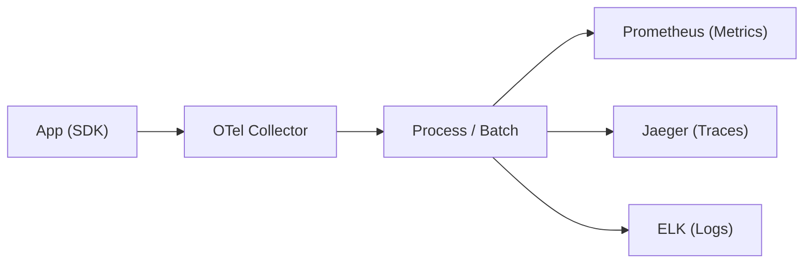

## 📌 Ozet
OpenTelemetry (OTel), bulut tabanlı yazılımlardan log, metrik ve trace (iz sürme) toplamak için kullanılan açık kaynaklı bir standarttır. Vendor-neutral (tedarikçiden bağımsız) yapısı sayesinde veriyi bir kez toplayıp istediğiniz backend e (Prometheus, Jaeger, Datadog vb.) göndermenizi sağlar.

## 🧠 Detay

### 1. OTel Bileşenleri
- **SDK:** Uygulama içinden veri toplamak için kullanılan kütüphaneler.
- **Collector:** Veriyi alan, işleyen ve farklı yerlere aktaran merkezi servis.
- **Exporter:** Veriyi hedef sisteme uygun formata çevirip gönderen modül.

### 2. Neden Standart?
- Uygulama kodunu değiştirmeden izleme aracını (backend) değiştirebilirsiniz.
- Dağıtık sistemlerde (Microservices) uçtan uca görünürlük sağlar.

## 💡 Baglantilar
- [[MO - Distributed Tracing ve Jaeger]]
- [[MO - Prometheus ile Metrik Toplama]]
