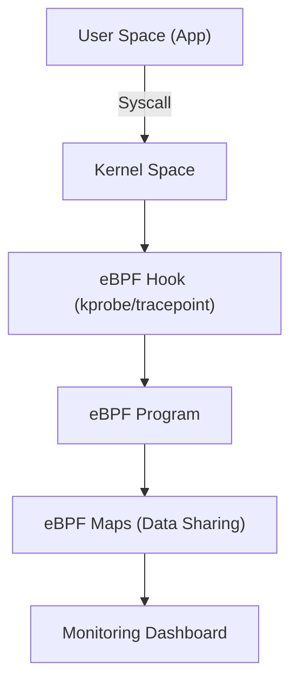

---
tarih: 2026-06-06
konu: eBPF
etiket: [ebpf, linux, monitoring, security, networking]
kaynak: Gemini CLI
zorluk: Uzman
---

## 📌 Ozet
eBPF (extended Berkeley Packet Filter), Linux çekirdeğini (kernel) değiştirmeden veya modül eklemeden çekirdek seviyesinde program çalıştırmayı sağlayan devrimsel bir teknolojidir. Sistem gözlemlenebilirliği, güvenlik ve ağ performansı için "süper güç" olarak kabul edilir.

## 🧠 Detay

### 1. Kullanım Alanları
- **Observability:** Uygulamanın en derinlerinde ne yaptığını sıfır gecikme ile izleme.
- **Networking:** Yüksek performanslı paket filtreleme ve load balancing (Cilium).
- **Security:** Şüpheli syscall (sistem çağrısı) takibi ve engelleme (Falco).

### 2. Avantajları
- **Hız:** Veri çekirdek seviyesinde işlendiği için çok hızlıdır.
- **Güvenlik:** eBPF programları çekirdeği çökertmemesi için özel bir "verifier" tarafından denetlenir.

## 💡 Baglantilar
- [[Linux - Process Yönetimi (ps, top, kill, systemd)]]
- [[Siber Güvenlik - Giriş ve Temel Kavramlar (CIA, Threat Model)]]
