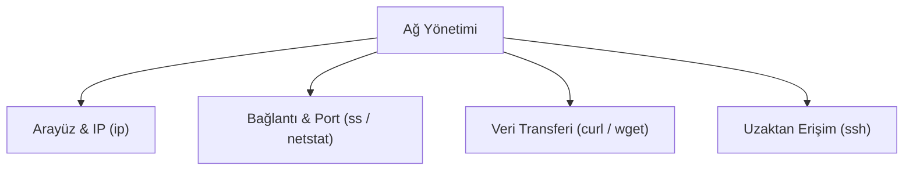

## 📌 Özet
Linux sistemlerde ağ konfigürasyonu ve sorun giderme işlemleri, genellikle komut satırı araçları ile gerçekleştirilir. `ip` komutu, ağ arayüzlerini ve yönlendirme (routing) tablolarını yönetmek için eski `ifconfig` komutunun yerini almış modern bir araçtır. Bağlantı noktalarını, açık portları ve ağ istatistiklerini izlemek için `netstat` veya daha yeni alternatifi olan `ss` kullanılır. Ağ üzerinden veri transferi yapmak veya API istekleri göndermek için `curl` ve `wget` komutları vazgeçilmezdir. Uzaktaki bir sunucuya güvenli bir şekilde bağlanmak ve komut çalıştırmak için ise şifrelenmiş protokol olan `ssh` (Secure Shell) kullanılır. Bu araçlar, sistem yöneticilerinin bir makinenin dünya ile olan iletişimini yönetmesini ve arızaları teşhis etmesini sağlar.

## 🧠 Detay



### IP ve Arayüz Yönetimi (ip)
Eski `ifconfig` komutunun yerine `iproute2` paketinden gelen `ip` komutu kullanılır.
- **IP Adreslerini Görme:** `ip addr show` veya kısaca `ip a`
- **Yönlendirme Tablosu (Route):** `ip route show`
- **Arayüzü Kapatma/Açma:** `sudo ip link set eth0 down` / `sudo ip link set eth0 up`

### Port ve Bağlantı İzleme (ss / netstat)
`netstat` eskimiştir, modern sistemlerde yerini `ss` (Socket Statistics) almıştır.
- **Açık ve Dinlenen Portlar:** `ss -tuln` (t: tcp, u: udp, l: listening, n: numeric/port numarası ile)
- **Tüm Bağlantılar:** `netstat -anp` (p: process bilgisini de gösterir)

### Veri Transferi (curl / wget)
- **`wget`:** Dosya indirmek için idealdir.
  - `wget http://ornek.com/dosya.zip`
- **`curl`:** API testleri ve veri transferi için çok yeteneklidir.
  - Sadece header bilgisini çekme: `curl -I http://ornek.com`
  - JSON verisi ile POST isteği atma:
    ```bash
    curl -X POST -H "Content-Type: application/json" -d '{"isim":"Ahmet"}' http://api.ornek.com/users
    ```

### Uzaktan Erişim (ssh ve scp)
- **SSH (Secure Shell):** Uzak sunucuya güvenli bağlantı.
  - `ssh kullanici@192.168.1.50`
  - Özel port ile bağlanma: `ssh -p 2222 kullanici@ipadresi`
- **SCP (Secure Copy):** SSH üzerinden güvenli dosya kopyalama.
  - `scp dosya.txt kullanici@192.168.1.50:/uzak/dizin/` (Lokaldan uzağa)
  - `scp kullanici@192.168.1.50:/uzak/dosya.txt /lokal/dizin/` (Uzaktan lokale)

### Sorun Giderme (ping, traceroute)
- `ping 8.8.8.8` (Hedefe ICMP paketleri atarak erişilebilirliği ölçer)
- `traceroute google.com` (Paketin hedefe giderken geçtiği yönlendiricileri listeler)

## 💡 Bağlantılar
- [[Linux - Firewall (iptables, ufw)]]
- [[Linux - SSH Sertifika ve Tünel]]

## ❓ Sorular / Anlamadıklarım

## 🔗 Kaynaklar
- [iproute2 Documentation](https://wiki.linuxfoundation.org/networking/iproute2)
- [cURL Tutorial](https://curl.se/docs/tutorial.html)