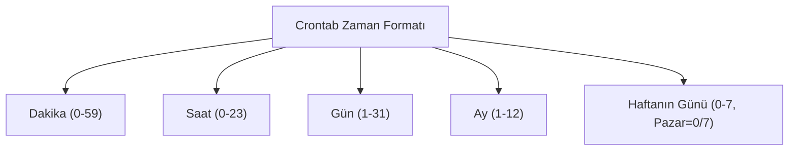

## 📌 Özet
Linux sistemlerinde belirli bir görevin, script'in veya komutun otomatik olarak ve düzenli aralıklarla çalıştırılmasını sağlamak için `cron` servisi (daemon) kullanılır. Bu zamanlanmış görevlerin listelendiği ve yönetildiği dosyaya ise `crontab` (cron table) adı verilir. Veritabanı yedeklerinin her gece saat 03:00'te alınması, log dosyalarının haftalık olarak temizlenmesi veya sistem durumu raporlarının aylık olarak e-postalanması gibi süreçler cron sayesinde insan müdahalesi gerektirmeden yürütülür. Cron, zamanlamayı dakika, saat, gün, ay ve haftanın günü olmak üzere 5 farklı parametre (yıldız `*`) ile belirler. Ayrıca, sistemin kapalı olduğu zamanlarda kaçırılan görevlerin sistem açıldığında çalıştırılmasını sağlayan `anacron` da alternatif bir yapı olarak mevcuttur.

## 🧠 Detay



### Crontab Yönetimi
- **Crontab Dosyasını Düzenleme:** `crontab -e` (Kendi kullanıcınızın görevlerini açar).
- **Mevcut Görevleri Listeleme:** `crontab -l`
- **Başka Kullanıcının Crontab'ını Düzenleme:** `sudo crontab -u root -e`

### Zamanlama Sözdizimi (Syntax)
Crontab satırları 5 zaman parametresi ve ardından çalıştırılacak komuttan oluşur:
`* * * * * komut`

- `*` : Her (Her dakika, her saat vb.)
- `,` : Değerleri ayırır (Örn: `1,15,30` -> 1., 15. ve 30. dakikalarda)
- `-` : Aralık belirtir (Örn: `1-5` -> 1'den 5'e kadar her gün)
- `/` : Adım (Step) belirtir (Örn: `*/5` -> Her 5 birimde bir)

### Örnek Cron Görevleri
- **Her gün gece 02:30'da çalışır:**
  `30 2 * * * /yedekle.sh`
- **Hafta içi (Pzt-Cuma) her sabah 08:00'de çalışır:**
  `0 8 * * 1-5 /script.sh`
- **Her 15 dakikada bir çalışır:**
  `*/15 * * * * ping -c 1 8.8.8.8 > /dev/null`
- **Her ayın 1. günü saat 00:00'da çalışır:**
  `0 0 1 * * /aylik_rapor.sh`

### Crontab Kısayolları (Macro)
5 yıldızlı yapı yerine okunabilirliği artırmak için şu kısayollar kullanılabilir:
- `@reboot` : Sistem her yeniden başladığında 1 kez çalışır.
- `@daily` veya `@midnight` : Her gün gece yarısı (`0 0 * * *`)
- `@hourly` : Her saatin başında (`0 * * * *`)

### Çıktı Yönlendirme (Loglama)
Cron işlerinin çıktısı (stdout ve stderr) varsayılan olarak kullanıcıya e-posta atılmaya çalışılır. Bunu bir log dosyasına yazmak daha güvenlidir:
```bash
0 2 * * * /yedekle.sh >> /var/log/yedek_cron.log 2>&1
```
*(Buradaki `2>&1` hata çıktılarını da standart çıktıya ekler.)*

## 💡 Bağlantılar
- [[Linux - Shell Scripting (bash)]]
- [[Linux - Pipe ve Yönlendirme (vbar, gt, ggt)]]

## ❓ Sorular / Anlamadıklarım

## 🔗 Kaynaklar
- [Crontab Guru (Cron Expression Generator)](https://crontab.guru/)