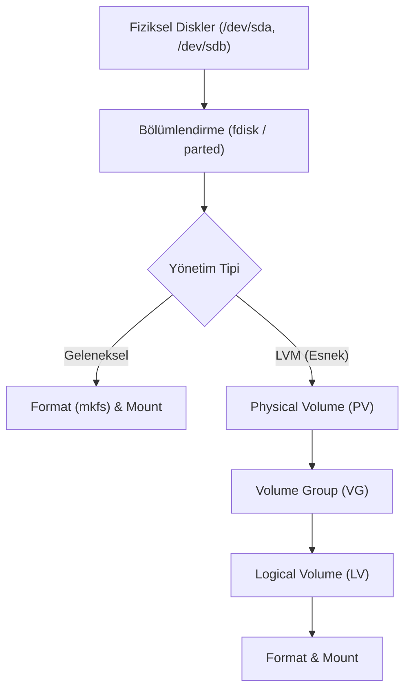

## 📌 Özet
Linux'ta yeni bir disk (HDD/SSD) eklendiğinde, bu disk doğrudan kullanılamaz; sırasıyla bölümlendirilmesi (partitioning), formatlanması (dosya sistemi oluşturulması) ve sisteme bağlanması (mounting) gerekir. Disk bölümlendirme işlemleri için `fdisk` veya `parted` araçları, formatlama için `mkfs` komutu, bir dizine bağlamak için ise `mount` komutu kullanılır. Geleneksel disk yönetiminin aksine, kurumsal sistemlerde çok daha esnek bir yapı sunan LVM (Logical Volume Manager - Mantıksal Hacim Yöneticisi) tercih edilir. LVM sayesinde, birden fazla fiziksel diski tek bir büyük havuza (Volume Group) dönüştürebilir ve bu havuzdan istediğiniz boyutta mantıksal diskler (Logical Volumes) oluşturabilirsiniz. Üstelik bu alanlar sistem çalışırken anında genişletilebilir veya daraltılabilir, bu da depolama yönetimini son derece dinamik hale getirir.

## 🧠 Detay

### Temel Disk İşlemleri (Geleneksel Yöntem)
1. **Diskleri Listeleme:** `lsblk` veya `fdisk -l` (Sisteme bağlı sda, sdb gibi diskleri ve boyutlarını gösterir).
2. **Bölümlendirme:** `sudo fdisk /dev/sdb` (Disk içinde yeni bölümler - sdb1, sdb2 - oluşturur).
3. **Formatlama (Dosya Sistemi Oluşturma):** `sudo mkfs.ext4 /dev/sdb1` veya modern sistemlerde `mkfs.xfs /dev/sdb1`.
4. **Bağlama (Mount):** `sudo mount /dev/sdb1 /mnt/yenidisk`
5. **Kalıcı Bağlama:** Sistem yeniden başladığında bağlantının kopmaması için disk bilgileri `/etc/fstab` (File System Table) dosyasına eklenmelidir. (Disk UUID'si `blkid` komutu ile bulunur).

### LVM (Logical Volume Manager) Mimarisi
LVM üç temel bileşenden oluşur:
- **PV (Physical Volume):** Gerçek diskleri veya bölümlerini LVM'ye tanıtır. (`pvcreate /dev/sdb1`)
- **VG (Volume Group):** PV'lerin birleştirildiği depolama havuzudur. (`vgcreate VeriHavuzu /dev/sdb1 /dev/sdc1`)
- **LV (Logical Volume):** Havuzdan (VG) kesilerek oluşturulan ve formatlanıp mount edilen sanal bölümlerdir. (`lvcreate -n YedekLV -L 50G VeriHavuzu`)

#### LVM ile Disk Genişletme (Canlı)
LVM'nin en büyük avantajı sistemi kapatmadan disk alanını büyütebilmektir:
1. LV'yi büyüt: `lvextend -L +20G /dev/VeriHavuzu/YedekLV`
2. Dosya sistemini büyüt (ext4 için): `resize2fs /dev/VeriHavuzu/YedekLV`
*(XFS dosya sistemi kullanılıyorsa `xfs_growfs` komutu kullanılır.)*

### Swap (Sanal Bellek) Alanı Yönetimi
- **Swap Oluşturma:** `mkswap /dev/sdc1`
- **Swap Etkinleştirme:** `swapon /dev/sdc1`
- Kalıcı olması için yine `/etc/fstab` dosyasına eklenmesi gerekir.

## 💡 Bağlantılar
- [[Linux - Dosya Sistemi Yapısı]]
- [[Linux - Sistem İzleme ve Performans]]

## ❓ Sorular / Anlamadıklarım

## 🔗 Kaynaklar
- [LVM Administrator's Guide (RedHat)](https://access.redhat.com/documentation/en-us/red_hat_enterprise_linux/8/html/configuring_and_managing_logical_volumes/index)