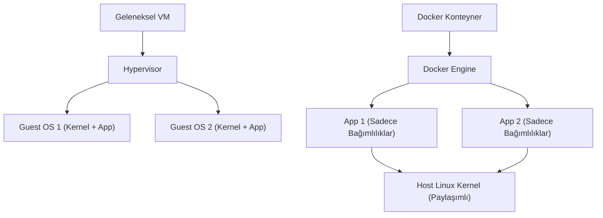

## 📌 Özet
Docker, uygulamaları ve onların bağımlılıklarını (kütüphaneler, yapılandırma dosyaları) "Konteyner" (Container) adı verilen izole paketler içine hapseden bir platformdur. Geleneksel sanal makinelerin (VM) aksine konteynerler kendi çekirdeklerini (kernel) çalıştırmazlar; ev sahibi (host) Linux sisteminin çekirdeğini paylaşırlar. Bu sayede VM'lere göre saniyeler içinde başlar ve çok daha az CPU/RAM tüketirler. Geliştiriciler kodlarını `Dockerfile` üzerinden bir "İmaj"a (Image) dönüştürür ve bu imaj, içinde Docker kurulu olan herhangi bir Linux makinesinde "Benim bilgisayarımda çalışıyordu ama sunucuda çalışmıyor" sorununu tamamen ortadan kaldırarak birebir aynı şekilde çalışır. Linux ekosistemi, cgroups ve namespaces teknolojileri sayesinde konteyner mimarisinin doğal yuvasıdır.

## 🧠 Detay

### Temel Docker Kavramları
- **Image (İmaj):** Bir uygulamanın çalışması için gereken her şeyin (kod, kütüphane, ortam) dondurulmuş (read-only) paketidir. Sınıf (Class) gibidir.
- **Container (Konteyner):** Bir imajın çalıştırılmış, yaşayan ve işlem yapan halidir. Obje (Object) gibidir.
- **Dockerfile:** Bir imajın nasıl oluşturulacağını adım adım anlatan metin dosyasıdır.
- **Docker Hub:** İmajların paylaşıldığı bulut deposudur (Örn: resmi ubuntu, nginx, python imajları).

### Sık Kullanılan Docker Komutları
- **Sistemdeki İmajları Listeleme:** `docker images`
- **Çalışan Konteynerleri Listeleme:** `docker ps` (Tümünü görmek için `docker ps -a`)
- **İmaj İndirme:** `docker pull nginx:latest`
- **Konteyner Çalıştırma:**
  `docker run -d -p 8080:80 --name benim-sunucum nginx`
  *(Açıklama: -d arka planda (detached) çalıştırır. -p dışarıdaki 8080 portunu konteyner içindeki 80'e bağlar).*
- **Konteyneri Durdurma ve Silme:**
  - `docker stop benim-sunucum`
  - `docker rm benim-sunucum`
- **Konteynerin İçine Girmek (Shell açmak):**
  `docker exec -it benim-sunucum /bin/bash`
- **Konteyner Loglarını Görme:** `docker logs -f benim-sunucum`

### Docker Compose
Birden fazla konteynerin (Örneğin: Bir Web API ve bir PostgreSQL veritabanı) aynı anda, birbirleriyle aynı ağda konuşacak şekilde tek bir komutla ayağa kaldırılmasını sağlayan araçtır. Tanımlamalar `docker-compose.yml` adlı YAML dosyasında yapılır.
- Başlatmak için: `docker-compose up -d`
- Kapatmak için: `docker-compose down`

## 💡 Bağlantılar
- [[Linux - Process Yönetimi (ps, top, kill, systemd)]]
- [[Docker - Dockerfile Yazımı]] *(Eğer vault içinde mevcutsa)*

## ❓ Sorular / Anlamadıklarım

## 🔗 Kaynaklar
- [Docker Official Documentation](https://docs.docker.com/)