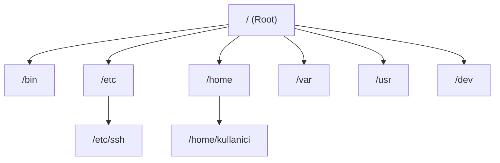

## 📌 Özet
Linux işletim sisteminde "Her şey bir dosyadır" (Everything is a file) prensibi hakimdir; donanımlar, süreçler ve dizinler dahi sistemde dosya olarak temsil edilir. Bu yapı, hiyerarşik bir ağaç düzenine sahiptir ve en üstte kök dizin (Root Directory) olan `/` bulunur. Linux, dizin yapısını standartlaştırmak için "Filesystem Hierarchy Standard (FHS)" adı verilen bir standart kullanır. Bu standart sayesinde uygulamalar, kütüphaneler ve ayar dosyaları sistemde belirli ve öngörülebilir dizinlerde tutulur. Kullanıcılar `cd`, `ls`, `pwd` gibi komutlarla bu yapıda gezinirken, dosya tiplerini (regular file, directory, symlink vb.) bilmek sistem yönetimini kolaylaştırır. Sistemin düzgün çalışması ve yapılandırılması için `/etc`, `/var`, `/home` gibi temel dizinlerin işlevlerini anlamak kritik öneme sahiptir.

## 🧠 Detay

### Filesystem Hierarchy Standard (FHS)
FHS, Linux dizin yapısını standartlaştırır. En önemli dizinler ve amaçları şunlardır:

- `/ (Root):` Sistemin kök dizinidir. Diğer tüm dizinler ve dosyalar bunun altındadır.
- `/bin (Binary):` Tüm kullanıcıların çalıştırabileceği temel komutlar (ls, cp, ping) bulunur.
- `/sbin (System Binary):` Sistem yöneticisi (root) tarafından çalıştırılabilen bakım ve yönetim komutları bulunur (fdisk, reboot).
- `/etc:` Sistemin genel konfigürasyon dosyalarını (ayarlarını) barındırır (Örn: `/etc/fstab`, `/etc/passwd`).
- `/home:` Normal kullanıcıların kişisel dosyalarının bulunduğu dizindir.
- `/root:` Sistem yöneticisinin (`root` kullanıcısının) ev dizinidir.
- `/var (Variable):` Log dosyaları (`/var/log`), veritabanları veya e-posta kuyrukları gibi boyutu sürekli değişen verileri tutar.
- `/usr (Universal System Resources):` Kullanıcılara ait programlar, kütüphaneler ve dokümanlar buradadır (Örn: `/usr/bin`).
- `/tmp (Temporary):` Geçici dosyaların tutulduğu alandır, sistem yeniden başladığında genellikle temizlenir.
- `/dev (Device):` Donanım aygıtlarını temsil eden özel dosyaları içerir (Örn: `/dev/sda` bir disktir).

### "Her Şey Bir Dosyadır" Prensibi
Soketler (sockets), borular (pipes), sembolik linkler (symlinks) ve hatta çalışan işlemler (`/proc` dizini altında) birer dosya olarak muamele görür. Bu durum, komut satırı araçlarının ve pipe (`|`) işlemlerinin çok güçlü bir şekilde birbiriyle entegre olmasını sağlar.

## 💡 Bağlantılar
- [[Linux - Temel Komutlar (ls, cd, cp, mv, rm, find)]]
- [[Linux - Dosya İzinleri ve chmod-chown]]

## ❓ Sorular / Anlamadıklarım

## 🔗 Kaynaklar
- [FHS (Filesystem Hierarchy Standard) Documentation](https://refspecs.linuxfoundation.org/fhs.shtml)